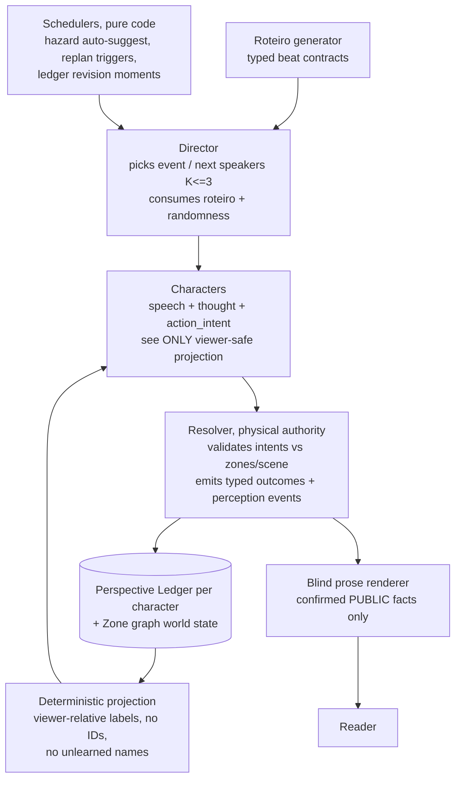

# Candidate Architecture Map (consolidated 2026-07-16)

**Status:** hypothesis consolidation for the Task 29.2 exploration gate — a clean
top-down reference. Decisions are frozen only by the 29.2 exploration deliverables.
Chronological evidence lives in `explore-29.2-subjective-state.md`.

## Boxes and contracts (target shape)

## Layers

| Layer | Owner | Content |
|---|---|---|
| **State** | code + initializer | per-character perspective ledger (names/beliefs/relationships, compiled once from priors at act 1, deterministic appends per turn, batched semantic revisions); **zone graph**: scene divided into zones with adjacency + acoustic/visual properties; every character has a zone position |
| **Decision** | Director + Resolver | Director: event selection, speaker routing (may route K speakers per beat, sequential within a zone); Resolver: intent adjudication, typed outcomes, perception events with **computed** witnesses |
| **Rendering** | code + prose call | viewer-safe projection (deterministic); blind prose renderer receives only confirmed public facts — never thoughts, sheets, IDs, or the roteiro |
| **Drive** | code schedulers | roteiro with typed beat contracts; replan on deterministic signals (exit met / budget exhausted / anchor-overlap drift with hysteresis); hazard-function auto-suggest, probability modulated by stagnation metrics with damping + hard cap |
| **Measure** | harness + benchmark | 29.1/29.3 xfailed3; fuzzy-similarity repetition metrics; per-check cost (Task 32) |

## The spatial model (added 2026-07-16 — user: "isso muda tudo")

Zone graph, not coordinates: a scene is a small graph of named zones (salão, varanda,
compartimento leste...) with edges carrying audibility/visibility. Characters and
objects hold a zone. Consequences, in order of importance:

1. **Perception becomes computable.** `witness_ids` stops being a model guess (E3) and
   becomes code: same-zone + audible-adjacent hears speech; whisper = same zone,
   addressed subset. The narrator loses one more semantic job — the stated direction
   ("diminuir as funções dele e delegar mais").
2. **Staging bugs become checkable state.** Task 26's teleports (walks to door, appears
   seated) stop being prose-only defects: position is state, movement is a typed intent
   the Resolver applies, prose is validated against it.
3. **Parallelism boundary = zone boundary.** Multiple character speeches ("abrir a
   porteira", user 2026-07-16) are safe to run in PARALLEL across different zones
   (independent conversations cannot perceive each other) and must stay SEQUENTIAL
   within one zone (later speakers heard earlier ones). This answers the ordering
   problem without giving up the chaos.
4. The 29.1 partition case (SP-01, acoustically isolated compartment) becomes typed
   data instead of a physical_facts prose fact; 29.1 still measures the CURRENT engine
   (baseline unaffected); 29.3 adapts the probe to the typed model.

## Multiple speeches per beat

Director may route K speakers (small, 2-3) per beat: sequential within a zone, parallel
across zones. Cost is acceptable (character calls are the cheapest, cache-dominated).
Note: 29.2 §2.6 earmarked "multiple Character speeches" as plugin territory — the
bounded autonomous loop reframes routing-K-speakers as core Director capability, while
exotic mechanics stay plugins. Resolve this boundary during the gate.

## Metric-modulated hazard (user, 2026-07-16)

Stagnation metrics (rising repetition similarity, no new anchors, no scene deltas) may
RAISE the auto-suggest firing probability. Keep damping: noisy metrics must not spam
events — hard cap, cooldown, and monotone decay after each fire (Task 33 parameters).

## Ownership

| Piece | Task |
|---|---|
| Baseline benchmark (fixture written, tests in construction) | 29.1 |
| Ledger, projection, perception events, zone graph, split placement | 29.2 (exploration gate decides) |
| Director/Resolver implementation, bounded autonomous loop, roteiro generator | post-29.2 tasks, staged |
| Auto-suggest hazard scheduler (shippable now) | 33 |
| Prose quality metrics (fuzzy similarity) | 26 |
| Force-speaker regression (independent bug) | 28 |
| Whisper UI | 30 |
| Harness cost/routing metrics | 32 |

## Open questions for the 29.2 gate

1. Zone schema: how small can v1 be (zones + audibility only?) while killing the
   witness-guessing job?
2. Undo semantics across an autonomous burst (one beat vs whole burst).
3. Latency budget per visible beat (3 sequential calls ≈ 6-8s) and progressive
   rendering.
4. K-speakers: core Director capability vs plugin boundary.
5. Character `action_intent`: core in v1 or staged after the split?
6. Fuzzy similarity thresholds; embeddings only if tier-1 misses.
