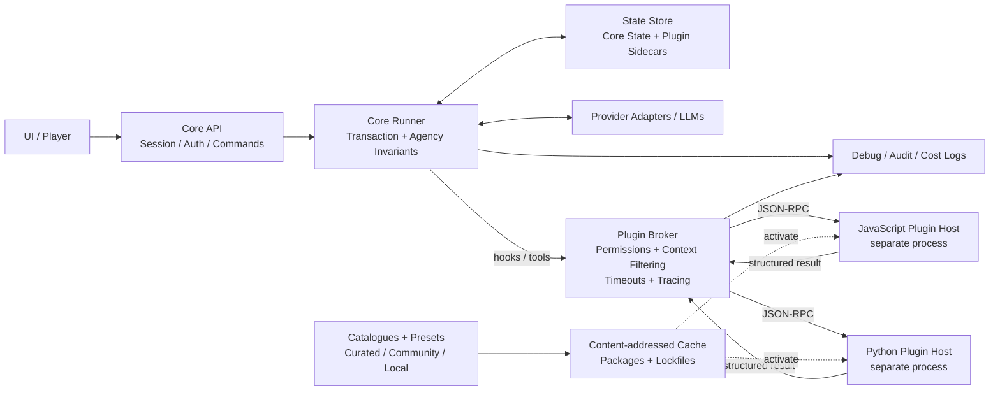
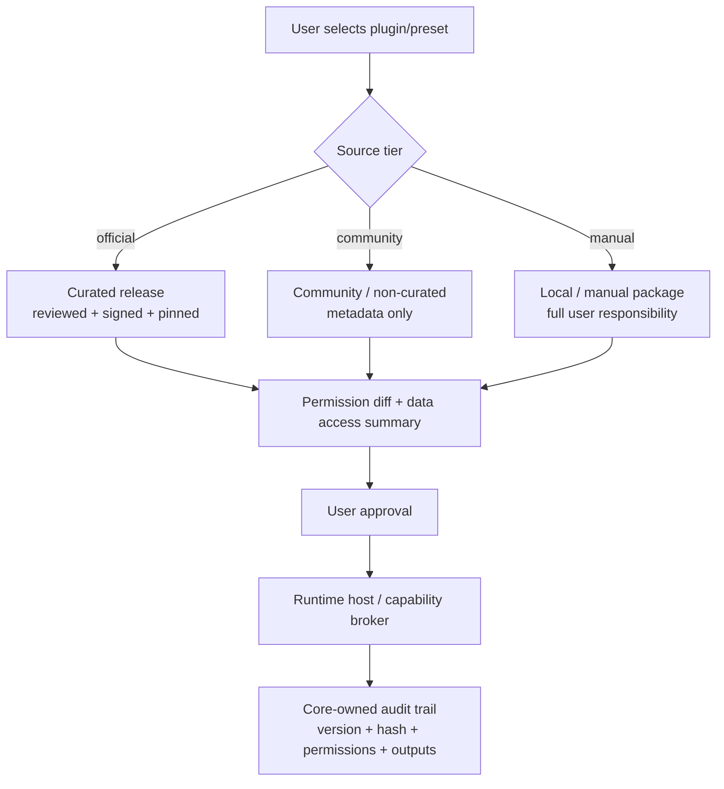
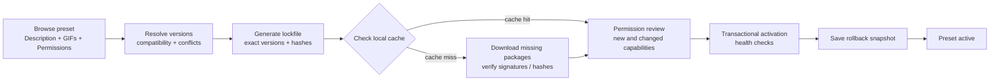

**SUPERTASK 01**

# Core Plugin System & Agentic Tool Pipeline

_Architecture report covering the plugin store, curation, presets, security,
governance, and roadmap_

> **Markdown edition for coding agents**
>
> Conceptual and decision-preservation document. Diagrams use Mermaid so the
> file remains self-contained and readable by Codex and other coding agents.

**Alex Tavern**

Status: Planned Conceptual Architecture\
Document version: 0.1\
Date: July 13, 2026

_Decision-preservation and architecture-exploration document_

## How to use this document

This document is intentionally extensive. It is not meant to be an immutable
specification. Its purpose is to preserve as much as possible of the ideas,
risks, alternatives, and decisions discussed before implementation. It should
make it possible to resume the architecture months later without relying on
memory of the original conversation.

> **Reading rule**
>
> Anything marked **Recommendation** represents the option currently considered
> safest or most sustainable. Anything marked **Open question** requires an
> explicit decision before the public API is frozen.

| Field                       | Value                                                                                               |
| --------------------------- | --------------------------------------------------------------------------------------------------- |
| Supertask                   | 01 — Core Plugin System & Agentic Tool Pipeline                                                     |
| Status                      | Planned Conceptual Architecture                                                                     |
| Initial evidence            | `README.md:30-43` — warning about the planned plugin refactor                                       |
| Replaces                    | `explore-plugin-system-task01-task07.md`                                                            |
| Scope                       | Runtime, hooks, agentic tools, store, presets, curation, permissions, observability, and governance |
| Outside the immediate scope | Full commercial marketplace implementation, multiplayer, and a perfect sandbox                      |

## Executive summary

The central proposal is to keep Alex Tavern as a small and strict engine for
multi-agent orchestration, persistence, and player agency, while optional
mechanics live outside the core. The plugin system must not be treated as a
simple file loader. It will become the architectural boundary between the
current product and an extensible platform.

The primary recommendation in this report is to build a capability-and-tool
model rather than a closed taxonomy of plugin “types.” A single package may
provide commands, synchronous hooks, background services, UI components, and
provider adapters. The core must control when code executes, filter the context
it receives, record metrics, and decide how structured results enter
authoritative state.

To preserve security and trust, the system must distinguish three separate
concepts: permission declaration, curation, and technical isolation. A UAC-like
prompt makes access and risk visible; curation verifies that a specific release
follows its manifest; only process isolation plus a capability broker can
enforce meaningful boundaries. Python or JavaScript plugins that execute freely
in the same process must be treated as trusted code regardless of what the
permission dialog says.

The store should be designed as a combination of catalogues, a content-addressed
cache, signatures, lockfiles, and presets. Presets are composed products: they
select plugins, exact versions, and configuration; declare aggregated
permissions; and demonstrate each major feature through visual material.
Curation must apply to a release, not permanently to a plugin name. Changes to
code, dependencies, or permissions require a new review.

The safest incremental strategy is to begin with explicitly trusted local
plugins and a minimal API, stabilize contracts through tests, add a broker and
observability, and only then launch catalogues, presets, and multiple runtimes.
Attempting to build the store, sandbox, Python runtime, JavaScript runtime, and
Android support at the same time would greatly increase the risk of delay and of
freezing an immature API.

> **Core thesis**
>
> The strategic value is not merely the ability to run external code. It is the
> combination of stable contracts, core-owned traceability, reversible
> installation, reproducible presets, and curation that turns community code
> into trustworthy user experiences.

## Document map

1. Context, product thesis, and core invariants
2. Architectural principles and reference architecture
3. Package model, capabilities, manifest, and lifecycle
4. Agentic pipeline, hooks, commands, and background services
5. Transactions, concurrency, state, undo, fork, and replay
6. Permissions, UAC, trust, sandboxing, and threat model
7. Observability, costs, limits, and diagnostics
8. Plugin store, catalogues, cache, signatures, and alternative sources
9. Presets, curation, demonstrations, and installation UX
10. Python/JavaScript framework and coding-agent workflows
11. Providers as plugins and reference examples
12. Licensing, governance, paid editions, and portability
13. Compatibility, testing, certification, and operations
14. Roadmap, backlog, ADRs, risks, and completion criteria
15. Appendices with schemas and example files

## 1. Context, product thesis, and core invariants

### 1.1 Stated goal of the Supertask

Establish a solid, stable, and highly extensible central engine before enabling
arbitrary mechanics, battle systems, inventory rules, dice, or integrations. The
core must remain focused on multi-agent orchestration, state persistence, and
player agency. Optional dynamics are loaded through a unified plugin
architecture.

> **Motivation**
>
> Prevent every requested feature from adding another special case to the
> Runner, agents, or state format. The project should grow laterally through
> extensions rather than vertically through conditionals in the core.

### 1.2 The product today and the future platform

The current product is a multi-agent role-playing experience with a Narrator
responsible for physical facts and turn routing, characters with independent
context, and one player-controlled character. The future platform is the set of
contracts that allows mechanics to be added without changing those rules.

| Layer                         | Responsibility                                                      | Examples                                                    |
| ----------------------------- | ------------------------------------------------------------------- | ----------------------------------------------------------- |
| Core / “kernel”               | Invariants, transactions, agency, persistence, routing, and audit   | Runner, GameState, sessions, Narrator/Character calls, undo |
| Plugin runtime / “user space” | Execute optional logic at controlled extension points               | Commands, RAG, dice, multi-speaker, TTS, providers          |
| Distribution                  | Discover, validate, download, cache, update, and roll back packages | Catalogue, signatures, lockfiles, presets                   |
| Curation                      | Turn third-party packages into recommended releases                 | Review, tests, GIFs, permissions, badges, revocation        |
| Future hosted platform        | Convenience and multiplayer layer, if desired                       | Accounts, synchronization, rooms, backups, hosting          |

### 1.3 Invariants plugins must not break

- **Player agency:** the system does not generate decisions, speech, or thoughts
  for the player-controlled character.
- **Private knowledge:** character thoughts are not exposed to plugins unless an
  explicit and exceptional capability permits it.
- **State authority:** the core remains the sole source of truth for the
  authoritative session version.
- **Atomicity:** a turn must complete consistently, fail without corruption, or
  be reversible.
- **Reproducibility:** inputs, commands, versions, and relevant outputs must
  support replay or diagnosis.
- **Observability:** the core, not the plugin, owns the reliable execution
  record.
- **Explicit compatibility:** plugins must not silently depend on undocumented
  internal implementation details.

### 1.4 Initial non-goals

- Build a perfect sandbox for hostile code in the first release.
- Support all languages and platforms simultaneously with full parity.
- Expose every internal core method as a public hook.
- Guarantee permanent compatibility with experimental APIs.
- Host or officially support every community plugin.
- Allow plugins to mutate central objects directly without validation.

## 2. Architectural principles and reference architecture

### 2.1 Capabilities, not closed plugin types

A rigid Trigger-versus-Background classification is insufficient. RAG is hybrid;
input cleanup is a synchronous hook; a provider may expose configuration UI,
services, and transport. The manifest should declare independent, composable
capabilities.

| Capability           | Description                                      | Examples                                            |
| -------------------- | ------------------------------------------------ | --------------------------------------------------- |
| `command`            | Registers slash commands or user-invoked actions | `/roll`, `/rag`, `/inventory`                       |
| `lifecycle_hook`     | Runs before or after turn stages                 | `before_turn`, `before_narrator`, `after_character` |
| `tool`               | Structured tool invoked by the core or an agent  | `rules_check`, `search_lore`, `calculate_damage`    |
| `background_service` | Supervised asynchronous process                  | RAG indexer, pre-cache, synchronization             |
| `provider`           | Adapts model transport and provider capabilities | OpenRouter, Anthropic, local server                 |
| `ui_extension`       | Adds components in declared UI zones             | Panel, button, configuration form                   |
| `content_transform`  | Transforms content under a contract              | Cleanup, translation, formatting                    |
| `event_consumer`     | Observes events without blocking a turn          | Local analytics, export, achievements               |

> **Recommendation**
>
> A `type` field may exist only as a user-facing label. Execution should be
> governed by detailed capabilities and versioned contracts.

### 2.2 Kernel and user space as discipline, not as a security promise

The analogy is useful for preserving responsibilities: plugins live around the
engine and enter only through public extension points. However, if a Python
plugin is imported into the same process, it is not genuinely isolated like
operating-system user space. The separation becomes a security boundary only
when backed by a separate process, OS permissions, or a restricted runtime.



_Figure 1 — Recommended reference architecture: core, broker, separate plugin
hosts, state, and distribution._

### 2.3 Contracts over patching

Plugins must not monkey-patch classes, replace internal functions, or import
private core modules. They should operate through an SDK, messages, and public
types. This rule is essential for updates, replay, curation, and
coding-agent-generated plugins.

> **Suggested rule**
>
> Any import from `src.core.*`, `src.agents.*`, or another internal module not
> exposed through the SDK should fail curated validation. Local plugins may
> ignore the rule at their own risk, but they lose compatibility guarantees and
> curation status.

### 2.4 Structured results before narrative prose

Mechanics should produce structured facts, decisions, and metadata. The Narrator
converts those results into fiction. This prevents plugins from emitting prose
that conflicts with style, player agency, or the Narrator’s authority over
physical reality.

**Example tool result**

```json
{
	"tool": "arcana_check",
	"facts": {
		"roll": 17,
		"difficulty": 14,
		"outcome": "success",
		"discovered_lore_ids": ["rune_eldra_01"]
	},
	"narration_guidance": {
		"tone": "uneasy",
		"must_mention": ["the rune reacts to blood"]
	}
}
```

## 3. Package model, manifest, and lifecycle

### 3.1 Recommended plugin structure

**Illustrative structure**

```text
plugins/dice-roller/
├── plugin.json
├── README.md
├── LICENSE
├── CHANGELOG.md
├── assets/
│   ├── icon.png
│   └── demos/
│       ├── roll-command.gif
│       └── character-sheet.gif
├── python/
│   ├── pyproject.toml
│   └── dice_roller/
│       └── main.py
├── js/
│   ├── package.json
│   └── src/index.js
├── ui/
│   ├── manifest.json
│   └── panel.js
├── schemas/
│   ├── config.schema.json
│   └── state.schema.json
└── tests/
    ├── contract/
    └── fixtures/
```

A plugin does not need to contain Python, JavaScript, and UI components at the
same time. The package declares only the components it actually provides. The
catalogue should distribute an immutable artifact for each release, preferably
addressed by a content hash.

### 3.2 Essential `plugin.json` fields

| Field                  | Purpose                                                           | Required                                 |
| ---------------------- | ----------------------------------------------------------------- | ---------------------------------------- |
| `id`                   | Immutable global identifier, reverse namespace, or qualified slug | Yes                                      |
| `name` / `description` | Human presentation and search                                     | Yes                                      |
| `version`              | Plugin release SemVer                                             | Yes                                      |
| `api_version`          | Supported Alex Tavern public API range                            | Yes                                      |
| `entrypoints`          | Executable hosts and modules                                      | Yes                                      |
| `capabilities`         | Commands, hooks, tools, provider, UI, and so on                   | Yes                                      |
| `permissions`          | Requested data and resources                                      | Yes, including an empty list             |
| `dependencies`         | Plugins, runtimes, and external packages                          | When applicable                          |
| `conflicts`            | Known incompatibilities                                           | When applicable                          |
| `config_schema`        | User-configuration schema                                         | Recommended                              |
| `state_schema`         | Persisted sidecar schema                                          | Required when state exists               |
| `license`              | Plugin license, separate from the core license                    | Required for catalogue inclusion         |
| `authors` / `source`   | Identity, repository, and support information                     | Required for catalogue inclusion         |
| `demos`                | GIFs or videos for each curated feature                           | Required for curated plugins and presets |

### 3.3 Lifecycle

1. **Discovery:** the registry finds manifests in installed sources and the
   local cache.
2. **Validation:** schemas, compatibility, hashes, signatures, and dependencies
   are checked.
3. **Resolution:** versions and conflicts are resolved and a lockfile is
   produced.
4. **Permission review:** new or expanded permissions are shown to the user.
5. **Prepare:** dependencies and directories are provisioned without activating
   the plugin.
6. **Start:** the host creates the process and performs a capability handshake.
7. **Health check:** the core confirms version, commands, and readiness.
8. **Activate:** hooks and tools are added to the routing table.
9. **Suspend/stop:** the core cancels tasks and persists sidecar state.
10. **Upgrade/rollback:** the new version is activated transactionally or the
    previous version is restored.

### 3.4 Runtime handshake

**Simplified handshake**

```text
Core -> Host:
{
  "jsonrpc": "2.0",
  "id": "boot-1",
  "method": "plugin.initialize",
  "params": {
    "plugin_id": "community.dice-roller",
    "plugin_version": "1.0.0",
    "core_api_version": "1.0",
    "granted_permissions": ["session.public_history.read", "session.events.append"],
    "session_scope": null
  }
}

Host -> Core:
{
  "jsonrpc": "2.0",
  "id": "boot-1",
  "result": {
    "ready": true,
    "capabilities": ["command:/roll", "tool:dice.roll"],
    "schema_hash": "sha256:..."
  }
}
```

## 4. Agentic pipeline, hooks, commands, and background services

### 4.1 Recommended turn pipeline

| Stage                   | Owner        | Possible plugin participation    | Blocks the transaction?   |
| ----------------------- | ------------ | -------------------------------- | ------------------------- |
| Receive input           | API/Core     | Input validators                 | Briefly                   |
| Parse command/intention | Dispatcher   | Commands, tool selectors         | Briefly                   |
| `before_turn`           | Broker       | Cleanup, policy, enrichment      | Yes, with timeout         |
| Pre-Narrator tools      | Broker/Tools | Dice, rules, retrieval           | Yes, controlled           |
| Narrator call           | Core         | Provider plugin                  | Yes                       |
| `after_narrator`        | Broker       | Routing augmenters, metadata     | Yes, restricted           |
| Character call          | Core         | Provider plugin                  | Yes                       |
| `before_commit`         | Core/Broker  | Validators                       | Yes, without side effects |
| Commit                  | Core         | No plugin mutates state directly | Atomic                    |
| `after_commit`          | Event bus    | Indexing, export, TTS            | Must not block            |

> **Principle**
>
> Synchronous hooks should exist only where their result must affect the current
> turn. Anything that can run after commit should become an asynchronous event
> to reduce lock contention.

### 4.2 Suggested public hooks

| Hook                             | Filtered input                                | Allowed output                    | Notes                                        |
| -------------------------------- | --------------------------------------------- | --------------------------------- | -------------------------------------------- |
| `before_input_append`            | Raw input plus minimal public session context | Effective input or rejection      | Log both original and effective input        |
| `before_turn`                    | Effective input plus public snapshot          | Turn metadata                     | No direct mutation                           |
| `before_narrator`                | Prompt plan plus public facts                 | Facts, tools, context patches     | Never exposes private thoughts               |
| `after_narrator`                 | Structured Narrator result                    | Validation or suggestions         | Must not arbitrarily rewrite agency          |
| `before_character`               | Character-scoped context                      | Facts, tools, context patches     | Only information available to that character |
| `after_character`                | Character output                              | Validation and metadata           | Must not speak for the player                |
| `before_commit`                  | Proposed turn diff                            | Accept/reject plus annotations    | Ideally pure                                 |
| `after_commit`                   | Immutable turn event                          | No mutation of the committed turn | Intended for background work                 |
| `session_open` / `session_close` | Metadata and limited handles                  | Status                            | Lifecycle only                               |

### 4.3 Slash commands

Commands require a separate route. A command may be transient, stateful, or
turn-producing. The classification determines history, undo, and replay
behavior.

| Class          | Example             | History                      | Undo           | Narrator                |
| -------------- | ------------------- | ---------------------------- | -------------- | ----------------------- |
| Transient      | `/help`, `/plugins` | Not recorded as a turn       | Not applicable | Not called              |
| State command  | `/equip sword`      | Structured event             | Yes            | Optional                |
| Tool turn      | `/roll perception`  | Input, result, and narrative | Yes            | Called after the result |
| Administrative | `/compact`, `/fork` | Operational log              | Custom policy  | Not called              |

The dispatcher must write a deterministic execution marker to JSONL with
`command_id`, normalized arguments, plugin version, random seed, and result.
Replay must not call an external service again when a recorded result already
exists.

### 4.4 Agentic pre-Narrator pipeline

Agentic tools may be selected through deterministic rules, a lightweight
classifier, or model tool-calling. Regardless of the selection method, the core
must enforce budgets, timeouts, and a maximum number of calls.

**Logical flow**

```text
Player input
  -> command/intention detection
  -> candidate tools
  -> permission + budget filter
  -> execute tools (parallel only when independent)
  -> validate structured outputs
  -> merge facts with provenance
  -> Narrator prompt
  -> narrative + next speaker
```

> **Recommendation**
>
> The first release should use explicit command and rule-based selection.
> Free-form LLM tool selection can be added after logs, budgets, and replay are
> mature.

### 4.5 Ordering and dependencies

Competing hooks require deterministic ordering. Instead of relying on a single
arbitrary global number, a manifest may declare `before` and `after` relations
for each capability plus a local priority. The registry builds a DAG and rejects
cycles.

**Declarative ordering**

```jsonc
"ordering": {
  "before_turn": {
    "after": ["official.input-normalizer"],
    "before": ["community.translation-layer"],
    "priority": 50
  }
}
```

## 5. Transactions, concurrency, state, undo, fork, and replay

### 5.1 Problem with the current lock

The Runner currently holds a session lock across loading, model calls,
mutations, and persistence. Synchronous hooks inside that lock increase waiting
time and amplify the impact of slow plugins. Background workers that save stale
snapshots may overwrite newer turns.

> **Mandatory rule**
>
> No background worker may save a cached `GameState`. Every write must re-enter
> the core as a small, versioned, validated operation under the session lock.

### 5.2 Suggested transaction model

1. Capture `session_version` and a minimal snapshot.
2. Run preparation and tools that do not mutate state.
3. Perform model calls and build a `proposed_turn`.
4. Re-enter or continue under the lock and verify that the version is still
   valid.
5. Validate invariants and apply one coherent diff.
6. Persist state and events atomically.
7. Emit `after_commit` outside the critical path.

If the current architecture cannot release the lock during model calls, the
first implementation may keep it, but it must enforce aggressive timeouts and
record time spent in every plugin. The API design must not assume that the lock
will remain this broad forever.

### 5.3 Plugin-state sidecars

Plugin state must not create arbitrary native fields in `GameState`. Use a
versioned sidecar for each plugin and session. The core controls reading,
writing, migrations, forking, export, and deletion.

**Per-session sidecars**

```text
.data/sessions/<session_id>/
├── game_state.json
├── history.jsonl
├── debug.jsonl
└── plugins/
    ├── community.dice-roller/
    │   ├── state.v1.json
    │   └── events.jsonl
    └── official.rag/
        ├── state.v3.json
        └── index/
```

| Operation    | Core obligation                                          |
| ------------ | -------------------------------------------------------- |
| Session fork | Copy or initialize sidecars according to plugin policy   |
| Delete       | Remove sidecars and invoke cleanup with a timeout        |
| Export       | Include state or explicitly declare its exclusion        |
| Undo         | Reverse stateful events or restore a checkpoint          |
| Upgrade      | Run a declared migration with a backup                   |
| Disable      | Preserve data by default; offer an explicit purge option |

### 5.4 Replay and determinism

Replay must distinguish reproducible inputs from external side effects. Results
from dice, web services, and secondary models must be stored as execution
records. During replay, the system uses the recorded result unless the user
explicitly requests re-execution.

- Record the exact plugin version and package hash.
- Record normalized arguments and random seeds.
- Record structured output before any narrative transformation.
- Record whether a result was live, cached, or replayed.
- Never store secrets; use references and redaction.
- Detect non-deterministic replay through output hashes.

### 5.5 Per-session queue and frontend polling

A move toward a more synchronous execution model can be implemented as a serial
queue per session without turning the whole server into blocking code. The API
receives an operation, creates an `operation_id`, and submits it to the session
worker. The frontend tracks status through polling, long polling, or events.
Background plugins submit small operations to the same queue rather than writing
directly.

| Component            | Responsibility                                                              |
| -------------------- | --------------------------------------------------------------------------- |
| Session queue        | Order turns, commands, and background writes for one session                |
| Session worker       | Run one operation at a time and preserve invariants                         |
| Operation store      | Track `queued`, `running`, `succeeded`, `failed`, `cancelled`, and progress |
| Frontend polling     | Update the UI without keeping the entire transaction in one HTTP request    |
| Background submitter | Submit a small append, event, or patch with `expected_version`              |

> **Caution**
>
> Polling is a transport and UX simplification mechanism. It does not replace
> the lock, version checks, or atomic commit. The benefit comes from clearly
> serializing operations and moving post-commit work out of the critical path.

## 6. Permissions, UAC, trust, sandboxing, and threat model

### 6.1 The real role of the “UAC” prompt

The permission window has three purposes: inform the user, create traceable
consent, and allow curation to compare the manifest with observed behavior. It
does not prevent arbitrary code from performing undeclared actions when that
code runs with full access in the same process.

| Layer                | What it provides                   | What it does not provide                              |
| -------------------- | ---------------------------------- | ----------------------------------------------------- |
| Permission prompt    | Transparency and consent           | Technical isolation                                   |
| Curation             | Review of a specific release       | Absolute protection from bugs or supply-chain attacks |
| Signature/hash       | Release integrity and identity     | Evidence that the code is benevolent                  |
| Process isolation    | Failure and privilege boundary     | Network or filesystem restrictions by itself          |
| Capability broker    | Real mediation of data and actions | Protection when capabilities are granted too broadly  |
| OS/container sandbox | Stronger restrictions              | Free portability and simplicity                       |



_Figure 2 — Trust tiers and consent. Curation is release-specific; execution
remains audited by the core._

### 6.2 Initial permission taxonomy

| Namespace                  | Examples                                         | Risk          |
| -------------------------- | ------------------------------------------------ | ------------- |
| `session.public_history`   | `read`, `append_annotation`                      | Medium        |
| `session.private_thoughts` | `read:self`, `read:any`                          | Critical      |
| `session.state`            | `read`, `propose_patch`                          | High          |
| `character.profile`        | `read`, `propose_update`                         | High          |
| `network`                  | Domain allowlist, arbitrary network              | High/Critical |
| `storage.plugin`           | Read/write its own directory                     | Low           |
| `storage.user_files`       | Picker-scoped, directory, arbitrary              | High          |
| `secrets`                  | `provider:<id>`, custom secret                   | Critical      |
| `process`                  | Spawn process, shell, executable                 | Critical      |
| `ui`                       | Panel, toolbar, notifications                    | Low/Medium    |
| `background`               | Run while session is closed, scheduled execution | Medium        |
| `model.calls`              | Provider, model, and call limits                 | Financial     |

> **UX principle**
>
> Permissions should be described in consequence-oriented language: “Can send
> your conversations to `api.example.com`,” not merely `network=true`.

### 6.3 Permission diffs on updates

A previously curated plugin does not automatically transfer trust to a new
release. The system must compare the installed and candidate versions. Changes
to permissions, dependencies, entrypoints, domains, or installation scripts
block automatic updates until review and, when required, new user consent.

**Example update diff**

```text
Update community.openrouter 1.4.0 -> 1.5.0

New permissions:
  + network.domains: api.analytics.example
  + session.public_history.read

Changed dependencies:
  + telemetry-sdk 3.2.1

Curation status:
  1.4.0 curated
  1.5.0 pending review

Action: keep 1.4.0 / inspect / install uncurated
```

### 6.4 Recommended trust tiers

| Tier           | Distribution                   | Execution                     | User-facing message             |
| -------------- | ------------------------------ | ----------------------------- | ------------------------------- |
| Built-in       | Bundled with the core          | Core or official host         | Maintained by the project       |
| Curated        | Official index, signed release | Restricted host when possible | Reviewed for this exact version |
| Community      | Public, non-curated source     | Isolated host recommended     | Not reviewed by the project     |
| Local trusted  | User folder or package         | User-selected mode            | Explicitly trusted local code   |
| Developer mode | Workspace and hot reload       | Broad access                  | Development only                |

### 6.5 Condensed threat model

| Threat               | Example                                                 | Priority mitigation                             |
| -------------------- | ------------------------------------------------------- | ----------------------------------------------- |
| Exfiltration         | Send chats or API keys to an external server            | Secret broker, allowlist, review                |
| Supply chain         | Malicious dependency introduced in an update            | Locking, hashes, SBOM, re-review, scans         |
| Privilege escalation | Plugin invokes a shell or reads the user home directory | Restricted process, no shell by default         |
| State corruption     | Inconsistent patch applied to `GameState`               | Proposed patches, schemas, atomic commit        |
| Cost drain           | Unlimited secondary LLM calls                           | Budgets and caps per turn/session               |
| Denial of service    | Infinite loop or excessive memory use                   | Timeout, process termination, quotas            |
| Thought leakage      | Plugin receives private NPC thoughts                    | Capability-based context projection             |
| Catalogue capture    | Official index prevents alternatives                    | Custom sources and local installation           |
| Malicious update     | Previously trusted author publishes hostile code        | Release-specific curation and version pinning   |
| UI deception         | Plugin panel imitates an official permission prompt     | Fixed visual zones and persistent origin labels |

## 7. Observability, cost control, limits, and diagnostics

### 7.1 The core must own observation

Plugins may produce their own logs, but the authoritative record must be
generated by the core. The broker knows the package version, hook, duration,
timeout, allowed payload, result, cost, and failure. A plugin therefore cannot
hide a normal invocation merely by omitting its own logger.

**Recommended log schema**

```json
{
	"ts": "2026-07-13T11:40:00Z",
	"session_id": "a1b2c3d4",
	"turn_number": 12,
	"event": "plugin_execution",
	"plugin": {
		"id": "community.dice-roller",
		"version": "1.0.0",
		"package_hash": "sha256:...",
		"trust_tier": "curated"
	},
	"invocation": {
		"capability": "tool:dice.roll",
		"hook": "before_narrator",
		"timeout_ms": 5000,
		"granted_permissions": ["session.public_history.read"]
	},
	"metrics": {
		"execution_time_ms": 142.5,
		"cpu_ms": 31.2,
		"memory_peak_kb": 28160,
		"network_requests": 0,
		"llm_calls": 0,
		"estimated_cost_usd": 0.0
	},
	"status": "success",
	"output_hash": "sha256:..."
}
```

### 7.2 Budgets

| Budget                 | Scope                         | Behavior when exceeded    |
| ---------------------- | ----------------------------- | ------------------------- |
| `wall_time_ms`         | Per invocation                | Cancel and record timeout |
| `cpu_ms` / `memory_mb` | Per process                   | Throttle or terminate     |
| `llm_calls`            | Per turn and session          | Block additional calls    |
| Tokens / cost          | Per plugin, preset, or period | Request consent or pause  |
| Network requests       | Per invocation                | Deny and report           |
| Output size            | Per result                    | Truncate or reject        |
| State bytes            | Per plugin and session        | Enforce quota and cleanup |

### 7.3 User diagnostics panel

- Turn timeline showing Narrator, Character, and plugin stages.
- Duration and cost for every stage.
- Identification of the plugin that changed input, context, routing, or state.
- Permissions actually exercised during an invocation.
- “Repeat without this plugin” diagnostic action.
- Safe mode that starts with all plugins disabled.
- Exportable diagnostic bundle with secrets redacted.

## 8. Plugin store, catalogues, cache, signatures, and sources

### 8.1 A store is not merely a list of URLs

The store should be understood as a resolution-and-trust system. A catalogue
contains metadata; packages are immutable artifacts; the cache stores content by
hash; a lockfile pins versions; signatures establish origin; and the runtime
activates only the resolved set.



_Figure 3 — Preset installation with resolution, cache, verification, consent,
and rollback._

### 8.2 Recommended sources

| Source                        | Default                       | Controlled by                   | Use                                  |
| ----------------------------- | ----------------------------- | ------------------------------- | ------------------------------------ |
| Official curated              | Enabled                       | Alex Tavern project             | Recommended path                     |
| Official community/unreviewed | Optional and clearly labelled | Open publishing plus moderation | Broad discovery                      |
| Third-party repository        | Added by the user             | Third parties                   | Communities and companies            |
| Direct URL/package            | Manual                        | User                            | Testing and independent distribution |
| Local folder                  | Developer mode                | User                            | Development and hot reload           |

> **Healthy governance**
>
> The client may prominently feature the official catalogue, but it should
> support alternative sources and local installation. Otherwise, an “open”
> repository remains centralized in practice.

### 8.3 Content-addressed cache

The cache should not be a mutable folder keyed only by plugin name. Address
packages by hash so multiple versions can coexist and a preset can be
reactivated without downloading again.

**Suggested cache layout**

```text
.data/plugin-cache/
├── blobs/sha256/ab/cd...package.tar.zst
├── unpacked/sha256/ab/cd.../
├── indexes/
│   ├── official-curated.json
│   └── community.json
├── locks/
│   ├── preset-fantasy-v3.lock.json
│   └── session-a1b2.lock.json
└── signatures/
    └── sha256-abcd.sig
```

- One immutable package per hash.
- Garbage collection only for unreferenced blobs and only after a retention
  period.
- Pinned packages are never removed automatically.
- Preset switching activates local content without downloading when the hash is
  already present.
- Rollback reuses the same lockfile and previous blobs.
- Offline mode shows only presets fully available in cache.

### 8.4 Signatures and identity

A signature proves that a release came from a specific key and was not altered.
The curated catalogue may sign a curation attestation; the plugin author may
sign the package. These are different claims and should be displayed separately.

| Signature            | Issuer                     | What it proves                              |
| -------------------- | -------------------------- | ------------------------------------------- |
| Author signature     | Plugin maintainer          | Package origin and integrity                |
| Curation attestation | Catalogue reviewer or team | This release passed the stated policy       |
| Build attestation    | Reproducible CI            | Artifact corresponds to a source commit     |
| Preset signature     | Preset author or curator   | Lockfile and configuration were not altered |

## 9. Presets, curation, demonstrations, and installation

### 9.1 Plugins and presets are different products

A plugin provides a capability. A preset composes an experience: plugins,
versions, configuration, ordering, aggregated permissions, and demonstration
assets. Curation may apply at both levels, but ordinary users will probably
consume presets more often than individual plugins.

| Object                | Typical owner | Change that requires review                                  |
| --------------------- | ------------- | ------------------------------------------------------------ |
| Plugin release        | Plugin author | Code, dependencies, permissions, entrypoints                 |
| Preset release        | Preset author | Lockfile, configuration, composition, aggregated permissions |
| Catalogue entry       | Curation team | Description, placement, badge, policy                        |
| Compatibility profile | Project/CI    | Core API, platform, and tests                                |

### 9.2 Requirements for a curated preset

- Clear description of the experience and target audience.
- List of observable features, not merely a list of plugin names.
- One GIF or short demonstration for every feature advertised as primary.
- Lockfile containing exact versions and hashes.
- Aggregated permissions with a per-plugin explanation.
- Expected costs: model calls, providers, and approximate consumption.
- Tested platforms: desktop, Docker, Android, browser/hosted.
- Reproducible test session or fixture.
- Rollback plan and known incompatibilities.
- Licenses for every component with authorship preserved.

> **Why mandatory GIFs are useful**
>
> They reduce marketing ambiguity, assist reviewers, reveal UI changes, and let
> users understand behavior before installation. The requirement should focus on
> observable features and avoid creating bureaucracy for purely internal
> changes.

### 9.3 Curation pipeline

1. **Submission:** manifest, source, package, lockfile, SBOM, and
   demonstrations.
2. **Automated validation:** schemas, malware scanning, dependency audit, secret
   scanning, and contract tests.
3. **Behavioral sandbox test:** execute fixtures and observe network,
   filesystem, CPU, and prompts.
4. **Manual review:** permissions, quality, UX, license, description, and
   demonstrations.
5. **Compatibility matrix:** supported core versions and platforms.
6. **Attestation:** publish hash, signature, reviewer, policy, and date.
7. **Monitoring:** crashes, reports, actual permission use, and regressions.
8. **Re-review:** every new release, with deeper review when risk changes.
9. **Revocation:** remove the badge or block a malicious hash without
   automatically deleting user data.

### 9.4 Curated updates

Trust should be bound to `package_hash`, version, resolved dependencies, and
`policy_version`. Automatic updates occur only when the candidate release has a
compatible attestation and does not expand permissions without consent.

| Change                                                    | New curation                              | New consent                    |
| --------------------------------------------------------- | ----------------------------------------- | ------------------------------ |
| Text or asset only, same code hash                        | Lightweight                               | No                             |
| Code bugfix, same permissions                             | Yes, automated plus sampled manual review | Usually no                     |
| New dependency                                            | Yes                                       | If risk changes                |
| New network domain                                        | Yes, deeper review                        | Yes                            |
| Access to private thoughts, secrets, or process execution | Yes, critical review                      | Yes, prominently displayed     |
| Preset lockfile change                                    | Yes for the preset                        | If permissions or costs change |

### 9.5 Ranking and conflicts of interest

Because the project may eventually offer its own commercial plugins or presets,
the UI must distinguish **built-in**, **curated community**, and
**commercial/official** content. Paid or first-party placement must be labelled.
Curation criteria should be public enough to reduce perceptions of favoritism.

- Do not conflate “curated” with “officially maintained.”
- Display the actual maintainer and support channel.
- Publish the reason for removal or loss of a badge when safe.
- Allow preset export and file installation even without catalogue placement.
- Do not disable a package merely because it left the catalogue; block only
  hashes proven malicious, with an advanced override when legally and
  technically possible.

### 9.6 Plugin Center: a dedicated menu

The interface should hide file and repository complexity from ordinary users
without removing those capabilities from advanced users. A dedicated Plugin
Center can combine discovery, installation, audit, and recovery.

| Tab         | Main content                                                        |
| ----------- | ------------------------------------------------------------------- |
| Discover    | Curated presets and plugins, search, GIFs, costs, and compatibility |
| Community   | Non-curated content with warnings and risk filters                  |
| Installed   | Active versions, session scope, permissions, and available updates  |
| Presets     | Create, export, import, activate, and compare combinations          |
| Permissions | Granted access, recent usage, and revocation                        |
| Cache       | Local packages, pins, storage use, cleanup, and rollback            |
| Sources     | Official catalogue, alternative repositories, and file installation |
| Developer   | Hot reload, logs, contract tests, and package validator             |

The details page should clearly separate: what the plugin does; who maintains
it; what exactly was curated; which data it receives; which services it
contacts; estimated cost; tested platforms; installed version; and which presets
depend on it.

## 10. Python/JavaScript framework and coding-agent workflows

### 10.1 Runtime strategy

Supporting both Python and JavaScript expands the developer base, but it also
duplicates packaging, dependency management, debugging, sandboxing, and
compatibility work. The API should therefore be language-neutral: JSON-RPC,
schemas, and fixtures. Each runtime implements the same protocol.

| Option               | Advantages                        | Disadvantages                                     | Recommendation                      |
| -------------------- | --------------------------------- | ------------------------------------------------- | ----------------------------------- |
| In-process import    | Very simple and fast              | No isolation; crashes and imports affect the core | Initial developer/trusted mode only |
| Python child process | Good separation and ecosystem fit | Environment and IPC management                    | First official runtime              |
| Node child process   | Web ecosystem and UI familiarity  | Bundling and Node availability on Android         | Add after the protocol is stable    |
| WASM/WASI            | Sandboxing and portability        | Library limitations and ecosystem maturity        | Explore for restricted plugins      |
| Containers           | Strong desktop/server isolation   | Heavyweight and impractical on Android            | Optional for high-risk plugins      |

> **Recommended sequence**
>
> Define the protocol once. Release out-of-process Python first. Add JavaScript
> only after hooks, errors, permissions, and contract tests are stable. Do not
> create separate internal APIs for each language.

### 10.2 SDK designed for Claude Code, Codex, and other coding agents

Coding agents work best with rigid scaffolds, schemas, minimal examples, and
executable tests. The framework should turn a natural-language request into a
testable plugin without requiring knowledge of core internals.

**Desired CLI**

```bash
alex-tavern plugin init multi-speaker --runtime python
alex-tavern plugin validate ./multi-speaker
alex-tavern plugin test ./multi-speaker --fixture tavern-scene-01
alex-tavern plugin dev ./multi-speaker --session sample-session
alex-tavern plugin pack ./multi-speaker
```

- Templates by capability: command, hook, tool, provider, and UI.
- SDK-specific `AGENTS.md` containing rules and anti-patterns.
- Generated schemas and Python/TypeScript types.
- Session fixtures without real private user data.
- Golden tests and structured-output snapshots.
- Linter that rejects private imports and undeclared permissions.
- Automatic documentation and permission-summary generation.
- Official prompt recipes for Claude Code and Codex without making AI mandatory.

### 10.3 AI-generated plugins and curation

AI dramatically reduces the cost of plugin creation, but it also increases
volume, duplication, and code that its publisher may not fully understand.
Curation should evaluate the artifact rather than whether it was “made by AI” or
“written manually.” The submitter remains responsible for the code and must
declare maintenance ownership and a contact channel.

## 11. Providers and reference plugins

### 11.1 Provider as a capability

Providers should be specialized plugins with contracts for transport,
authentication, model capabilities, and normalized usage metrics. The core
should not contain OpenRouter-, DeepSeek-, Anthropic-, or llama.cpp-specific
fields.

| Provider responsibility | Examples                                                            |
| ----------------------- | ------------------------------------------------------------------- |
| Request mapping         | Messages, reasoning, `response_format`, tools                       |
| Authentication          | Bearer tokens, custom headers, OAuth                                |
| Capability discovery    | JSON mode, tool use, context size, vision                           |
| Usage normalization     | Tokens, cache hits/writes, estimated cost                           |
| Error normalization     | Rate limit, invalid model, authentication, timeout                  |
| Routing hints           | Sticky sessions, preferred upstream provider                        |
| Secret handling         | Core broker provides a handle instead of raw key text when possible |

### 11.2 Example: OpenRouter

An OpenRouter plugin could expose multiple models, caching, and reasoning
controls. Its manifest must not imply that every model satisfies Alex Tavern’s
narrative contract. It should provide filters or capability probes for
structured JSON, context size, and stability.

**Illustrative fragment**

```jsonc
"capabilities": {
  "provider": {
    "protocol": "openai-chat-completions",
    "supports": ["json_object", "usage_cache_metrics", "reasoning_control"],
    "model_capability_probe": true
  }
},
"permissions": {
  "network": {"domains": ["openrouter.ai"]},
  "secrets": ["provider:openrouter"]
}
```

### 11.3 Example: multi-speaker

The “one character at a time” behavior remains a core rule. A multi-speaker
plugin may observe routing and request an additional NPC queue without changing
the definition of player agency.

- Receives present characters and the Narrator’s routing decision, but not
  private thoughts.
- Produces a structured queue with rationale and limits.
- The core invokes each character in order with individually validated context.
- The turn ends immediately when it reaches the player-controlled character.
- A budget limits additional replies and cost.
- Undo reverses the entire set as one transaction or as explicitly declared
  substeps.

### 11.4 Example: hybrid RAG

- **Background:** indexes `after_commit` events.
- **Command:** `/rag status`, `/rag rebuild`, `/rag query`.
- **Tool:** retrieves context before the Narrator or a character call.
- **State:** sidecar containing the index and embedder version.
- **Privacy:** separate indexes for public and private visibility classes.
- **Replay:** retrieved documents and scores are included in the execution
  record.

### 11.5 Example: input cleanup

The `before_input_append` hook returns `input_effective`. Logs preserve both
original and effective text; the API returns both; the UI replaces the
optimistic bubble with the effective text or displays a transformation
indicator. The user must be able to disable rewriting on a per-plugin basis.

## 12. Licensing, governance, paid editions, and portability

### 12.1 Separate five licenses or terms

| Asset                  | Legal question                                                          |
| ---------------------- | ----------------------------------------------------------------------- |
| Core                   | Who may use, modify, distribute, and host Alex Tavern?                  |
| SDK/framework          | Who may create hosts, tools, and compatible clients?                    |
| Schemas/protocol       | May third parties independently implement the contracts?                |
| Catalogue and metadata | May indexes be mirrored and reused?                                     |
| Plugin/preset          | Does ownership remain with the author, and what commercial terms apply? |

A strong proprietary core license may be a legitimate commercial choice.
Applying the same restriction to the SDK, schemas, and metadata, however,
reduces adoption, makes plugin development harder, and increases lock-in
concerns. One possible split is a proprietary core with a permissively licensed
SDK and protocol.

> **Trust recommendation**
>
> Do not require plugin or preset authors to assign copyright in exchange for
> curation. Request only the rights necessary to index, test, store, display
> assets, and distribute the submitted release according to the author’s
> selected license.

### 12.2 Minimum healthy portability

- Local folder or package installation remains available.
- Presets can be exported with their lockfiles.
- Alternative catalogues can be added.
- The plugin schema is publicly documented.
- A plugin does not require continuous online authorization to run locally.
- Session data and sidecars can be exported.
- The official signature is the default trust badge, not the only technically
  accepted signature.

### 12.3 Relationship with a future paid edition

A hosted or multiplayer edition could fund infrastructure, curation, and
development. Trust problems arise when the local version is deliberately
degraded or when community curation is used only to favor first-party
components. A public policy can reduce that fear.

| Healthy model                                                          | Risky model                                          |
| ---------------------------------------------------------------------- | ---------------------------------------------------- |
| Local edition remains functional and receives fixes                    | Local edition is deliberately worsened               |
| Paid edition offers hosting, synchronization, multiplayer, and support | Basic features are removed to force migration        |
| External plugins remain available                                      | Only the official catalogue is authorized            |
| Presets and data are exportable                                        | Data and configuration lock-in                       |
| Curation is separate from commercial ranking                           | First-party plugins always receive hidden preference |
| Author terms are explicit                                              | Community ideas or code are silently appropriated    |

> **Governance note**
>
> The project does not need to promise feature parity between local and hosted
> editions. It needs to state boundaries, ownership, and portability
> predictably.

## 13. Compatibility, testing, certification, and operations

### 13.1 API versioning

- **Core version:** application release.
- **Plugin API version:** hook and IPC contract.
- **Capability version:** independent versioning for critical capability
  families.
- **Manifest schema version:** `plugin.json` format.
- **Catalogue schema version:** index and attestation format.
- **Preset schema version:** composition and lockfile format.

SemVer alone does not establish compatibility. Plugins should declare version
ranges and required features. The core exposes a capability handshake to detect
actual support.

### 13.2 Deprecation policy

1. Mark the API experimental until at least three reference plugins exist.
2. Publish a deprecation notice and replacement API.
3. Maintain a defined compatibility window measured in releases, not
   indefinitely.
4. Provide codemods or migration guides when practical.
5. Reject use of private APIs in curation to avoid hidden dependencies.

### 13.3 Test matrix

| Category    | Objective                                | Examples                            |
| ----------- | ---------------------------------------- | ----------------------------------- |
| Schema      | Validate manifests and outputs           | JSON Schema, type generation        |
| Contract    | Verify hook and RPC compliance           | Timeouts, error codes, cancellation |
| Unit        | Test plugin logic                        | Dice, transforms, provider mapping  |
| Integration | Test core, host, and plugin together     | Turn pipeline, commands             |
| Replay      | Reproduce execution                      | Recorded tool results               |
| Security    | Test permissions and supply chain        | Network/file probes, SBOM           |
| Performance | Enforce budgets and detect regressions   | Latency, memory, load               |
| UX          | Test installation and permission prompts | Rollback, safe mode                 |
| Platform    | Verify supported environments            | uv, Docker, Windows, Linux, Android |

### 13.4 Certification badges

- **Curated release:** reviewed for a specific hash.
- **Reproducible build:** CI can reproduce the distributed artifact.
- **No network:** fixture tests confirm no network use.
- **Android compatible:** runtime and dependencies were tested.
- **Deterministic replay:** fixtures reproduce structured outputs.
- **Low cost:** stays below the default budget profile.
- **Maintained:** recent release or maintainer response; never treat this as
  proof of quality.

### 13.5 Suggested repository layout

**Possible repository split**

```text
al4xdev/alex-tavern                 # proprietary / source-visible core
al4xdev/alex-tavern-plugin-sdk      # schemas, CLI, types, examples
al4xdev/alex-tavern-plugin-host-py  # Python host
al4xdev/alex-tavern-plugin-host-js  # future JavaScript host
al4xdev/alex-tavern-plugin-index    # curated metadata and attestations
al4xdev/alex-tavern-plugin-ci       # reusable workflows and scanners
al4xdev/alex-tavern-reference-plugins
```

## 14. Incremental roadmap and implementation plan

### 14.1 Phase strategy

| Phase              | Goal                              | Primary deliverable                                      | Do not build yet          |
| ------------------ | --------------------------------- | -------------------------------------------------------- | ------------------------- |
| 0 — Contracts      | Stabilize concepts and invariants | Schemas, event model, fixtures, ADRs                     | Store and JavaScript      |
| 1 — Local trusted  | Prove extensibility               | Local discovery, Python, minimal hooks, logs             | Hostile-code support      |
| 2 — Broker         | Control context and failures      | Process host, JSON-RPC, timeouts, budgets                | Full marketplace          |
| 3 — Commands/tools | Deliver real use cases            | `/roll`, RAG tool, input cleanup, provider               | Broad arbitrary UI        |
| 4 — Store/presets  | Reproducible distribution         | Index, cache, lock, install, rollback                    | Complex ranking           |
| 5 — Curation       | Create a trust path               | CI, review, signatures, permission diff, GIF policy      | Claims of absolute safety |
| 6 — JS/advanced UI | Expand the author base            | Node host, UI zones, parity tests                        | Private APIs              |
| 7 — Hardening      | Improve isolation and scale       | Sandbox profiles, Android strategy, multi-user readiness | Eternal compatibility     |

### 14.2 Detailed backlog

| ID          | Task                                         | Priority | Depends on           | Exit criterion                                              |
| ----------- | -------------------------------------------- | -------- | -------------------- | ----------------------------------------------------------- |
| PLUG-001    | Define Plugin API v0 and glossary            | P0       | None                 | Approved document with capabilities, errors, and invariants |
| PLUG-002    | Create manifest schema v0                    | P0       | PLUG-001             | Validated `plugin.json` plus minimal examples               |
| PLUG-003    | Create immutable event/turn model            | P0       | PLUG-001             | Events shared by logs, replay, and hooks                    |
| PLUG-004    | Define context projections                   | P0       | PLUG-003             | Public, character-scoped, and privileged contexts           |
| PLUG-005    | Implement local registry                     | P0       | PLUG-002             | Folder scan, validation, enable/disable                     |
| PLUG-006    | Implement development Python host            | P0       | PLUG-005             | Handshake, invocation, errors, shutdown                     |
| PLUG-007    | Integrate `before_input_append`              | P0       | PLUG-006             | Original/effective input plus UI update                     |
| PLUG-008    | Integrate `before_narrator` tools            | P0       | PLUG-006             | Structured facts with provenance                            |
| PLUG-009    | Implement command dispatcher                 | P0       | PLUG-003             | Transient, state, and tool commands                         |
| PLUG-010    | Create plugin sidecar storage                | P0       | PLUG-003             | Fork, delete, export, and migration supported               |
| PLUG-011    | Implement execution records                  | P0       | PLUG-003             | Replay uses recorded outputs                                |
| PLUG-012    | Add core-owned plugin metrics                | P0       | PLUG-006             | Time, cost, status, and hash in debug log                   |
| PLUG-013    | Add timeout and cancellation supervision     | P0       | PLUG-006             | Plugin process can be cancelled without hanging the session |
| PLUG-014    | Build ordering/dependency DAG                | P1       | PLUG-005             | Cycles and conflicts are reported                           |
| PLUG-015    | Define permission schema and summaries       | P1       | PLUG-002             | Manifest support plus human-readable UX strings             |
| PLUG-016    | Implement capability broker v0               | P1       | PLUG-004, PLUG-015   | Filtered contexts and mediated operations                   |
| PLUG-017    | Implement secret handles                     | P1       | PLUG-016             | Raw keys are withheld when avoidable                        |
| PLUG-018    | Implement budget manager                     | P1       | PLUG-012             | Calls, tokens, and time controlled per turn/session         |
| PLUG-019    | Add safe mode and disable-on-crash           | P1       | PLUG-013             | Recoverable startup                                         |
| PLUG-020    | Build `init`/`validate`/`test`/`pack` CLI    | P1       | PLUG-002, PLUG-006   | Complete author workflow                                    |
| PLUG-021    | Reference plugin: dice                       | P1       | PLUG-008, PLUG-009   | Command, tool, and replay                                   |
| PLUG-022    | Reference plugin: input cleanup              | P1       | PLUG-007             | UI corrects optimistic bubble                               |
| PLUG-023    | Reference plugin: RAG skeleton               | P1       | PLUG-010, PLUG-011   | Background, tool, and command                               |
| PLUG-024    | Reference provider: OpenRouter               | P1       | PLUG-016, PLUG-017   | Normalized usage, cache, and errors                         |
| STORE-001   | Define catalogue schema                      | P1       | PLUG-002             | Entries, releases, and attestations                         |
| STORE-002   | Implement content-addressed package cache    | P1       | PLUG-020             | Hash-addressed blobs and safe GC                            |
| STORE-003   | Implement dependency/version resolver        | P1       | STORE-001, STORE-002 | Reproducible lockfile                                       |
| STORE-004   | Implement install/activate transaction       | P1       | STORE-003            | Rollback on failure                                         |
| STORE-005   | Add custom sources and local package install | P1       | STORE-001            | Alternative catalogue and local file support                |
| STORE-006   | Define preset schema and lockfile            | P1       | STORE-003            | Exact versions and configuration                            |
| STORE-007   | Build preset browse/install UI               | P2       | STORE-004, STORE-006 | Description, GIFs, and permissions                          |
| STORE-008   | Build offline/cache manager UI               | P2       | STORE-002            | Inspect, pin, clean, and reactivate                         |
| CURATE-001  | Publish curation policy                      | P1       | STORE-001            | Criteria, scope, and disclaimers                            |
| CURATE-002  | Build automated submission CI                | P1       | PLUG-020             | Schemas, tests, SBOM, and scans                             |
| CURATE-003  | Define attestation/signing format            | P1       | STORE-001            | Hash and policy version                                     |
| CURATE-004  | Implement permission diff and re-review      | P1       | PLUG-015, CURATE-003 | Updates do not inherit badges automatically                 |
| CURATE-005  | Validate GIFs and demonstrations             | P2       | STORE-006            | Every curated feature links to an asset                     |
| CURATE-006  | Add revocation and advisory feed             | P2       | CURATE-003           | Revoked hashes and local warnings                           |
| RUNTIME-001 | Implement Node host protocol parity          | P2       | PLUG-006, PLUG-020   | Same contract tests as Python                               |
| RUNTIME-002 | Define Android dependency strategy           | P2       | PLUG-006, STORE-002  | Allowed runtimes and bundle rules                           |
| RUNTIME-003 | Experiment with sandbox profiles             | P2       | PLUG-016             | Documented desktop/server profiles                          |
| UX-001      | Build plugin timeline diagnostics            | P2       | PLUG-012             | Visible time, cost, and modifications                       |
| UX-002      | Build permission prompt and update diff      | P1       | PLUG-015, STORE-004  | Readable, persisted consent                                 |
| UX-003      | Add “repeat turn without plugin”             | P2       | PLUG-011, PLUG-019   | Controlled diagnosis                                        |
| GOV-001     | Decide SDK/schema license                    | P0       | None                 | Public terms before community plugin work begins            |
| GOV-002     | Define submission terms                      | P1       | CURATE-001           | Authors retain rights; distribution license is explicit     |
| GOV-003     | Define local-versus-hosted policy            | P2       | None                 | Clear portability and support expectations                  |

## 15. Proposed decisions (ADRs) and open questions

### 15.1 Recommended ADRs

| ADR     | Decision                                                                        | Recommendation |
| ------- | ------------------------------------------------------------------------------- | -------------- |
| ADR-001 | Use capabilities instead of mutually exclusive plugin types                     | Accept         |
| ADR-002 | Plugins do not mutate `GameState` directly; they return structured proposals    | Accept         |
| ADR-003 | The core records logs and metrics for every invocation                          | Accept         |
| ADR-004 | Plugin state lives in a per-session sidecar                                     | Accept         |
| ADR-005 | Curation is release/hash-specific, not permanent for a plugin name              | Accept         |
| ADR-006 | The official catalogue does not block alternative sources or local installation | Accept         |
| ADR-007 | An out-of-process Python host is the first stable runtime                       | Accept         |
| ADR-008 | JavaScript implements the same protocol after stabilization                     | Accept         |
| ADR-009 | The permission prompt is not marketed as a sandbox                              | Accept         |
| ADR-010 | Presets use lockfiles and aggregated permissions                                | Accept         |
| ADR-011 | Tools produce structured facts; the Narrator produces prose                     | Accept         |
| ADR-012 | SDK/protocol licensing and policy are separate from the core                    | Decide early   |

### 15.2 Open questions with suggested answers

| Question                                    | Suggested answer                                                                                                                                     |
| ------------------------------------------- | ---------------------------------------------------------------------------------------------------------------------------------------------------- |
| Is code under `.data/plugins` trusted?      | In Phase 1, yes, and label it explicitly. Later, move curated and community plugins to separate hosts.                                               |
| Are plugins global or per session?          | Installed globally; enabled and configured globally or per session. Presets create session profiles.                                                 |
| How are hooks ordered?                      | `before`/`after` DAG, local priority for tie-breaking, stable fallback order by `plugin_id`.                                                         |
| Does the UI show original or cleaned input? | Show effective input in chat and offer “view original” in turn details.                                                                              |
| Do slash commands participate in undo?      | Stateful and tool commands do; transient commands do not.                                                                                            |
| Does randomness come from the LLM?          | No. Use local RNG with a recorded seed; the LLM only narrates the outcome.                                                                           |
| How are Python/JS dependencies handled?     | Isolated environment per plugin or a runtime-managed locked environment; never global `pip`/`npm`.                                                   |
| Can plugins render arbitrary UI?            | Only within declared zones and a restricted iframe/webview; no direct access to the main DOM.                                                        |
| Can plugins read private thoughts?          | Denied by default; only through a privileged capability that is unlikely to qualify for normal curation.                                             |
| Can a closed-source plugin be curated?      | Define policy explicitly. Suggested: community curated catalogue requires auditable source; first-party commercial content uses a separate category. |
| How is curation funded?                     | Hosted/paid edition, donations, or a transparent fee; never hide commercial ranking.                                                                 |
| Can the catalogue block malware?            | Yes, through hash advisories, while preserving an advanced override when legally and technically possible.                                           |

## 16. Risk register, success metrics, and Definition of Done

### 16.1 Risk register

| ID  | Risk                                                           | Probability | Impact   | Mitigation                                                  |
| --- | -------------------------------------------------------------- | ----------- | -------- | ----------------------------------------------------------- |
| R1  | API is frozen too early                                        | High        | High     | Build reference plugins before v1; mark API experimental    |
| R2  | Scope explosion: store, sandbox, runtimes, and Android at once | High        | High     | Strict phases and Python first                              |
| R3  | Curation becomes a one-person bottleneck                       | High        | High     | Automation, multiple reviewers, public policy, review tiers |
| R4  | Low-quality AI-generated plugins                               | High        | Medium   | Contract tests, demos, declared maintenance ownership       |
| R5  | Permission prompts create false security                       | High        | High     | Honest UX plus an explicit isolation roadmap                |
| R6  | Malicious supply chain                                         | Medium      | Critical | Lockfiles, SBOM, hashes, re-review                          |
| R7  | Lock-in concerns reduce trust                                  | Medium      | High     | Alternative sources, export, and clear terms                |
| R8  | Plugins contaminate narrative or core invariants               | Medium      | High     | Structured outputs and context projections                  |
| R9  | Background process corrupts state                              | Medium      | Critical | Core-mediated operations under lock/version checks          |
| R10 | Hidden LLM cost                                                | High        | Medium   | Budgets, dashboard, and estimates                           |
| R11 | Android cannot support arbitrary dependencies                  | High        | Medium   | Compatibility tiers and constrained bundles                 |
| R12 | Paid edition conflicts with the community                      | Medium      | High     | Governance policy and clearly separated categories          |

### 16.2 Success metrics

| Metric                   | Desired signal                                                            |
| ------------------------ | ------------------------------------------------------------------------- |
| Time to first plugin     | An author creates, tests, and installs an example in under 30 minutes     |
| Core changes per plugin  | Zero core changes for a plugin using public APIs                          |
| Crash isolation          | Plugin failure does not terminate the session or core                     |
| Turn overhead            | Broker adds imperceptible overhead when no plugin runs                    |
| Rollback success         | A preset returns to its previous version without redownload or state loss |
| Replay fidelity          | Fixtures reproduce structured outputs                                     |
| Permission comprehension | Users understand what data leaves the app and what costs money            |
| Curation throughput      | Automation filters most submissions; human review focuses on risk         |
| Compatibility survival   | Reference plugins work throughout the promised compatibility window       |
| Ecosystem health         | Multiple authors and presets, not only first-party plugins                |

### 16.3 Definition of Done for Supertask 01

- Experimental Plugin API is documented and implemented.
- Manifest schema, validator, and scaffolder are available.
- Supervised Python host supports timeout and clean shutdown.
- At least `command`, `before_turn`, `before_narrator`, and `after_commit` work.
- Core-owned execution records and metrics appear in the debug log.
- Sidecar state participates in fork, delete, export, and undo according to
  policy.
- Three reference plugins cover command, tool, and background capabilities.
- Safe mode and crash recovery are implemented.
- Permission UX is honest about trust boundaries.
- A basic lockfile and cache are demonstrated even before the complete store
  exists.
- ADRs plus licensing and curation policies are published before significant
  third-party contributions are accepted.

## Appendix A — Complete `plugin.json` example

**JSON**

```json
{
	"schema_version": "0.1",
	"id": "community.multi-speaker",
	"name": "Multi Speaker Queue",
	"description": "Allows sequential NPC replies without changing the core routing model.",
	"version": "0.3.0",
	"api_version": ">=0.1 <0.2",
	"license": "MIT",
	"authors": [
		{
			"name": "Example Author",
			"url": "https://example.invalid"
		}
	],
	"source": {
		"repository": "https://example.invalid/repo",
		"commit": "abc123"
	},
	"entrypoints": {
		"python": {
			"module": "multi_speaker.main",
			"runtime": ">=3.12"
		}
	},
	"capabilities": {
		"lifecycle_hooks": [
			{
				"hook": "after_narrator",
				"handler": "build_queue",
				"timeout_ms": 1500
			}
		],
		"tools": [
			{
				"name": "multi_speaker.plan",
				"handler": "plan",
				"input_schema": "schemas/plan.input.json",
				"output_schema": "schemas/plan.output.json"
			}
		]
	},
	"permissions": {
		"session": [
			"public_history.read",
			"characters.present.read"
		],
		"model_calls": {
			"max_per_turn": 1,
			"allow_user_provider": true
		},
		"network": {
			"domains": []
		},
		"storage": [
			"plugin_state.read",
			"plugin_state.write"
		]
	},
	"ordering": {
		"after_narrator": {
			"after": [],
			"before": [],
			"priority": 50
		}
	},
	"config_schema": "schemas/config.schema.json",
	"state_schema": "schemas/state.schema.json",
	"compatibility": {
		"platforms": [
			"windows",
			"linux",
			"macos",
			"docker"
		],
		"android": "unsupported"
	},
	"demos": [
		{
			"feature": "Sequential NPC replies",
			"asset": "assets/demos/sequential-replies.gif"
		}
	]
}
```

## Appendix B — Example `preset.json`

**JSON**

```json
{
	"schema_version": "0.1",
	"id": "community.cinematic-party-rpg",
	"name": "Cinematic Party RPG",
	"version": "1.2.0",
	"description": "A party experience with sequential replies, RAG memory, and local dice rolls.",
	"features": [
		{
			"id": "multi-replies",
			"description": "Up to three NPCs react in sequence.",
			"demo": "demos/multi-replies.gif"
		},
		{
			"id": "memory",
			"description": "Retrieves relevant facts without exposing private thoughts.",
			"demo": "demos/memory.gif"
		},
		{
			"id": "dice",
			"description": "Reproducible rolls narrated by the Narrator.",
			"demo": "demos/dice.gif"
		}
	],
	"plugins": [
		{
			"id": "community.multi-speaker",
			"version": "0.3.0",
			"hash": "sha256:..."
		},
		{
			"id": "official.rag",
			"version": "0.5.1",
			"hash": "sha256:..."
		},
		{
			"id": "community.dice-roller",
			"version": "1.0.0",
			"hash": "sha256:..."
		}
	],
	"configuration": {
		"community.multi-speaker": {
			"max_npcs": 3
		},
		"official.rag": {
			"top_k": 6
		},
		"community.dice-roller": {
			"seed_policy": "session"
		}
	},
	"permissions_summary": {
		"network_domains": [],
		"reads_public_history": true,
		"reads_private_thoughts": false,
		"estimated_llm_calls_per_turn": 1
	},
	"platforms_tested": [
		"windows",
		"docker"
	],
	"lockfile": "preset.lock.json"
}
```

## Appendix C — Example catalogue entry and attestation

**JSON**

```json
{
	"catalog_schema": "0.1",
	"generated_at": "2026-07-13T12:00:00Z",
	"source": "official-curated",
	"entries": [
		{
			"plugin_id": "community.dice-roller",
			"release": {
				"version": "1.0.0",
				"package_url": "https://.../sha256-abcd.pkg",
				"package_hash": "sha256:abcd...",
				"author_signature": "ed25519:...",
				"curation": {
					"status": "curated",
					"policy_version": "2026.1",
					"reviewed_at": "2026-07-10T18:00:00Z",
					"attestation_signature": "ed25519:...",
					"permissions_hash": "sha256:...",
					"sbom_hash": "sha256:..."
				}
			}
		}
	]
}
```

## Appendix D — Standard error codes

| Code                | Meaning                             | Core action                                 |
| ------------------- | ----------------------------------- | ------------------------------------------- |
| `PLUGIN_TIMEOUT`    | Invocation exceeded its deadline    | Cancel, record, apply fallback              |
| `PLUGIN_CRASHED`    | Plugin process terminated           | Disable or auto-restart according to policy |
| `PERMISSION_DENIED` | Requested operation was not granted | Deny and show the source of the request     |
| `INVALID_OUTPUT`    | Output fails schema validation      | Reject without mutating state               |
| `VERSION_CONFLICT`  | API or dependency is incompatible   | Prevent activation                          |
| `BUDGET_EXCEEDED`   | Cost or call limit exceeded         | Pause or request approval                   |
| `STATE_CONFLICT`    | Session version changed             | Safe retry or abort                         |
| `DEPENDENCY_CYCLE`  | Dependency DAG is invalid           | Prevent startup of the set                  |
| `CURATION_REVOKED`  | Release lost its curation status    | Warn and offer rollback or disable          |

## Appendix E — Checklist before publishing the framework

- The terms core/kernel, plugin/user space, and sandbox are explained without
  misleading promises.
- A short list of invariants identifies what no hook may break.
- `plugin.json` and schemas include valid and invalid examples.
- At least three reference plugins use public APIs only.
- Logs preserve original/effective input and every plugin invocation.
- Replay, undo, fork, and delete behavior is documented for plugin state.
- The user can start in safe mode and remove a plugin without editing code.
- Permissions use human language and updates show permission diffs.
- SDK, schema, catalogue, and submission licenses/terms are separate and
  explicit.
- Alternative sources and local installation have an intentional policy, not an
  accidental one.
- Curation explicitly applies to a specific release and hash.
- GIF and demonstration requirements are proportional and include copyright
  rules.
- The project does not imply official support for third-party code; it displays
  the actual maintainer.
- Android strategy is documented before arbitrary dependencies are accepted.
- The first framework release is marked experimental and may change with notice.

## Conclusion

The plugin system can become Alex Tavern’s central strategic asset, but only if
it is treated as platform infrastructure rather than a folder of scripts. The
strongest design keeps the core responsible for invariants, context,
transactions, auditing, and state integration; plugins contribute tools and
behaviors through narrow contracts; presets turn technical combinations into
installable experiences; and curation provides a release-specific trust path
without blocking independent distribution.

The most important practical decision is to resist building the entire vision at
once. A small Python runtime, three reference plugins, trustworthy logs, and
sidecar state will expose flaws in the contract. The store, JavaScript runtime,
sandboxing, and curation should follow after those foundations have been
exercised in real scenarios. This sequence preserves the project’s pragmatism:
invest in platform infrastructure only as the product proves the need.

> **Suggested next action**
>
> Convert the P0 ADRs and backlog items in this document into small issues.
> Before building the store, implement and deliberately stress the API with
> dice, input cleanup, RAG, and an OpenRouter provider as reference plugins.

### 30/60/90-day restart plan

| Window     | Goal                                                  | Expected result                                                 |
| ---------- | ----------------------------------------------------- | --------------------------------------------------------------- |
| Days 0–30  | Finalize glossary, invariants, schemas, and P0 ADRs   | Plugin API v0 on paper, fixtures, and licensing decisions       |
| Days 31–60 | Local registry, Python host, minimal hooks, and logs  | Dice and input cleanup running without private imports          |
| Days 61–90 | Sidecars, replay, budgets, provider, and RAG skeleton | Four reference plugins validating the contract before the store |

### Template for recording a future decision

| Field                     | Entry                                            |
| ------------------------- | ------------------------------------------------ |
| ID / title / status       | `ADR-XXX — proposed \| accepted \| superseded`   |
| Context and problem       |                                                  |
| Decision and alternatives |                                                  |
| Consequences and impacts  | Security, privacy, compatibility, and operations |
| Migration and review      | Plan, owner, and review date                     |
