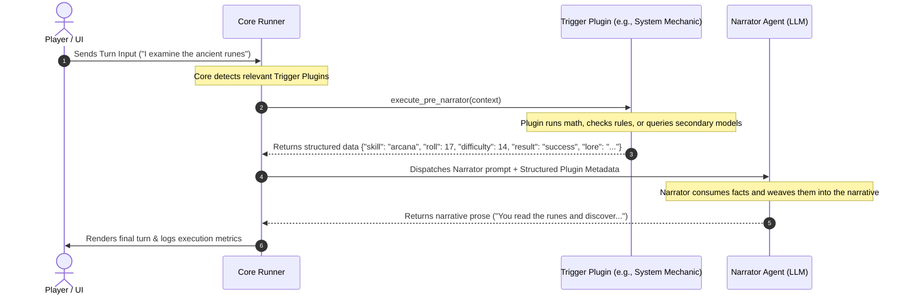

# Supertask 01: Core Plugin System & Agentic Tool Pipeline

**Status:** Planned Conceptual Architecture (Supertask)  
**README evidence:** `README.md:30-43` (Warning on Planned Plugin Refactoring)  
**Replaces:** `explore-plugin-system-task01-task07.md` (Merged)

---

## 1. Stated Goal
Establish a solid, stable, and highly extensible core engine before enabling arbitrary custom mechanics, battle systems, inventory rules, or dice-rolling. Once the core is robust, features will be loaded dynamically via a unified plugin architecture. This keeps the core codebase focused purely on multi-agent orchestration, state persistence, and player agency, while plugins supply the wild and custom dynamics users desire.

---

## 2. Exploration Findings (Architectural Fit)

### 2.1 Capabilities vs. Closed Types
* A strict classification of plugins into only *Trigger* or *Background* is insufficient. RAG memory, for example, is a **Hybrid** requiring both a background embedder and a slash-command query trigger.
* Turn hook cleanup (e.g., Task 01) is a third type: a synchronous transformation hook that runs before human input is added to history.
* Therefore, the plugin system should define **capabilities** (which a plugin can declare) rather than mutually exclusive types:
  1. **Command dispatch** (e.g., `/roll`, `/rag`)
  2. **Synchronous lifecycle hooks** (e.g., `before_turn`, `before_narrator`, `before_character`)
  3. **Background services** (e.g., RAG indexing, long-running processes)

### 2.2 Transactional Boundary & Lock Contention
* `Runner.player_turn` currently holds a single session-wide `asyncio.Lock` across loading state, all LLM calls, mutations, and save operations.
* Synchronous hooks (like input cleanup) running inside this lock will extend the duration of the transaction.
* Background workers must never write directly using a cached state, as they could overwrite newer turns. Background events must re-enter the session lock to append data.

### 2.3 Integration Mismatches (Input Cleanup & UI)
* Raw player input is logged *before* history append. If a hook alters text, the log needs to record both original and effective inputs.
* The frontend optimistically renders the raw input bubble. A hook rewriting text requires the API to return the modified text so the UI can update the bubble.
* Private thoughts must be isolated: hooks should not leak `thought` records to plugins that only need public speech/action.

### 2.4 Command Parsing, State, and Replay
* Slash commands need separate execution paths. If `/roll` is parsed, it shouldn't hit the Narrator until the result is computed.
* Command outputs must integrate cleanly with the history. If `/roll` creates a message, undoing the last turn must handle it cleanly.
* Replay tooling (`replay_session.py`) reconstructs states from `turn_input` markers. Commands must write matching execution inputs to the JSONL log for deterministic replay.
* Plugin state cannot live in `GameState` fields natively. The core needs an explicit plugin state container or sidecar structure, which must be accounted for during session fork and delete.

---

## 3. Proposed Architecture

### 3.1 Plugin Hook Pipeline
Plugins declare capabilities in their `plugin.json` descriptor. The core runner triggers these hooks at critical stages of execution.

### 3.2 Agentic Pre-Narrator Pipeline
Plugins act as system tools executed before the Narrator call. Instead of writing final narrative text, the plugin outputs structured game-state metadata, which the Narrator then translates into fiction.



---

## 4. Plugin Observability & Resource Safety ("Plugins Gastões")

Because plugins run in the same process and can perform secondary LLM calls, they pose performance, timeout, and cost risks. We enforce strict resource observability by appending structured metrics to the debug log (`.debug.jsonl`).

### 4.1 Plugin Execution Log Schema
Every plugin execution writes a metric entry to the session debug log:

```json
{
  "ts": "2026-07-13T11:40:00Z",
  "session_id": "a1b2c3d4",
  "turn_number": 12,
  "agent": "plugin:dice-roller",
  "plugin_metrics": {
    "plugin_id": "dice-roller",
    "version": "1.0.0",
    "type": "trigger",
    "execution_time_ms": 142.5,
    "api_calls": {
      "count": 1,
      "model": "deepseek-v4-flash",
      "prompt_tokens": 150,
      "completion_tokens": 20,
      "total_tokens": 170,
      "cost_usd_estimated": 0.00025
    },
    "resource_usage": {
      "memory_delta_kb": 128,
      "cpu_percent": 0.5
    },
    "status": "success",
    "error": null
  },
  "output": {
    "outcome": "success",
    "roll_result": 18,
    "modifier": 3,
    "final_value": 21
  }
}
```

### 4.2 Resource Safeguards & Core Protections
* **Timeout Enforcements:** Core enforces duration limits (e.g., 5s for triggers) to avoid blocking the main game loop.
* **Secondary LLM Call Limits:** Strict cap on secondary calls per turn to prevent token drainage.
* **Dependency Cycle Protection:** Core constructs a Directed Acyclic Graph (DAG) of plugins at startup to detect and throw errors on circular dependencies (e.g., Plugin A -> Plugin B -> Plugin A).
* **Isolation of Private Thoughts:** Under no circumstances should plugins receive other characters' `thought` records, keeping in line with domain invariants.

---

## 5. Public Plugin Repository & Curation
* **Safety First:** Since user-installed plugins run with application-level system access, a curated public repository is planned.
* **Curated List:** Only peer-reviewed and signed plugins will be listed in the central catalogue to prevent arbitrary file access or secret token leaks (such as API keys).
* **standardized `plugin.json`:** Plugins must declare their metadata, capabilities, and permissions (e.g., network access, storage access, session edit scope).

---

## 6. Open Questions
* **Code Trust:** Is plugin code in `.data/plugins` explicitly trusted, or is process isolation/sandboxing a requirement?
* **Scope:** Are plugins enabled globally, per session, or both?
* **Hook ordering:** If multiple `before_turn` hooks run, is ordering declared or arbitrary?
* **Original Retain:** For input cleanup (Task 01), does the user interface show the raw text, cleaned text, or both?
* **Slash undo:** Does a slash command create an undoable history step or a transient UI-only result?
* **Dice selection:** For `/roll`, is the random seed/value chosen locally (fair/reproducible) or by the LLM (narrated)?
* **Runtimes:** How are user-plugin dependencies installed across uv, Docker, and Android?

---

## 7. Development Steps & Roadmap
1. **Core Polling Transition:** Simplify concurrency by shifting the core runner toward a polling/synchronous loop where applicable, reducing asynchronous lock conflicts.
2. **Plugin Registry & Discovery:** Build the basic loading system in `src/plugins/` to scan for packages with valid `plugin.json` descriptors.
3. **Turn Pipeline Integration:** Add hook hooks (`before_turn`, `before_narrator`, `before_character`) in the runner.
4. **Slash Command Dispatcher:** Add a frontend command bar and backend routing for commands (e.g., `/roll`).
5. **Observability Integration:** Integrate the `plugin_metrics` logger into `.debug.jsonl`.
6. **Curated Public Repository Setup:** Host a repository metadata list for standard community extensions.
