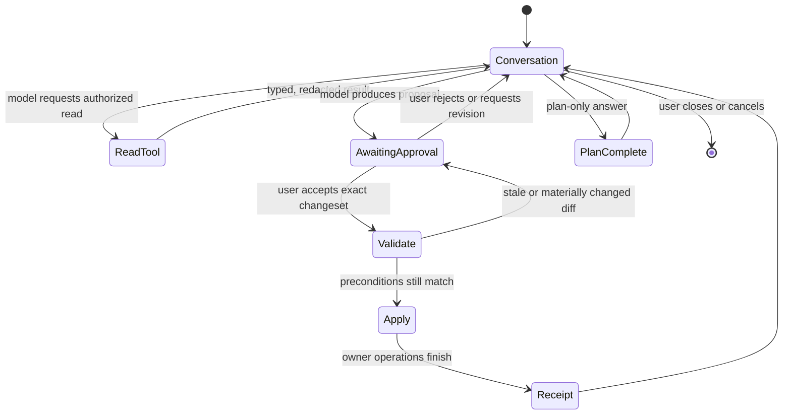

**SUPERTASK 02**

# Alex Tavern Celestial: Agentic Configuration Command Center and General Agent SDK

_Large, deferred architecture exploration for a full-screen configuration assistant and the
reusable plugin capabilities it should force the platform to discover_

| Field | Value |
|---|---|
| Supertask | S02 - Alex Tavern Celestial: Agentic Configuration Command Center and General Agent SDK |
| Status | Open, exploration only |
| Kind | Product vision, architectural investigation, and contract discovery |
| Priority | Deferred; revisit near the end of the current architecture cycle |
| Created | 2026-07-15 |
| Implementation authorized by this document | No |
| Primary repositories | Core checkout, the sibling curated plugin hub for platform contracts, and a dedicated `alex-tavern-celestial` repository for this plugin |
| Depends on | The live plugin contract at the time this exploration resumes |

> [!IMPORTANT]
> **Long-term product intent, not current scope:** this plugin may eventually ship as part of the
> standard/default Alex Tavern experience. S02 does not make it default, bundle it, auto-activate
> it, grant it private APIs, or decide how first-party distribution works. That decision belongs to
> a later implementation and release task after the contracts have stabilized.

> [!IMPORTANT]
> **Dedicated repository decision:** the provisional product/repository name is
> `alex-tavern-celestial`. Its source does not belong under the existing
> `alex-tavern-plugins` repository. Celestial is expected to become the largest and most complex
> first-party plugin, potentially broader than the planned RAG plugin, and it needs independent
> versioning, documentation, tests, CI, releases, issues, and architectural history. The curated
> hub may eventually discover or catalogue pinned Celestial releases, but it must not become a
> second source checkout or a manually synchronized copy. S02 does not create either repository or
> decide the publication integration.

> [!IMPORTANT]
> **This is deliberately a late exploration.** The surrounding architecture is expected to change
> substantially before work starts. The first action when resuming S02 is to re-read `AGENTS.md`,
> all open Supertasks, the live core contract exported through the hub MCP, and the current source.
> Examples and candidate surfaces in this document preserve intent; they are not frozen APIs.

## 1. Product vision

Create a separately maintained plugin, provisionally named **Alex Tavern Celestial**, that opens a
full-screen configuration chatbot from `/chat`. The assistant
uses the application's active model provider and helps the user understand, prepare, and configure
Alex Tavern through natural conversation.

The assistant is more than a one-shot prompt. It is a small, bounded agent runtime with:

- a conversational interface;
- project-specific skills that teach the model how Alex Tavern concepts are configured;
- typed, discoverable read tools and mutation-proposal tools;
- multi-step tool use with explicit budgets and stop conditions;
- a `/plan` workflow that inspects relevant state and prepares a coherent batch of proposed
  changes;
- a visual approval surface, similar in spirit to an agentic coding tool's change approval screen;
- an absolute rule that no proposed mutation is applied without an explicit user acceptance;
- receipts, conflicts, failures, and observability that make every accepted change explainable.

Expected user-facing abilities include, subject to later scope decisions:

- explain settings and guide the user to a valid configuration;
- create or update character presets;
- convert imported character descriptions or cards into canonical presets;
- inspect a scenario, preset, or world configuration and propose a coordinated plan;
- prepare several related changes and present them together for review;
- help configure plugins and Experiences through public contracts;
- expose future capabilities contributed by other plugins without adding a branch for each one.

The existing character-converter plugin is a direct predecessor and integration case. S02 must
investigate whether its functionality should be composed, absorbed, or superseded. The final
architecture must have one owner and one current contract, not duplicated conversion paths or a
legacy compatibility layer.

Celestial is also expected to be a **plugin host**: other plugins can extend Celestial itself with
new skills, resources, tools, workflows, UI contributions, or domain integrations. An extension
that requires Celestial must declare that dependency and compatible version before installation or
activation. The user must receive an actionable dependency notice rather than a silently broken
plugin. This makes S02 a test not only of powerful plugins, but of plugins that expose a stable
extension platform to other plugins.

## 2. Platform thesis

The Command Center is the reference use case, not a privileged exception.

If it requires a global workspace, a full-screen plugin surface, provider-neutral agent calls,
skills, typed tools, long-running operations, changesets, or approval gates, those abilities should
be explored as generic SDK contracts. Other plugins should be able to build comparably ambitious
experiences without editing Alex Tavern's core for every new idea.

The target extensibility test is:

> A capability is not a successful SDK capability merely because the Command Center can use it.
> It must be public, namespaced, machine-readable, lifecycle-safe, observable, and usable by at
> least one conceptually different plugin without a plugin-ID branch in Python, JavaScript, or HTML.

Possible future examples are a campaign builder, lore librarian, provider diagnostic agent,
content migration studio, ruleset workbench, playtest analyst, or Experience composer. These are
extensibility probes, not scope promised by S02.

This thesis does not mean exposing arbitrary core objects as the normal solution. The current
`unsafe` escape remains valid for trusted experiments, but the exploration should identify the
smallest coherent public capabilities that allow unusual products while retaining ownership,
locking, redaction, and audit boundaries.

It also does not mean moving every Celestial extension into the core SDK. The core plugin system
should understand generic dependency, lifecycle, capability-discovery, and service-export
contracts. Celestial should own the domain-specific extension API built on top of them. Satellite
plugins should be able to target Celestial without Alex Tavern core learning their identities or
business logic.

## 3. Non-negotiable invariants

### 3.1 Human approval owns every mutation

- The model may read authorized projections and draft proposed operations.
- The model never directly applies a write.
- Every write requires a visible proposal and an explicit user acceptance.
- Silence, timeout, closing the window, model confidence, previous approval, or a `/plan` result
  never counts as consent.
- Approval applies only to the exact reviewed changeset, identified by content and preconditions.
- If source state changes before application, the proposal becomes stale and must be revalidated
  and shown again when its meaning or diff changes.
- Destructive, secret-bearing, external-network, installation, and provider-switch operations may
  require stronger or separate confirmation even inside an approved batch.
- Rejecting or editing a proposal causes no hidden partial write.

The approval UI must remain core-recognizable and origin-labelled so a trusted plugin panel cannot
silently imitate an official approval and train users to accept ambiguous changes.

### 3.2 Provider and secret ownership remains server-side

- The browser must not call the provider directly or receive an API key.
- The assistant uses the active provider through a server-owned, provider-neutral gateway.
- Provider selection, authentication, timeout, retry, structured-output adaptation, redaction, and
  logging remain with their current owners.
- Secrets are never inserted into the chatbot transcript, skill text, model context, tool output,
  localStorage, plugin journal, or client-side cache.
- Secret values should continue to use dedicated redacted configuration controls. The assistant may
  explain where a secret is needed, but should not ask the user to paste it into chat.

"Simple HTTP calls" means a simple server-side path through the configured provider adapter. It
does not authorize a second provider client in frontend code or provider-specific branches in the
plugin.

### 3.3 Narrative and configuration domains stay separate

- The configuration assistant is not the Narrator, a Character, or the Historian.
- Its transcript and instructions never enter roleplay prompts unless a future, explicit tool
  produces a reviewed configuration artifact that later becomes ordinary canonical input.
- It does not generate speech, thought, or physical action for the controlled character.
- Access to private thoughts, character notes, or hidden session state is denied unless a future
  capability explicitly defines a justified projection and review policy.
- A roleplay session ID must not be invented merely to satisfy an SDK method intended for narrative
  turns.

### 3.4 Core ownership, transactions, and forward-only evolution remain intact

- Tools invoke public domain operations; they do not edit `.data/` files directly.
- Session operations use the session lock. Scenario, preset, config, plugin, and Experience writes
  use the lock and validation owned by those domains.
- Built-in scenarios remain immutable.
- Cross-domain batches must define honest atomicity, conflict, and recovery semantics before they
  can be offered as one approval.
- When a contract changes, producers and consumers move together. Do not preserve abandoned chat,
  plan, skill, tool, or changeset formats through fallback readers.

## 4. Terminology that the exploration must settle

The following names are provisional and must not be treated as an API by implementation tasks:

| Term | Intended meaning |
|---|---|
| Command Center | The user-facing full-screen plugin experience opened by `/chat` |
| Configuration agent | The non-narrative model-driven loop behind the Command Center |
| Agent workspace | A conversation and operation context that is not a `GameState` session |
| Host plugin | A plugin that exposes a versioned extension contract consumed by other plugins |
| Satellite plugin | A normal plugin whose declared dependency and features extend a host plugin such as Celestial |
| Exported service | A namespaced, versioned capability that one plugin intentionally makes available to dependents |
| Skill | Versioned instructional material that teaches the agent how to perform one class of task |
| Resource | A bounded, typed, usually read-only projection made available to the agent |
| Tool | A namespaced typed operation the loop may request |
| Proposal | One or more intended mutations that have not been applied |
| Changeset | A canonical, reviewable representation of exact mutations and preconditions |
| Approval | A user's explicit acceptance of an exact changeset |
| Receipt | The durable result of attempting an approved changeset |
| Plan mode | A conversation mode that investigates and produces a proposal without applying it |

The word "MCP" must be used precisely. The exploration must distinguish among:

1. an actual MCP server and protocol transport;
2. MCP-compatible tool/resource schemas serialized into a provider request;
3. an internal tool registry merely inspired by MCP;
4. the existing authoring and debug MCP servers, which are external development tools.

The model provider does not "speak MCP" merely because a prompt contains tool descriptions. The
final report must name the actual boundary and transport without marketing ambiguity.

## 5. Representative user journeys

### 5.1 Open a global configuration conversation

1. The user invokes `/chat` from the application shell.
2. A full-screen, dismissible plugin workspace opens even if no roleplay session has started.
3. The assistant shows which active provider will be used, what categories it may read, and that
   all changes require approval.
4. The user asks a configuration question.
5. The assistant reads only the required projections and answers or prepares a proposal.

The exploration must decide whether `/chat` remains a slash command, becomes a generic application
action exposed in the slash catalogue, or is one entrypoint into a broader plugin route/workspace
contract. It must not force a fake session-bound command for convenience.

### 5.2 Plan a world or scenario configuration

1. The user opens `/chat` and enters `/plan`, or starts directly through a future `/plan` action.
2. The user selects or names the relevant scenario, character presets, plugin configuration, and
   Experience.
3. The agent inspects typed, redacted snapshots.
4. It explains assumptions and produces a multi-operation changeset.
5. The UI shows per-domain diffs, warnings, conflicts, and the expected effect.
6. Nothing is written until the user accepts the exact proposal.

### 5.3 Convert and save a character

1. The user supplies an unstructured description or supported character card.
2. Imported content is treated as untrusted data, never as instructions for the agent runtime.
3. The conversion produces the canonical `mind`/`body` shape and a preset draft.
4. The user reviews and edits the result.
5. Saving is represented as an explicit create/update changeset with revision preconditions.

This journey must reuse or intentionally replace the semantics of
`dev.alex-tavern.character-converter`; it must not introduce a second silent writer.

### 5.4 Reusable agent capability from another plugin

A separate plugin contributes a skill, read resource, typed proposal tool, or full-screen workspace
through the same SDK. It appears with its own origin, permissions, costs, namespace, and approval
requirements. No `if plugin_id == ...` logic is added to the core or frontend.

This is a required architectural proof, not a promise to ship that second plugin.

## 6. Current-state findings that motivate the exploration

These findings describe the repository on 2026-07-15 and must be refreshed when S02 resumes.

| Area | Current fact | Consequence for S02 |
|---|---|---|
| Slash commands | `src/plugins/commands.py` defines them as session-bound utilities, and `src/main.py:372-380` routes execution through a session ID and Runner lock. | `/chat` cannot honestly be a global command under the current contract. |
| Slash frontend | `src/static/slash-commands.js:198-201` rejects execution when no session exists. | The launcher/action model needs investigation rather than a Command Center special case. |
| Plugin model calls | `src/plugins/sdk.py:79-129` requires `runner`, `game`, a positive `turn_number`, and a session-bound `GameState`. | A global configuration agent needs a different generic execution context or service contract. |
| Provider requests | `src/llm/client.py:100-124` currently sends messages and structured response format, but exposes no generic tool-call loop. | Native tool calls, schema-driven action envelopes, and provider capability adaptation must be compared. |
| Frontend SDK | `src/static/plugin-runtime.js:17-40` offers API access, hooks, mounting into named slots, provider registration, and `unsafe`. | There is no complete public full-screen workspace or route lifecycle yet. |
| Contribution catalogue | `src/plugins/contracts.py` names `routes` and `panels`, but the current generic renderer is implemented only for the narrow `settings` contribution. | Route/panel names must not be mistaken for finished UI contracts. |
| Plugin settings | The current settings contribution supports boolean fields only. | "Configure everything" cannot be reduced to the existing settings descriptor. |
| Character presets | `src/main.py:620-682` exposes create/update/delete operations; preset storage already uses revision conflicts. | Presets are a strong first changeset and optimistic-concurrency case. |
| Scenarios | User scenarios have per-name locking and atomic writes, while built-ins are immutable. | Scenario proposals must use the store owner and need a deliberate conflict/revision story. |
| Runtime config | `src/main.py:595-614` updates config under `RuntimeState.config_lock`, preserves redaction semantics, and swaps the Runner. | Provider/config changes are cross-runtime operations and cannot be generic file writes. |
| Existing converter | The curated converter returns an editable `character_preset_draft` and never writes a preset. | Its draft-first behavior aligns with approval, but integration ownership remains open. |
| MCP | Current debug MCP and hub authoring MCP are external tools. | Their existence does not supply an in-product agent protocol automatically. |
| Plugin trust | Plugins are trusted in-process; permissions are observational review metadata, not enforcement. | Approval UX and context filtering cannot be advertised as a sandbox. |
| Plugin dependencies | `src/plugins/manifest.py:110-128` supports required/optional SemVer dependencies, and `src/plugins/runtime.py:96-137` validates versions and loads dependencies before dependents. | The graph can express that a satellite requires Celestial, but it cannot yet express or broker a typed Celestial extension API. |
| Dependency UX | Missing required dependencies currently disable a plugin during boot; Experience activation installs only the plugins explicitly listed by that Experience. | Installation must preflight, explain, resolve, or block a Celestial dependency before leaving an unusable activation behind. |
| Cross-plugin services | The current SDK exposes core-owned hooks, contributions, commands, and services, but no namespaced service registry owned and exported by one plugin to declared dependents. | Celestial-hosted plugins require a deliberate public contract rather than direct imports, globals, DOM reach-through, or `unsafe`. |

## 7. Central architecture questions

### 7.1 General SDK capabilities

Investigate whether the public plugin platform needs generic contracts for:

- application-level actions that do not require a roleplay session;
- full-screen workspaces/routes with mount, focus, navigation, teardown, and error lifecycles;
- a non-narrative model execution context with provider-owned secrets and observability;
- agent loops with bounded steps, cancellation, streaming progress, and budgets;
- namespaced skill, resource, and tool registration;
- context projection and redaction policies;
- proposal and changeset creation;
- a core-recognizable approval surface;
- one-time application of an exact approved changeset;
- operation receipts and audit events;
- long-running task resumption or deliberate non-resumption;
- plugin-to-plugin capability discovery without implicit privilege inheritance.

For each candidate, determine whether it belongs in core, the browser SDK, the backend SDK, a
shared protocol, or the Command Center plugin itself. "Useful to the plugin" is not sufficient
reason to put a mechanism in core.

### 7.2 Where the agent loop lives

Compare at least these ownership models:

- a loop entirely inside one trusted backend plugin using lower-level public services;
- a generic core-owned loop service configured by plugin-contributed skills and tools;
- a reusable library shipped in the curated hub but not privileged by core;
- a hybrid where core owns provider calls, budgets, approval tokens, and logs while plugins own
  orchestration policy.

The comparison must cover secret handling, provider portability, testability, cancellation,
observability, extension by other plugins, versioning, and the risk of freezing one agent design
too early.

### 7.3 Provider transport and tool use

The current providers have different structured-output capabilities. Investigate:

- native provider tool/function calling;
- a provider-neutral JSON action envelope executed iteratively by the server;
- prompt-serialized MCP-like contracts plus local schema validation;
- capability negotiation and an explicit unsupported-capability failure;
- how tool calls, results, reasoning summaries, and final text are extracted from each response;
- whether the existing `ProviderAdapter` should adapt tool requests and response envelopes;
- retries that never repeat a committed side effect;
- deterministic fixtures for multi-step calls;
- total call, token, cost, time, and tool-step budgets;
- cancellation between steps and during HTTP requests;
- clear user feedback when the configured model cannot run the requested workflow.

Do not solve provider differences with a special narrative prompt or a browser-side provider
branch. Any extension should remain part of the shared provider contract.

### 7.4 Skills

Define what the mini skill system actually is. Questions include:

- Are skills static Markdown instructions, structured manifests, executable modules, or a mix?
- Can a plugin contribute skills to another agent workspace?
- How are IDs, versions, locales, dependencies, ordering, and conflicts represented?
- How does the runtime select the smallest relevant skill set instead of sending every instruction
  on every call?
- Which skill content is trusted, and how is user/scenario/imported content kept out of the
  instruction boundary?
- Can skills declare required tools and resources without automatically gaining access to them?
- How are prompt size, caching, updates, and observability measured?
- Are user-authored skills in scope, or should the first contract accept only reviewed
  plugin-shipped skills?
- How are skill instructions tested against stale field names and evolving schemas?

A skill teaches the agent how to operate; it must not be a hidden permission grant or an
alternative persistence system.

### 7.5 Tools and resources

Explore a machine-readable contract with namespaced IDs, descriptions, strict input/output JSON
Schema, side-effect classification, data sensitivity, cost, timeout, and owning plugin.

At minimum, distinguish:

- read-only inspection;
- local computation with no mutation;
- proposal construction;
- mutation application after approval;
- destructive operations;
- external side effects and network calls.

The safest baseline hypothesis is that the model can invoke reads and build proposals, while an
approval broker applies the exact reviewed changeset. S02 must test that hypothesis against real
workflows rather than silently giving the model a generic write tool.

Questions include:

- Can tools be composed across plugins, and who curates the resulting context?
- Does activating one plugin let it expose another plugin's data or operations?
- How are name collisions, dependency order, version drift, and tool disappearance handled?
- Can a tool return private data that then leaks through the model's final prose?
- How are large resources paged, summarized, or selected?
- How are tool results marked as untrusted data to resist prompt injection?
- Which schemas can be exported to providers, and which remain server-only?
- How are calls logged without persisting secrets or unnecessarily duplicating private content?

### 7.6 Plugins that host other plugins

Celestial introduces a second extension boundary:

```text
Alex Tavern core SDK
        |
        v
Celestial host plugin and its versioned extension API
        |
        +-- Celestial skill plugin
        +-- Celestial tool/integration plugin
        +-- Celestial workflow or UI plugin
```

The core should provide generic mechanics for this relationship without owning Celestial-specific
semantics. The exploration must determine how a plugin can deliberately export services and how a
declared dependent can consume them.

Investigate:

- a namespaced registration and lookup contract for plugin-exported services;
- whether exports are backend, frontend, or paired contracts;
- the difference between load ordering, package dependency, extension-API compatibility, and
  runtime service availability;
- how the dependent proves it declared the host dependency before accessing an export;
- SemVer constraints for the Celestial package and, if necessary, separately versioned extension
  capabilities;
- dependency-first setup and reverse-order teardown;
- what happens when the host fails boot, is disabled, crashes, updates, restarts, or removes an
  export;
- whether optional Celestial integrations can activate later when the host appears;
- how multiple host plugins avoid global service-name collisions;
- how permissions, data projections, model-call budgets, and approvals flow across the boundary
  without being implicitly inherited;
- whether a satellite may contribute skills/tools directly to Celestial or only through an
  explicit Celestial registration service;
- how Celestial validates third-party contributions before including them in an agent context;
- frontend isolation and lifecycle when satellite UI appears inside a Celestial workspace;
- observability that attributes a tool call, cost, failure, and proposal to the satellite that
  contributed it rather than only to the host;
- conformance tests that can run against a Celestial extension API without importing Celestial's
  private modules.

Direct Python imports from another installed plugin's package, module-name guessing, shared
globals, arbitrary DOM queries, and undocumented access through `unsafe` are not acceptable as the
stable extension architecture.

### 7.7 Dependency installation and user communication

A satellite plugin that requires Celestial must declare a required compatible dependency in its
manifest. The exploration must turn that declaration into an end-to-end user experience:

- the catalog and install review show that Celestial is required before any mutation;
- the review shows the exact Celestial release, source, hash, permissions, restart effect, and
  additional dependencies that would be introduced;
- if Celestial is missing, installation either offers an explicit combined dependency review or
  blocks with an actionable explanation;
- dependencies are never silently downloaded or activated merely because the model requested a
  satellite feature;
- an incompatible Celestial version produces a clear upgrade/conflict decision before activation;
- deactivation, uninstall, and downgrade of Celestial warn about or block affected dependents;
- dependency resolution works across separate source repositories and curated catalogs without
  copying source between them;
- cycles, diamond dependencies, conflicting constraints, optional integrations, and unavailable
  repositories have deterministic behavior;
- approval binds the exact dependency closure so the installed graph cannot change after review;
- offline and already-cached behavior remain reproducible by `id/version/hash`.

The existing manifest dependency graph is a starting point, not proof that the complete install,
service-discovery, and failure experience already exists.

## 8. Proposal and approval model

The exploration must define a lifecycle equivalent to the following behavior without committing to
these exact type names:



Required investigation topics:

- canonical operation IDs and stable serialization;
- content hashes or equivalent binding between review and application;
- domain-specific preconditions such as preset revisions and config generations;
- readable before/after diffs for JSON, images, activation sets, and provider changes;
- creation, update, rename, replacement, deletion, and external side-effect semantics;
- partial failure versus all-or-nothing behavior across multiple owners;
- idempotency and duplicate-click protection;
- stale plan detection;
- approval granularity for a whole plan versus individual operations;
- edit-after-proposal behavior;
- warnings for cost, network, privacy, destructive actions, or process restart;
- a receipt that states exactly what changed and what did not;
- accessibility, keyboard navigation, localization, mobile layout, and cancellation.

Approval should authorize an exact result, not grant the agent a reusable permission to improvise
additional writes.

## 9. Data ownership and candidate operation inventory

The exploration must enumerate every readable and mutable object before claiming the assistant can
"configure everything." A starting inventory follows.

| Domain | Candidate reads | Candidate proposals | Important boundary |
|---|---|---|---|
| Runtime/provider config | Redacted public config, adapter fields, validation errors | Non-secret settings and provider selection | Secret entry stays outside chat; provider swap uses `RuntimeState` owner |
| Character presets | List, canonical character, revision, avatar metadata | Create/update/rename/delete, avatar draft | Optimistic revision and media review required |
| User scenarios | List and canonical scenario | Create/update/rename/delete | Per-name lock, immutable built-ins, conflict semantics required |
| Plugins | Inventory, active state, manifest, permissions, public config schema | Configuration or activation proposal | Installation/update/restart is higher risk and may remain out of initial scope |
| Experiences | Installed definitions and ordered plugins | Save or activate proposal | Activation can rebuild environment and restart process |
| Active sessions | Public or explicitly projected state | Possibly no mutations initially | Session locks, agency, private thoughts, undo, and replay invariants |
| Logs and diagnostics | Bounded redacted summaries | No ordinary mutation | Raw prompts can contain private data and are not casual chat context |
| Built-in source content | Read-only schemas/examples when useful | None | Built-ins remain immutable |
| Filesystem/source code | None through a generic config assistant | None | This is not an operating-system coding agent |

For every domain admitted to the product, document:

- authoritative owner;
- read projection;
- sensitivity and redaction;
- validation contract;
- lock and revision strategy;
- proposal operation schema;
- approval presentation;
- application API;
- receipt and audit representation;
- failure and recovery behavior.

## 10. Full-screen plugin workspace and command UX

The frontend investigation should cover a generic contract rather than a hardcoded Command Center
overlay.

Questions include:

- How does a plugin register an application action such as `/chat`?
- Can it open before a roleplay session exists?
- Is a workspace a route, overlay, modal, tab, or declared surface?
- What lifecycle events exist for open, resume, background, close, and plugin deactivation?
- How does browser history/deep linking behave?
- Which application services are injected rather than reached through `unsafe.window`?
- How are plugin identity and trust displayed persistently?
- Which parts of the approval UI must be core-owned?
- How do other plugins contribute tools or skills without mounting arbitrary controls into the
  Command Center's private DOM?
- How are streaming responses, tool activity, cancellations, retries, and stale proposals shown?
- How does `/plan` coexist with slash commands used inside the roleplay composer?
- How does the UI remain usable on desktop and small screens without making Android a plugin
  architecture constraint?

The result should make unusual plugin UIs possible while avoiding globals and per-plugin branches
in `index.html`, `app.js`, or the shared runtime.

## 11. Persistence, privacy, and observability

The configuration agent needs an explicit lifecycle distinct from narrative history.

Investigate:

- whether conversations persist at all by default;
- if persisted, their owner, location under `.data/`, schema, retention, export, deletion, and
  concurrency behavior;
- whether a workspace is global, per browser, per configuration target, or explicitly named;
- how plans and pending approvals survive refresh without being accidentally applicable after
  source state changes;
- how to avoid localStorage for provider configuration, secrets, or sensitive transcripts;
- prompt, response, tool-call, cost, latency, cancellation, and approval audit events;
- redaction rules for imported cards, scenarios, plugin config, private session data, and errors;
- whether a separate agent log is required instead of overloading session `debug.jsonl` or the
  plugin permission journal;
- replay fixtures for multi-step agent loops that do not become a second legacy log format;
- bounded reads and UI disclosure before private data is sent to the configured provider.

There are no invisible model calls. Every call must carry a stable workspace/operation identity and
an agent label suitable for cost and debug inspection even though it is not a narrative turn.

## 12. Character converter integration study

The current curated converter already establishes useful behavior:

- imported content is untrusted;
- output uses canonical `mind`/`body`;
- output is structured and semantically validated;
- the command returns an editable preset draft;
- the plugin never saves automatically.

S02 must compare three forward-only outcomes:

1. the Command Center depends on and invokes a public conversion capability contributed by the
   converter plugin;
2. conversion becomes a generic tool/skill owned by the Command Center and the standalone plugin is
   retired;
3. both products use a smaller shared public capability without duplicating source or runtime
   behavior.

The study must cover ownership in the curated hub, command discoverability, migration of tests and
artifacts, dependency/version behavior, prompt injection defenses, supported file formats, avatar
handling, and what is removed when the new path becomes authoritative. It must not preserve the
old plugin merely as an internal wrapper around the new one.

## 13. Security and failure investigation

At minimum, threat-model:

- prompt injection embedded in scenarios, character cards, lore, plugin descriptions, filenames,
  logs, or tool results;
- a plugin contributing deceptive skill instructions or tool descriptions;
- a plugin spoofing the approval surface;
- model output proposing operations outside its declared tool set;
- secrets copied into chat or reflected by an error;
- unauthorized cross-plugin config reads;
- private roleplay state leaking to the provider;
- stale changesets and time-of-check/time-of-use races;
- partial cross-domain application;
- repeated provider calls or writes after timeout/retry;
- runaway loops, token/cost exhaustion, and cancellation races;
- malicious or oversized tool output;
- plugin deactivation/update while a workspace or approval is pending;
- Experience activation or provider switching that restarts/replaces runtime components;
- approval fatigue caused by vague or excessively fragmented proposals;
- a trusted in-process plugin bypassing contracts through `unsafe`.

The final threat model must be honest that current plugins are trusted code. SDK contracts,
redaction, and user approval improve correctness and reviewability; they do not sandbox a malicious
in-process plugin.

## 14. Generic SDK validation probes

Before freezing any new SDK surface, validate it against the Command Center and at least one
different conceptual plugin. Candidate probes include:

- a provider diagnostic workspace that runs read-only checks and proposes no configuration writes;
- a lore importer that contributes a skill plus resource readers and returns a reviewable artifact;
- a playtest analyst with a long-running cancellable task and a full-screen report;
- an Experience composer that proposes ordered plugin configuration without narrative access.

The second probe may be a contract fixture or disposable prototype rather than a shipped plugin,
but it must exercise the same public SDK. Success means:

- no plugin ID is hardcoded in core or shared frontend modules;
- no private core import is necessary;
- no direct `.data/` write is necessary;
- provider secrets remain hidden;
- lifecycle, cancellation, logs, and failure behavior remain coherent;
- the plugin can declare only the resources and operations it actually needs;
- approvals are provided by the same generic mechanism for equivalent side effects.

Celestial additionally requires a **satellite-plugin probe**. It must be packaged as an ordinary
plugin, declare a compatible Celestial dependency, register at least one useful Celestial extension
through public contracts, and fail cleanly and actionably when the host is absent or incompatible.
This probe is distinct from merely testing another plugin that uses the core agent SDK.

## 15. Relationship to existing work

S02 must be reconciled with, not silently override:

- `.plan/closed/S01-plugin-system.md` - original platform exploration and capability thesis;
- `.plan/tasks/20-slash-command-experience.md` - slash discoverability and plugin migration;
- `.plan/tasks/21-plugin-storage-namespacing.md` - plugin-owned storage boundaries;
- `.plan/tasks/25-secret-handling-behavior.md` - exact secret preservation and redaction behavior;
- `.plan/closed/12-character-converter.md` - current converter ownership and draft behavior;
- `.plan/tasks/16-global-world-lore.md` and `.plan/tasks/06-rag-retrieval.md` - potentially large,
  untrusted context sources that should not become accidental agent memory;
- the current hub documentation and machine-readable `plugin_contract` response.

The exploration must also define the relationship among three repositories without duplicating
ownership:

- the Alex Tavern core repository owns generic plugin/runtime contracts;
- `alex-tavern-plugins` owns its existing curated hub source and platform authoring integration;
- `alex-tavern-celestial` owns Celestial source, its host extension API, tests, documentation, and
  release history.

Whether the curated hub stores only Celestial catalog metadata, fetches a release artifact from the
dedicated repository, mirrors a content-addressed artifact, or uses another verified distribution
boundary remains an exploration question. Celestial source must remain authoritative in exactly
one repository.

If those tasks are completed or replaced before S02 begins, use their resulting source and closed
records rather than preserving assumptions from this document.

## 16. Exploration deliverables

S02 is complete as an exploration only when it produces current, evidence-backed artifacts for all
of the following:

1. **Current-state map:** exact backend, frontend, provider, storage, MCP, and plugin boundaries.
2. **User journey specification:** `/chat`, `/plan`, conversion, proposal review, rejection,
   approval, conflict, cancellation, and failure flows.
3. **Generic SDK capability report:** candidate contracts, ownership, lifecycle, namespacing, and a
   second-plugin validation probe.
4. **Agent-loop study:** ownership alternatives, provider capability matrix, tool transport,
   budgets, cancellation, and deterministic testing.
5. **Skill/resource/tool contract study:** exact terminology, schemas, trust, selection, context
   budgets, and plugin composition rules.
6. **Changeset and approval RFC:** binding, preconditions, diffs, atomicity, idempotency, stale-plan
   behavior, receipts, and core-owned UI boundaries.
7. **Data-operation inventory:** every admitted domain mapped to its real owner, lock, validation,
   redaction, and application API.
8. **Persistence and observability report:** workspace identity, transcript policy, log schema,
   privacy, retention, replay, and cost visibility.
9. **Threat model:** prompt injection, deceptive plugins, data leakage, races, partial failures,
   runaway loops, and the trusted-code limitation.
10. **Character-converter decision:** compose, absorb, or extract a shared capability, including the
    forward-only removal story.
11. **UI contract exploration:** global action registration, full-screen workspace lifecycle,
    origin display, accessibility, localization, and approval presentation.
12. **Decision register:** accepted decisions, rejected alternatives, unresolved questions, and
    evidence for each conclusion.
13. **Hosted-plugin ecosystem report:** exported-service contracts, dependency declaration and
    resolution, lifecycle, compatibility, attribution, permissions, and a satellite-plugin proof.
14. **Repository and distribution report:** ownership across core, hub, and
    `alex-tavern-celestial`; independent CI/releases; content-addressed catalog integration; and no
    duplicated source of truth.
15. **Implementation decomposition:** only after the exploration is accepted, create smaller
    implementation tasks with dependencies and boundary tests. Do not turn this document itself
    into an ever-growing implementation checklist.

The exploration may include wireframes, protocol sketches, throwaway fixtures, or narrowly scoped
prototypes when needed to answer a question. None should become production source by accident.

## 17. Exploration acceptance criteria

- [ ] Work begins with a fresh reading of `AGENTS.md`, open Supertasks, current source, hub docs,
  and the live MCP-exported plugin contract.
- [ ] The report explicitly distinguishes actual MCP transport from MCP-inspired schemas.
- [ ] `/chat` works conceptually without requiring or fabricating a roleplay session.
- [ ] The proposed provider path keeps secrets server-owned and provider-neutral.
- [ ] No model-driven mutation can bypass an exact, visible, explicit approval.
- [ ] Plan mode has a proven no-write path.
- [ ] Every writable domain has an owner, lock/revision rule, validator, diff, precondition, and
  receipt design.
- [ ] Cross-domain partial failure and stale-state behavior are resolved rather than hidden.
- [ ] Imported/user/plugin content is treated as untrusted data in the agent context.
- [ ] Transcript persistence, redaction, retention, and observability are explicitly decided.
- [ ] Character conversion has one forward-only owner with no duplicated runtime path.
- [ ] Any SDK extension is generic and passes a second-plugin validation probe.
- [ ] A satellite plugin can declare, discover, and use a versioned Celestial extension contract
  without private imports, globals, `unsafe`, or a core special case.
- [ ] Missing/incompatible Celestial dependencies are reported before activation with an
  actionable, explicitly reviewed resolution path.
- [ ] Deactivation, update, downgrade, failure, and removal of a host plugin have deterministic
  dependent-plugin behavior.
- [ ] Permissions, costs, tool calls, proposals, and failures remain attributable to the satellite
  that contributed them.
- [ ] Celestial source, tests, docs, CI, and releases have one authoritative home in the dedicated
  `alex-tavern-celestial` repository.
- [ ] Catalog/distribution integration does not copy Celestial source into
  `alex-tavern-plugins`.
- [ ] The full-screen UI requires no Command Center-specific branch in shared core/frontend code.
- [ ] The design does not rely on `unsafe` as its ordinary integration path.
- [ ] Default installation/activation remains a later product decision, not a hidden deliverable.
- [ ] No source implementation, hub publication, Git mutation, or default activation is performed
  as part of this exploration task.

## 18. Non-goals for the exploration

- Implement or publish the plugin now.
- Create the `alex-tavern-celestial` repository now.
- Make the plugin default now.
- Build a general operating-system coding agent, shell executor, or filesystem editor.
- Give the model direct access to provider secrets or raw server configuration.
- Let chat become a secret-entry form.
- Add provider-specific frontend calls or narrative prompts.
- Reuse a roleplay turn number or session log as fake configuration-agent metadata.
- Treat existing `routes` or `panels` contribution labels as a finished workspace API.
- Promise hostile-code isolation for trusted in-process plugins.
- Design around Android while it remains outside the plugin platform scope.
- Preserve obsolete converter, skill, tool, chat, plan, or changeset formats for compatibility.
- Publish, commit, push, change remotes, or mutate the curated hub without separate explicit
  authorization.
- Place Celestial's authoritative source under `alex-tavern-plugins` or maintain synchronized
  source copies in both repositories.

## 19. Questions intentionally left open

- Should the generic agent loop be core-owned, plugin-owned, or split across a broker and plugin
  policy?
- Is an actual in-process/stdio MCP boundary useful here, or is a smaller typed registry the honest
  contract?
- How should providers without native tool calling participate?
- Should skills be a first-class plugin contribution, or private assets interpreted by an agent
  workspace?
- Can plugins contribute tools to another plugin's workspace without creating confused-deputy
  access?
- What is the smallest safe global command/application-action contract?
- Which parts of a full-screen workspace are declared and which are arbitrary plugin UI?
- Who owns the approval screen and exact changeset application?
- Can a cross-domain batch be atomic with current owners, or must it be presented as ordered
  independently approved operations?
- Which data may be sent to a remote active provider, and how does the user see that disclosure?
- Should configuration conversations persist, and for how long?
- What replaces `session_id` and `turn_number` in non-narrative model observability?
- What budgets and cancellation guarantees are portable across providers?
- Which configuration domains belong in the first useful release?
- Should the converter remain independently installable after integration?
- What second-plugin probe best demonstrates that the SDK gained real generality?
- What is the smallest generic service-export/discovery contract required for one plugin to host
  extensions from another?
- Does the Celestial extension API version follow the Celestial package SemVer exactly, or expose
  independently negotiated capability versions?
- How should the installer resolve and review required host plugins across repositories and
  catalogs?
- Should a missing Celestial dependency be installable as one reviewed closure, or should the user
  complete a separate host installation first?
- Which operations on a host plugin must be blocked while active dependents require it?
- How are satellite-contributed skills and tools reviewed, attributed, budgeted, and removed from
  an active Celestial workspace?
- What verified artifact/catalog relationship connects `alex-tavern-celestial` to the curated hub
  without duplicating source ownership?

These questions are the work of S02. They should not be answered by incidental code while another
feature is being implemented.
