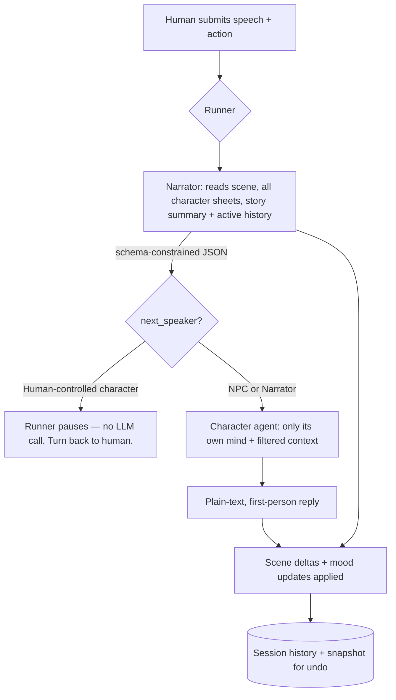

# 🎭 Alex Tavern: A Blind-Narrator Multi-Agent Roleplay Engine

<place_1:banner screenshot or gif of the app running a scene, chat bubbles for Narrator/Character, undo and force-speaker buttons visible>

A multi-agent roleplay system built around one deliberately risky bet: **the Narrator never
knows a human is playing.** A blind game-master agent narrates action and decides who speaks
next, independent Character agents only ever speak or think in first person, and a stateless
FastAPI backend enforces player agency in code instead of in the prompt. It talks to a local
model through llama.cpp and is built as a personal study project in agentic architecture — not
a SillyTavern or character.ai clone (more on that below, it matters a lot for how this codebase
is shaped).

> [!NOTE]
> **Context Compaction is implemented.** A manual action backs up the session, folds older
> turns into a running story summary and per-character notes, and keeps a recent verbatim
> window active. See [Context compaction](#-context-compaction) for the exact behavior and
> restore safeguards.

<place_2:gif of a full turn — player submits an action, narration streams in, a character responds, mood/scene update in the debug panel>

---

## ⚡ Quickstart

To install and run the server locally:

```bash
# Clone the repository
git clone https://github.com/al4xdev/alex-tavern.git
cd alex-tavern

# Install dependencies and generate default config (requires 'uv')
./install.sh

# Start the server (runs on port 8889)
./start.sh
```

Open the gear menu to choose the AI engine and edit its server-owned settings. The install script
creates `.data/config.json`; provider configuration and API keys live only there, never in browser
storage. llama.cpp remains available as a local engine, while DeepSeek uses
`deepseek-v4-flash` with thinking explicitly disabled.

### 💻 Other Operating Systems (Windows / macOS)

Since the project is built in Python and standard web technologies, it is fully cross-platform. If you are on Windows (PowerShell/CMD) or macOS, you can set it up manually:

```powershell
# Install dependencies
uv sync

# Start the server (runs on port 8889)
uv run uvicorn src.main:app --host 0.0.0.0 --port 8889
```

*Note: The server will automatically generate the default `.data/config.json` on its first launch. You can then edit it manually.*

> [!WARNING]
> **Docker Support**: A `Dockerfile` and GitHub Action workflow are available, but they have **not** been heavily tested yet. Use Docker at your own discretion.

---

## 🗺️ How a Turn Flows



A single human action can trigger up to two sequential LLM calls:

1. **Narrator call** — reads the current scene, the full personality and appearance of every
   present character, the running `story_summary` when one exists, and the active history
   (trimmed by an estimated token budget, never by a fixed turn count or by character clipping).
   Before the first manual compaction, that active history is the entire stored history; after
   compaction, it is the retained verbatim window. There's no separate "player input" block;
   the human's last action is just the most recent history entry, rendered under their
   controlled character's name like anyone else's. It answers with grammar-constrained JSON:
   the narration text, who acts next, a context message filtered specifically for that next
   speaker, any physical changes to the scene, and any mood updates (a missing key means
   unchanged, `null` means the fact is removed from the scene entirely).
2. **Character call**, only if the routed speaker is a present, non-human-controlled character.
   Receives its own personality, knowledge, and current mood, the Narrator's filtered context
   message, public speech, and only that Character's own private thoughts. Narration, actions,
   and other Characters' thoughts are excluded. Replies as structured JSON with nullable
   `speech` and `thought` fields; at least one must be populated.

If the routed speaker is the human-controlled character (or forced to be, see
[manual triggers](#-manual-trigger-system-force-speaker--suggestions)), the runner stops after
narration — no character call happens — and the API response tells the frontend it's the
human's turn.

Two smaller, load-bearing details, both confirmed by inspecting real captured prompts rather
than assumed from the builder code:

- **Language is injected at call time, not at prompt-build time.** The language instruction
  (and an instruction to avoid em/en dashes entirely) is appended to the system message inside
  the shared LLM client wrapper, after the narrator/character prompt builders already did their
  work. The "debug preview" of a prompt (built without calling the LLM) is intentionally the
  pre-language version.
- **The two calls are fully independent.** The Character agent re-reads the history itself; it
  isn't handed anything precomputed by the Narrator beyond the one filtered context string.

---

## 🎲 Why a *blind* Narrator

This is the single biggest and riskiest design decision in the project, so it gets its own
section.

Most roleplay LLM tooling in the SillyTavern / character.ai ecosystem carries machinery that
made sense in 2022–2023, when models had 4k of context and were bad at following instructions:
keyword-triggered lorebooks, `{{char}}`/`{{user}}` string substitution, jailbreaks stuffed into
the middle of history, per-character sampler tuning, greeting/example dialogue as a style
crutch, aggressive token budgeting. Today's models — including local ones with far fewer
parameters than a frontier model — are post-trained to act as agents: they follow structured
instructions, emit schema-constrained JSON, and reason over long context reasonably well.

The test applied before adding any mechanism to this codebase:

> Does this exist to compensate for a weak model or a small context window, or does it solve a
> structural problem that exists regardless of how good the model is?

If the answer is "compensates for weakness," it doesn't belong here. Structured output (an
actual JSON schema enforced by grammar-constrained decoding, not prompt-begging plus a regex
parser) and retrieval-augmented generation both survive this test — not because models are
dumb, but because no amount of intelligence lets a model read a ten-million-token corpus in one
shot; that's a data-volume problem, not a model-quality problem. Per-character sampler tuning
does *not* survive it: the newer pattern is pinning temperature near one and controlling
behavior through reasoning effort, not `top_p`/`top_k` tuning per character card.

Given that lens, the design goes one step further than "the Narrator knows who the player is
but keeps it out of the fiction." **No agent, not even the Narrator, ever knows a human exists
at all.**

That's a genuinely risky bet — a blind game master can railroad the player, since it treats the
human-controlled character exactly like every NPC when deciding who speaks or acts next. A
naive implementation would have the LLM write dialogue and action on behalf of the human the
moment its routing logic lands on them, which is a severe agency violation for a roleplay tool.

**The mitigation: player agency lives in code, not in the prompt.** The Narrator stays blind — it
never sees the word "player" in any form, and its `next_speaker` field can only ever be a
character id or `"Narrator"`, never a player token. But the backend runner *does* know which
character id is human-controlled. When the Narrator routes to that character, the runner never
calls the Character agent — it just stops and hands control back to the human.

Storage isn't the same as rendering. Internally, the human's input is still recorded with an
internal marker (`speaker == "Player"`) so undo, tooling, and any future grammar-cleanup
sub-agent can identify it — but a helper function translates that marker into the controlled
character's actual name before it's ever placed into any prompt sent to any LLM. The Narrator's
history literally reads `"Thorn: ..."`, never `"Player: ..."`.

<place_3:screenshot of the debug/observability panel with the raw LLM call log open, showing narrator + character calls for one turn>

This was validated with real conversations against the actual local model, not just unit tests
against a mocked client:

| Validation run | Result |
|---|---|
| 9-turn manual session | Narrator routed to the controlled character twice; runner correctly paused both times instead of generating speech for the human |
| 10-turn manual session | Never triggered the pause condition at all — logged as a coverage gap, not a broken mechanism, since the run simply never exercised the case |
| 5-turn stress run, forced silence (action only, no speech, repeatedly) | Exercised exactly the scenario this mechanism exists for |
| Log scan for the literal string `"Player"` across every audited session, dozens of live LLM calls | **Zero leaks found** |

There's also a planned, currently optional, grammar-cleanup sub-agent: a config flag that would
run the player's raw typed text through a short LLM call that only fixes grammar and style
before it enters the history, specifically so typos or shorthand don't "out" them as the human
inside the fiction. Deliberately left unimplemented until it's actually needed.

---

## 👥 Role Model

| Role | Can | Cannot | Receives in its prompt |
|---|---|---|---|
| **Human player** | Speak, think, and act through three independent inputs | — the human designs the scene at setup time | — |
| **Narrator** | Everything physical: action, description, consequence, scene transitions, and deciding who speaks next | Cannot know which character is human-controlled or read private thoughts | Everything observable about the world: full personality and appearance (the `body`) of every character, the scene, the running public story summary, and the active public history window |
| **Character** | Only speak or think, strictly first person | Cannot narrate, describe environment, or perform/describe physical action, including its own | Only its own mind, private accumulated note, Narrator-filtered context, public speech, and its own prior thoughts |

Two real bugs surfaced through live playtesting rather than being designed in from the start:

- **Characters narrating other characters' body language inside their own marked thoughts.**
  A character's internal thought would read something like "*he grips the hilt of his sword,
  ready for combat*" — an objective physical description of someone else, exactly the kind of
  statement that should only ever come from the Narrator. Subtle, because it technically obeyed
  "wrap thoughts in bold" while violating "characters never narrate." The fix: a thought can
  absolutely be about another character — that's normal — but it must be framed as this
  character's own subjective read, not as objective fact. *"He seems tense"* is fine. *"He grips
  the hilt of his sword"* is not. The first attempt overcorrected (briefly banning any thought
  about someone else's body or actions at all); the constraint is about subjectivity of framing,
  not scope of subject matter.
- **A marked thought losing its bold wrapper entirely**, turning into loose unmarked prose
  sitting between two speech lines, indistinguishable from either.

---

## ⏪ History, Undo, and Mood

Every history record carries a deep copy of the scene state and every character's mood at the
moment it was appended — that snapshot is what makes undo possible without a separate undo log.

All records belonging to a single player turn (human speech, human action, Narrator narration,
Character speech — whichever actually exist for that turn) share one turn number, so undo
always knows exactly which records make up "the last thing that happened" as one atomic unit.
Undo removes every record sharing the highest turn number and restores scene + moods from the
snapshot those records carry.

Validated with a real playtest: forcing another character to speak causes a mood change *and* a
door-state change, and a single undo click correctly restores both while removing every record
of that step — confirmed through the persisted session JSON and through the frontend directly.

<place_4:short gif of the undo button reverting a mood + scene change in one click>

Two frontend bugs were found here worth calling out, since neither was guessable from the
backend alone:

- **Replay duplicated bubbles.** Session reload iterated every record and rendered one chat
  bubble per record, so a turn with separate speech + action records for the human produced two
  duplicate-looking bubbles instead of the single combined bubble used for the live echo (and
  the action bubble lost its icon).
- **Undo desync.** The undo button removed "up to three" DOM bubbles by a fixed guess (player
  bubble, narration, character response) — which desynced the moment a step produced fewer than
  three records (the pause case, or a step with no human speech at all).

Both were fixed the same way: never guess how many bubbles a step produced — always re-render
the visible chat log from the authoritative history array the backend returns, for both session
load and after an undo.

---

## 🎯 Manual Trigger System (force speaker & suggestions)

An earlier version had the Narrator emit a list of selectable options
(`{index, label, description}`) whenever it judged the player needed to make a choice, backed by
a `pending_options` state that paused the session until one was picked. **Removed** — it added
real complexity (a paused session state, a resolver stitching the chosen option's label into the
action text, undo special-casing the paused state) for a feature that mostly duplicated ordinary
Narrator behavior, when a simpler manual mechanism covered the same ground better.

What replaced it, next to the undo button in the UI:

- **Force speaker** — an optional field on the turn request naming a present character id, or
  the Narrator, that overrides whatever `next_speaker` the Narrator actually chose. If the
  forced speaker is the human-controlled character, the runner still pauses instead of
  generating for them — agency is never bypassed by this mechanism.
- **Suggest** — a separate endpoint that asks the (still fully blind) Narrator for three
  candidate `{speech, action}` pairs for the human-controlled character, worded generically
  ("suggest three plausible next moves for C1"), never revealing that character is the human.
  Nothing is persisted by this call; the frontend just fills the input boxes, the human still
  has to press send, so it enters the world through the completely normal path.

<place_5:screenshot of the suggestion popup with three candidate speech/action pairs>

Both validated live in one test turn: asking for a suggestion, picking one, then separately
forcing the non-human character to respond with both input boxes left empty. The forced
response worked correctly, and critically, no history record at all was created for the empty
submission — confirmed by reading the persisted session history directly.

---

## 🔍 Observability: the Raw Sequential LLM Call Log

An earlier debug mechanism embedded exact prompts and raw responses inside each turn's API
response, rendered in a frontend drawer. It worked, but only ever showed one turn at a time, and
required plumbing a debug flag through every layer.

The replacement: since every LLM call already funnels through one unified low-level wrapper,
intercept **once**, right there, for everything. Every actual call to the local model (narration,
character speech, suggestions, summarization) appends one line of JSON to a per-session file,
right before the request would otherwise return — success or failure. Each line carries a
timestamp, session id, turn number, which agent triggered it (`"narrator"`,
`"narrator_suggest"`, `"character:<name>"`, `"summarizer:world"` or
`"summarizer:<name>"`), the full outgoing request (model,
messages, max tokens, response format), and either the response text or the error. This
naturally captures retries too, since the wrapper's own retry loop logs through the same point
on every attempt.

Before that first model call, each turn also appends a `turn_input` marker with the exact speech,
private thought, action, requested `force_speaker`, and validated effective override. Call records include the
attempt number, duration, approximate prompt size, and structured exception type/representation,
so an exception with an empty string still remains diagnosable and new logs can be replayed
without inferring UI actions from the Narrator prompt.

A separate, non-LLM breadcrumb was added later, once it became clear that undo silently changes
mood/scene state with *no* LLM call, which could look indistinguishable from a fresh Narrator
decision when reading the log afterward: a single
`{"agent": "undo", "turn_number": N, "removed_records": K}` line, appended on every undo. It
doesn't reverse or edit anything already logged — the file stays append-only end to end, by
design.

This log has been the primary tool for every real audit performed during development: scanning
every request/response across a whole session for the literal string `"Player"` (zero hits,
every session so far), confirming which turns paused for agency versus triggered a character
call, tracing exactly when a scene fact changed and why, and reconstructing after the fact that
a mood change came from an undo rather than a new decision.

---

## ✍️ Prompt Engineering Notes

A few instruction-level changes made purely from reading real output, validated against the live
model, not from theory:

- **The Narrator was too terse.** Its instruction said "vivid but concise, two to four
  sentences" — that instruction itself was the constraint causing short output, not a token
  budget (max tokens was already generous). Fix: replace the sentence cap with an instruction to
  ground narration in concrete sensory detail — texture, temperature, what specifically catches
  a character's attention — and prefer immersive prose over quick summary. Measured before/after
  on real calls: narration length went from ~200–300 characters to an average of ~700–950
  characters, and the content changed qualitatively (sound, touch, smell, not just stated
  outcomes).
- **Em dashes and en dashes, suppressed project-wide.** The local 30B model leaned heavily on
  the em dash as a stylistic tic. Since the language instruction already injects from one shared
  point regardless of which agent is calling, an instruction to avoid em/en dashes entirely
  (commas, periods, or parentheses instead) was added at that same point, unconditionally — cost
  in tokens is negligible even with a long context window, since it sits near the top of the
  system message. One nuance: Brazilian Portuguese literary convention sometimes opens dialogue
  with an em dash, so characters shift to quotation marks there instead — a style change, not a
  defect.
- **Characters narrating other people's bodies inside thoughts** (see [Role Model](#-role-model))
  turned out to be as much a prompt-engineering fix as a role-model fix: the instruction that
  actually mattered was distinguishing subjective reaction from objective narration, not merely
  "wrap thoughts in bold."

---

## 🧠 Context Compaction

> [!IMPORTANT]
> Compaction is a completed manual MVP. It is not triggered automatically by context usage, and
> its progress bar is a UI estimate rather than measured generation progress.

The starting question was how Anthropic's own tooling actually handles a growing conversation.
Context is treated as a finite resource even with large windows, because attention degrades as
tokens grow (sometimes called *context rot*), so compacting is worth doing well under any hard
limit. Claude Code compacts by discarding old tool outputs first, then summarizing the remaining
conversation (plus a manual `/compact`); the public API has a comparable server-side mechanism
triggered on an input-token threshold. Separately, there's a general pattern of structured note
taking — durable notes kept in external memory, outside the active context window, read back in
only when needed — and a pattern of isolated sub-agents that return only a condensed summary to
whatever coordinates them.

Mapping that onto this project produced one clarifying realization: **this codebase already does
structured note taking without ever calling it that.** Scene facts and every character's current
mood already live outside the prose, in structured state, cheap to keep around indefinitely. So
compaction here is really only about the narrative prose itself — old narration and dialogue —
not the already-durable structured state.

The first draft proposed two live layers recomputed on every prompt: a durable layer (scene,
moods, rolling summary) always present, plus a verbatim recent window, with the full history
always kept intact underneath for undo. That was deliberately simplified: **no layer is
recomputed per call.** Compaction is instead a discrete, manual event:

1. Read `compaction_keep_recent_turns` (8 by default) and count distinct `turn_number` values,
   not individual history records. If the session has at most that many turns, return without
   creating a backup or calling the model.
2. Copy the current session bytes to the next `{session_id}.kb_N.json` before changing the live
   state.
3. Send only the turns older than the retained window to the blind Historian. It receives the
   existing running summary and character notes, sees the human-controlled character by its
   character name rather than `"Player"`, and returns schema-constrained JSON.
4. Replace `story_summary` with the Historian's full rewritten summary, merge only the character
   notes it returned, and replace the live history with the retained verbatim window.
5. Save the compacted state and append a `compact` marker to the session's debug log.

Afterward, the Narrator receives `story_summary` as an optional `STORY SO FAR` section followed
by the active history. A Character receives only its own note as an optional `What you remember`
line, plus speech records from the active history; it never receives another character's note or
the world-level summary.

A consequence accepted explicitly: ordinary turn undo cannot reach past whatever was compacted
away, since those turns are gone from the active history. It continues to work normally for
turns inside the retained window.

Two deliberate constraints remain:

- **No automatic token-threshold trigger** in this first version — only a manual button next to
  the existing undo control, with a deliberately simulated (not measured) progress indicator,
  since real progress tracking would need a streaming architecture judged not worth the
  complexity yet.
- **Per-character notes** (accumulated memory/relationships, distinct from the world-level
  rolling summary) are included from the start, scoped per character the same way personality
  already is — each character only ever sees its own notes, never anyone else's.

<place_6:screenshot of the compact-session button with its progress bar mid-animation>

Summary and notes are wired into the actual prompts: the Narrator's user prompt has an
optional "story so far" section, placed before the current scene, populated only once a
`story_summary` exists. The Character's system prompt gained an optional "what you remember"
line, populated only from that character's own notes — matching the same per-role scoping used
everywhere else in this project.

**Undoing a compaction itself.** A separate action restores the highest-numbered backup, but only
when the live session has no turn newer than that backup. The backend compares their maximum
`turn_number` values and refuses without changing either file if restoration would discard newer
play. On success it copies the backup over the live session and deletes that consumed backup.
The UI asks for confirmation, reloads the restored state, and reports refusals without changing
the visible history. This is deliberately not a merge operation and not an unrestricted undo
stack: older backups can remain after restoring the newest one, but the same safety check may
make them impossible to restore through the UI if the live history is already newer.

---

## 🖥️ Frontend Notes

A handful of issues surfaced purely through actual usage, not code review — none were guessable
from reading the backend alone:

- **Hover popup gap.** The action popup (undo, retry, force speaker, suggest) appeared on hover,
  but an 8px visual gap between the trigger button and the popup meant the mouse left the hover
  area while moving toward it, closing the popup before it could be clicked. Fixed with an
  invisible bridge element covering the gap.
- **Stale service worker cache.** The service worker cached the app shell first, under a cache
  name that was never bumped since creation, so a browser could keep serving an old bundle
  indefinitely even after real fixes landed — including, ironically, some of the fixes in this
  same list. Switched to network-first with a cache fallback, and bumped the cache version once
  to force a clean flush.
- **A visible, but ultimately dead, "your name" field.** Traced every prompt and render path and
  confirmed it was never read anywhere — not by any LLM call, not by any frontend render (the
  name shown anywhere always comes from the controlled character). Removed end to end: model,
  backend, frontend, and the handful of tests that only used it as a convenient mutable string
  unrelated to the actual feature.
- **Typewriter reveal effect.** Narrator and Character messages reveal character-by-character
  based on elapsed time (not frame count), clamped to a sane min/max duration, click-to-skip, and
  respecting `prefers-reduced-motion`. Deliberately left off for the human's own echoed message
  and for history replay — both stay instant.
- **Landing screen.** The app opens on the session list rather than the "start a new adventure"
  setup screen, so continuing an existing session is the default path, with "new session" one
  click away in the same screen's footer.

<place_7:screenshot of the session list landing screen>

Separately, the git history for this repository was rewritten once: every commit message
converted to English, Conventional Commits style, with an AI co-author trailer removed (it had
been added by default and violated this project's own stated preference of not attributing
commits to an assistant). Verified message-only: the final tree hash after rewriting matched the
tree hash before it, byte for byte — no code changed, only commit text.

---

## ⚡ Multi-provider LLM architecture

Alex Tavern supports multiple OpenAI-compatible inference backends without teaching the Runner,
Narrator, Character, Suggestion, or Historian about individual vendors. The integration is split
between a shared client and small provider adapters:

```text
Player turn / suggestion / compaction
                 │
                 ▼
        Runner and role agents
                 │
                 │ provider-neutral messages, limits, schema
                 ▼
          shared LLM client
    ┌────────────┼─────────────────────────────┐
    │            │                             │
    │ retries    │ raw observability log       │ JSON parsing and
    │ timeout    │ without credentials         │ local validation
    │            │                             │
    └────────────┴──────────────┬──────────────┘
                                │
                     ProviderAdapter contract
                    ┌───────────┴───────────┐
                    ▼                       ▼
            LlamaCppAdapter          DeepSeekAdapter
            native json_schema       Bearer authentication
            no required secret       forced non-reasoning mode
            local/network host       json_object adaptation
```

This boundary exists because “OpenAI-compatible” does not mean “identical”. Providers commonly
differ in URL construction, authentication, model requirements, structured-output capabilities,
reasoning controls, defaults, and optional payload fields. Encoding those differences as branches
throughout the agents would make every new provider a cross-cutting feature. Here, those decisions
are registered once in `src/llm/adapters/`.

### Ownership and responsibilities

| Layer | Owns | Deliberately does not own |
|---|---|---|
| Role agents | Prompts, role rules, schemas, and output-token choice | URLs, API keys, vendor payloads |
| Shared LLM client | HTTP execution, timeouts, retries, output policy, and JSON parsing | Provider forms, vendor payloads, response envelopes, debug persistence, or schema implementation |
| Provider adapter | URL, headers, request capability adaptation, response extraction, defaults, secrets, and forced settings | Story logic, persistence, retry policy, or response side effects |
| Schema validator | Supported JSON Schema contract and local output validation | HTTP, retries, prompts, or provider selection |
| Debug log | Concurrent append/read of raw calls and state-operation markers | Provider credentials, HTTP execution, or story state |
| Configuration service | Canonical config validation, atomic writes, redaction, secret preservation, and active-provider resolution | HTTP calls or prompt construction |
| Frontend adapters | Provider cards, fields, secrets, forced UI settings, parsing, and serialization | Server persistence or backend transport rules |

`ProviderAdapter` is a structural Python protocol. An implementation declares metadata and three
operations:

```python
class ProviderAdapter(Protocol):
    name: str
    config_defaults: dict[str, Any]
    secret_fields: tuple[str, ...]
    model_required: bool
    requires_secret_when_active: bool
    forced_settings: dict[str, Any]

    def completion_url(self, api_base: str) -> str: ...
    def headers(self, api_key: str) -> dict[str, str] | None: ...
    def prepare_request(
        self,
        messages: list[dict],
        response_format: dict[str, Any] | None,
        json_schema: dict[str, Any] | None,
        thinking_enabled: bool,
    ) -> PreparedRequest: ...

    def extract_content(self, response: object) -> str: ...
```

The immutable registry is also the backend source of truth for provider identity and
configuration metadata. `src/config.py` derives the supported names, default configuration,
secret handling, model requirements, and forced settings from the registered adapters. This
prevents the transport layer and backend configuration catalog from drifting apart.

The frontend mirrors the same boundary in `src/static/adapters/`. The base adapter renders common
controls and each provider module declaratively owns its card, fields, secret behavior, forced
settings, parsing, and serialization. `index.html` contains only provider containers; it has no
llama.cpp or DeepSeek form markup. The browser modules use explicit ES imports instead of shared
application globals.

### Request lifecycle

A structured Narrator or Historian call follows this path:

1. The agent builds provider-neutral messages and a JSON Schema describing its output contract.
2. `llm_request_options()` projects only the active provider's transport settings into the call.
3. The shared client resolves the adapter and calls `prepare_request()` exactly once.
4. The adapter preserves the semantic contract using the strongest capability supported by that
   provider.
5. The shared client sends the request and asks the adapter to extract content from its declared
   response envelope.
6. `src/llm/schema.py` parses and validates structured output while
   `src/llm/debug_log.py` records complete attempts under a per-session lock.
7. HTTP, parsing, or schema failures are written to the raw debug log and enter the same bounded
   retry path.
8. Only a successfully parsed and validated value reaches the agent and application state.

Character responses use a JSON Schema with nullable `speech` and `thought` fields. Provider
switching does not create separate implementations of Narrator, Character, Suggestion, or
Historian.

The shared `httpx.AsyncClient` intentionally has no provider-bound `base_url`. Every adapter
returns the completion URL for its request. Switching providers therefore does not require
recreating the client, and one provider's host cannot leak into another provider's call.

### Llama.cpp adapter

Llama.cpp remains the default provider and requires no secret. Its adapter:

- builds `<api_base>/chat/completions`;
- sends no authorization header;
- accepts an empty model name, which is useful when the server already owns model selection;
- passes the native OpenAI-style `json_schema` response format through unchanged;
- defaults to `http://localhost:8888/v1` and a 98,304-token configured context.

The adapter works with a local process or a llama.cpp server elsewhere on the network. The API
base belongs to the provider config, not to the global HTTP client.

### DeepSeek adapter and DeepCode reference

The DeepSeek implementation was verified from two independent sources: direct probes against the
configured account and the locally cloned DeepCode client. The DeepCode implementation was used
as a low-level behavioral reference, not copied as a runtime dependency. It confirmed the model
identifier and the provider-specific non-reasoning payload already used by a working client:

```json
{
  "model": "deepseek-v4-flash",
  "thinking": {"type": "disabled"}
}
```

A live model inventory exposed `deepseek-v4-flash` and `deepseek-v4-pro`. Alex Tavern deliberately
selects `deepseek-v4-flash`, and `thinking_enabled` is forced to `false` by both defaults and
validation. A submitted configuration cannot silently enable reasoning for this integration.

Direct compatibility probes established a capability difference:

| Capability | llama.cpp | DeepSeek V4 Flash API |
|---|---:|---:|
| OpenAI-style chat completions | Yes | Yes |
| Bearer API key required | No | Yes |
| `response_format: json_object` | Yes | Yes |
| `response_format: json_schema` | Yes | Rejected by the probed API |
| Explicit thinking control | Not needed here | `thinking.type = disabled` |

DeepSeek returned HTTP 400 for `response_format: json_schema`, so pretending the two APIs are
identical would either break structured calls or weaken application contracts. Instead, the
adapter performs a capability-preserving transformation:

1. Serialize the requested schema compactly into the system instruction.
2. Ask DeepSeek for `response_format: {"type": "json_object"}`.
3. Include `thinking: {"type": "disabled"}`.
4. Authenticate only inside the adapter with `Authorization: Bearer <key>`.
5. Let the shared client parse and validate the returned object locally against the original
   schema.

The local validator covers objects, arrays, primitive and nullable types, enums, constants,
required properties, `additionalProperties`, array bounds, string length/pattern constraints, and
numeric bounds. Unknown types, malformed declarations, references, combinators, and every other
unsupported keyword are rejected before output can be accepted. A future schema feature must
therefore be implemented explicitly; merely placing it in a prompt cannot create false safety.

This fallback was exercised against the real API. Two invalid outputs in the stress suite were
caught: one returned a `next_speaker` outside the allowed enum, and another returned a boolean
where `scene_update` allowed only string or null. Both entered the retry path and neither reached
application state.

### Server-owned configuration and secret handling

There is one canonical configuration file: `.data/config.json`. Provider settings are not split
across environment caches, browser storage, or unrelated files. A representative redacted shape
is:

```json
{
  "active_provider": "llama_cpp",
  "language": "Portuguese",
  "compaction_keep_recent_turns": 8,
  "providers": {
    "llama_cpp": {
      "api_base": "http://localhost:8888/v1",
      "model": "",
      "context_max": 98304,
      "max_tokens_narrator": 2048,
      "max_tokens_character": 1024,
      "summarizer_max_tokens": 1024,
      "llm_timeout_seconds": 60.0
    },
    "deepseek": {
      "api_base": "https://api.deepseek.com",
      "api_key": "<stored only on the server>",
      "model": "deepseek-v4-flash",
      "thinking_enabled": false,
      "context_max": 524288,
      "max_tokens_narrator": 2048,
      "max_tokens_character": 1024,
      "summarizer_max_tokens": 1024,
      "llm_timeout_seconds": 60.0
    }
  }
}
```

Writes use a temporary file, flush and `fsync`, then atomically replace the destination. Invalid
or old config shapes fail explicitly; the loader does not accumulate legacy compatibility layers.
The active provider must have all required secret fields before it can be selected.

The setup modal's **Motor de IA** section calls `GET /config` and `PUT /config`:

- `GET /config` removes every declared secret and returns only `api_key_configured: true/false`;
- leaving the key field blank during `PUT /config` preserves the existing server-side key;
- the frontend never writes provider configuration to localStorage;
- `/config` is network-only in the service worker and cannot be satisfied from the PWA cache;
- raw LLM logs contain provider and host diagnostics but never authorization headers or keys.

The entire `.data/` directory is gitignored and removed from the repository index. Development,
CI/CD, desktop, and packaged runtimes must create and own separate data directories rather than
sharing a checked-in key, session, preset, or debug log.

Built-in presets are immutable application assets under `src/defaults/`. User presets remain
mutable runtime data under `.data/presets/`. Both use the same nested `mind`/`body` character
shape from browser form through API, storage, and Runner; there is no flat legacy conversion path.

### Runtime switching and concurrency

Changing `active_provider` applies to subsequent operations, including existing sessions, because
provider selection is application runtime configuration rather than persisted story state. It
does not rewrite any session.

Configuration, the shared HTTP client, and the active Runner live in an application-scoped
`RuntimeState`, not mutable module globals. `PUT /config` validates and persists the update,
resolves the active provider, and replaces the Runner under the state's runtime lock. This closes
the race where concurrent updates could otherwise leave one config on disk and a different Runner
in memory. An operation already executing keeps its bound Runner; later operations observe the
newly selected provider.

Session turns, suggestions, snapshots, history reads, prompt previews, forks, deletion,
compaction, undo, and restore share the same per-session transaction lock. Delete waits for active
work and removes state, debug log, and backups together. Preset writes/deletes and debug-log
append/reads have their own locks. Lock registries use weak references so completed session or
preset identifiers do not accumulate for the lifetime of the process.

The lock and Runner are process-local. Multi-worker Uvicorn deployment would require a shared
coordination mechanism and is not claimed by this architecture.

### Repeatable provider playtests

`tools/playtest_harness.py` can execute the same scenario set against any configured provider:

```bash
uv run python tools/playtest_harness.py \
  --config-file .data/config.json \
  --provider deepseek \
  --model-label deepseek-v4-flash \
  --language English \
  --context-max 65536 \
  --repeat 2 \
  --max-in-flight 1
```

The key is read from the server-owned config and is never accepted as a command-line argument or
written to the result manifest. For fair A/B work, the harness deliberately overrides experiment
variables such as language, context, token limits, timeout, repetition count, and concurrency
while retaining provider transport, model, and authentication from the selected config.

The initial controlled comparison used four scenarios twice for each provider. DeepSeek was about
25% faster and produced fewer Character action markers, nested physical facts, redundant moods,
and forbidden dashes. It was not a strict model-quality upgrade: under the English suite it used
second-person narration far more often and sometimes let the Narrator write another Character's
actions or dialogue. Provider compatibility is therefore complete, while model/prompt quality
remains an empirical and language-sensitive concern.

### Adding another provider

A third OpenAI-compatible backend should be added as another adapter, not as branches in agents or
the harness:

1. Add the backend adapter under `src/llm/adapters/` and implement `ProviderAdapter`.
2. Declare defaults, secret fields, model requirements, and immutable forced settings on it.
3. Implement URL, authorization headers, and request capability adaptation.
4. Register the adapter in `_ADAPTERS`.
5. Add a declarative frontend adapter under `src/static/adapters/`; do not add provider markup to
   `index.html` or provider branches to `runtime-config.js`.
6. Add tests for redaction, configuration validation, request transformation, and failure paths.
7. Run the same harness scenarios against the existing baseline before judging model quality.

Transport and response-envelope differences end at the adapter. A non-OpenAI response can be
supported by implementing `extract_content()` in its adapter; it does not require conditionals in
the shared client or role agents.

## 🚀 Running It

```bash
source .venv/bin/activate.fish   # fish shell virtual environment
uv run pytest                    # test suite
uv run ruff check                # lint
uv run ruff format               # formatting
uv run mypy src                  # type checking
```

Start the development server:

```bash
./start.sh
```

This runs `uv run uvicorn src.main:app --reload --host 0.0.0.0 --port 8889`. Configuration lives
in `.data/config.json` (gitignored); edit it through the gear menu or directly while the server is
stopped. Presets (character and scene starting points) live under `.data/presets/`.

<place_8:gif of ./start.sh booting and a fresh session being created from a preset>

---

## 🔌 MCP Debugging and Deterministic Replay

Alex Tavern includes a debug-only [Model Context Protocol](https://modelcontextprotocol.io/)
server for external development clients. MCP is deliberately **not** part of the roleplay
pipeline: Narrator, Character, suggestion, and Historian calls still use the same direct
OpenAI-compatible HTTP client. The MCP process sits outside the application and operates its
ordinary HTTP API, exactly as a developer or test driver would.

That boundary is important. The roleplay runtime does not become dependent on MCP, an MCP outage
cannot break a turn, and the model never receives MCP tool definitions in its prompt. MCP is used
where it adds real leverage: letting a coding agent inspect and drive a running application with
typed tools instead of assembling ad hoc `curl` commands.

### Architecture

```text
External MCP client
        |
        | stdio / JSON-RPC
        v
tools/mcp_server.py
        |
        | ordinary HTTP
        +-----------------------> Roleplay API :8889
        |                           Runner, sessions, frontend,
        |                           undo, suggestions, compaction
        |
        +-----------------------> Replay API :8888
                                    recorded output tape,
                                    status, reset, seek

Roleplay agents ----------------> :8888 /v1/chat/completions
                                  (llama.cpp in normal use,
                                   replay_llm.py during replay)
```

The three processes have separate responsibilities:

| Component | Responsibility | Persistent state |
|---|---|---|
| `tools/mcp_server.py` | Translate typed MCP tools into Roleplay or replay HTTP requests | None |
| `src.main:app` | Run the real application, persistence, prompts, and frontend | Session data under `ROLEPLAY_DATA_DIR` |
| `tools/replay_llm.py` | Serve recorded successful LLM responses in strict sequence | Immutable fixture loaded once plus an in-memory cursor |

### Available tools

The server exposes exactly 15 tools. Naming is part of the safety model: inspection is visibly
separate from mutation.

| Read-only tool | Purpose |
|---|---|
| `inspect_api_routes` | Enumerate the live Roleplay OpenAPI operations |
| `inspect_sessions` | List saved sessions and summary metadata |
| `inspect_session_state` | Read a complete serialized session |
| `inspect_session_history` | Read a bounded recent history window |
| `inspect_debug_log` | Read bounded raw LLM/debug records |
| `inspect_replay_status` | Inspect tape size, cursor, remaining entries, and next response metadata |

| Mutating tool | Purpose |
|---|---|
| `mutate_start_session` | Start from a preset or explicit configuration |
| `mutate_fork_session` | Create a non-destructive copy |
| `mutate_submit_turn` | Submit speech/action and optionally force a speaker |
| `mutate_request_suggestions` | Consume a model/replay call to generate three suggestions |
| `mutate_undo_turn` | Undo the latest complete turn |
| `mutate_compact_session` | Summarize older history and retain the configured recent window |
| `mutate_restore_compaction` | Restore a compaction backup when the backend safety check allows it |
| `mutate_reset_replay` | Rewind the replay tape to position zero |
| `mutate_seek_replay` | Move the replay cursor to an absolute position |

Session/preset deletion and retry are intentionally absent. Undo, compaction, and compaction
restore are exposed because they are essential debugging operations, but each call must include
`confirm=true`. MCP's `destructiveHint` annotation remains present for client UIs; the explicit
argument is the server-side gate and does not rely on a particular client honoring the hint.

`inspect_debug_log` deserves the same care as reading a local database. Entries can contain full
system prompts, user-authored dialogue, model responses, timing, and exception details. The tool
is bounded to at most 1,000 records per call, the MCP transport is local stdio, and the default
HTTP targets use `127.0.0.1`. Pointing the process at remote APIs is an explicit CLI choice.

### Running the MCP server

Start the Roleplay application first:

```bash
./start.sh
```

Then register this repository-local process in an MCP client:

```json
{
  "mcpServers": {
    "alex-tavern-debug": {
      "command": "uv",
      "args": ["run", "python", "tools/mcp_server.py"],
      "cwd": "/absolute/path/to/roleplay"
    }
  }
}
```

The defaults are `http://127.0.0.1:8889` for Roleplay and
`http://127.0.0.1:8888` for replay. Both can be changed explicitly:

```bash
uv run python tools/mcp_server.py \
  --roleplay-url http://127.0.0.1:8889 \
  --replay-url http://127.0.0.1:8888
```

Communication with the MCP client uses stdio, so stdout is reserved for protocol messages. The
server owns two shared asynchronous HTTP clients and closes both through the FastMCP lifespan.
Connection failures, timeouts, non-success HTTP responses, and invalid JSON become MCP
`ToolError` results with the service and request identified.

### Deterministic replay without llama.cpp

Every current-format turn writes a `turn_input` marker before its first LLM request. It records
the exact speech, action, requested force-speaker value, and validated effective override. That
marker makes a session reproducible without guessing from prompt text.

Start the fake OpenAI-compatible endpoint with a current debug log:

```bash
uv run python tools/replay_llm.py tests/fixtures/current_replay.debug.jsonl
```

Run the real application on port 8889 with `llm_host` pointing to port 8888, then drive and
compare the complete conversation:

```bash
uv run python tools/replay_session.py tests/fixtures/current_replay.debug.jsonl
```

The driver resets the cursor, starts a real preset session, submits every recorded input, and
requests state immediately after every turn. It rejects a wrong response turn number, missing
history, or a persisted turn that does not match the input just submitted. When the source tape
contains a Historian output it also triggers real compaction, then compares all successful
`{turn_number, agent, response}` records in exact order. Optional source backup/final-state files
enable full structural state comparison in addition to output comparison.

Replay is strict about plain text versus structured output and never silently recycles a tape.
Mismatch and exhaustion return HTTP 409 without advancing the cursor. Reset and seek share the
same asynchronous lock as consumption, so concurrent callers cannot receive the same entry.

Legacy logs without `turn_input` are intentionally rejected. The project does not infer player
inputs or overrides from old Narrator prompts, avoiding a compatibility layer whose output would
only appear exact while silently guessing important routing decisions.

The maintained fixture contains nine turns and one summarizer response. The end-to-end reference
run consumed all ten outputs, observed history after every turn, compacted from 18 to 16 active
records, exhausted the cursor, and reported `matches: true`. More operational commands and the
output schema are documented in [`tools/README.md`](tools/README.md).

---

## 📚 Mapping to Anthropic Agent Literature & Harness Techniques

This section connects the concrete decisions above to publicly documented agent-architecture and
context-engineering concepts — mostly from Anthropic's own published material — both to credit
where the ideas came from and to be explicit about what was adopted, adapted, or deliberately set
aside.

**Structured output over string parsing.** The Narrator's response is constrained by an actual
JSON schema enforced through grammar-constrained decoding at the inference server, not "please
return only JSON" plus a regex parser and a hope. Same underlying idea as tool calling and
structured-output support in modern agent frameworks: the contract between program and model
should be enforced at decode time, not negotiated through instruction-following alone —
especially with a smaller local model where instruction-following is weaker than a frontier
model's.

**Sub-agents with isolated, clean context.** Character and Narrator never share a context window.
The Character receives only a filtered message, public speech, and its own private memory. During
compaction, the world summarizer receives only observable events; separate per-character calls
receive public events plus that Character's thoughts and note. Private thoughts therefore cannot
enter another Character's note or the public story summary through prompt sharing.

**Structured note-taking as durable, external memory.** Scene facts and character mood are
external, structured state that persists cheaply outside the prose, read back in as needed
rather than re-derived from conversation text every time. Same underlying idea as letting an
agent keep notes in files outside its active context window and pull them back in just in time.
Realizing the project was already doing this without naming it is what made the compaction
design above tractable — only the unstructured prose needed a compaction strategy at all.

**Compaction, adapted rather than copied.** The publicly documented approach (Claude Code's own
behavior, and the platform's server-side compaction) summarizes an approaching context limit and
continues from that summary, discarding what came before. This project keeps the same underlying
shape — generate a summary of what's about to fall out of the active window, keep a verbatim
recent window, continue — but trades "recompute automatically as the conversation grows" for a
simpler, manual, one-shot event that physically rewrites the stored session and keeps a numbered
backup of what came before. A conscious simplification for a small personal project, not an
attempt to reproduce a production-grade server-side mechanism locally.

**Retrieval-augmented generation, explicitly deferred, not rejected.** RAG is the one technique
repeatedly reaffirmed as *not* legacy, specifically because the problem it solves (more source
material than any context window can hold at once) doesn't go away as models get smarter or
contexts get longer — it only gets more pressing as content accumulates. Explicit future work,
sequenced deliberately after compaction, matching the general pattern of retrieving identifiers
or data just in time through a tool call rather than front-loading everything into context.

**Tool-result and context editing, judged not applicable.** The documented pattern of clearing
old, already-processed tool call outputs to save context has no clean analog here, since this
project has no bulky tool results to clear in the first place — its closest equivalent is simply
old narration and dialogue, which the compaction mechanism already addresses directly.

**Prompt caching, acknowledged as a future lever, not blocking.** Reusing a stable prefix (system
instructions, rarely changing content) ahead of frequently changing content (the rolling history)
is the standard shape of prompt caching, and a local inference server can reuse a shared prefix
per generation slot similarly. Noted that compaction and context clearing tend to invalidate
whatever changed at or after the point they touch, but explicitly treated as non-blocking for
this project's scope.

**Failing silently, treated as the central operating risk, not an edge case.** Agentic LLM
workflows don't raise exceptions when they misbehave — a field quietly goes unpopulated, an
output format almost-but-not-quite complies, a history entry silently disappears. This project's
answer is procedural rather than architectural: never trust "the tests passed" alone, always
inspect the actual assembled prompt, the actual raw model response, and the actual persisted
state — and where feasible, run a real turn against the real model, not only a mocked one. Less a
technique borrowed from a specific document and more a hard-learned operating discipline that
shaped how every feature above was verified before being called done.

---

## 🛠️ Development Notes

Built across two Claude Code sessions working on the same repository at overlapping times,
coordinating through the owner relaying context back and forth rather than through any automated
handoff. A few recurring situations shaped some of the working conventions above:

- **Uncommitted work collided more than once.** At least one working set of edits was saved via
  `git stash` by one side before the other committed something unrelated, and was recovered
  cleanly afterward. Destructive git operations were treated with real caution throughout: a
  request to "rewrite git history" wasn't carried out until the exact scope was clarified (squash
  vs. message-only rewrite vs. something else), specifically because another session was active
  on the same repository and an uncoordinated rewrite risked a serious collision.
- **Review happened in both directions**, not just top-down. One side reviewed the other's live
  playtest logs and caught a real regression (the duplicated-bubble/undo-desync bug above); the
  other caught a subtle over-correction in a prompt-rule fix before it shipped (the "react to but
  don't narrate others' bodies" nuance), simply by asking "wait, doesn't that also break the
  valid case?"
- **Verification was never "it passed pytest" alone.** The recurring discipline, stated
  explicitly multiple times across both sessions: open the actual persisted session JSON, read
  the actual assembled prompt, and where possible run a real turn against the real local model,
  not only a mocked one — specifically because agentic LLM workflows fail silently.

---

## 🔮 Future Work

**RAG, delivered as a slash-command tool rather than a pipeline change.** RAG itself (see
[Mapping to Anthropic Agent Literature](#-mapping-to-anthropic-agent-literature--harness-techniques))
is still deferred, but the plan for landing it settled on not touching the existing turn
pipeline at all, and on **vector embeddings over a lexical keyword search** — the data volume
per session is small enough that embedding it is cheap, and a vector store buys actual semantic
retrieval instead of exact string matches. An optional (opt-in) vectorization agent runs in the
background while the human is simply reading or playing, not blocking a turn: it watches for
older or already-compacted JSON it hasn't embedded yet and incrementally adds it to that
session's own vector store, so the index stays warm without a dedicated indexing step.

Retrieval itself is deliberately **not "pure RAG"** — raw chunks are never dumped straight into a
prompt. Two separate LLM layers sit between the vector search and the live conversation:

1. **Curation.** An LLM distills whatever the vector search actually returns into clean,
   relevant information, discarding near-duplicate or irrelevant hits.
2. **Message generation.** A second pass turns that curated result into the actual invisible
   context message — matching the same pattern the Narrator already uses for
   `context_for_character` — that exists purely to feed the Character and Narrator prompts. It
   is never shown to the human and never enters the visible chat, only the session's underlying
   JSON/log, alongside everything else in the
   [call log](#-observability-the-raw-sequential-llm-call-log).

Triggered on demand via `/rag <keyword>`, this costs roughly a minute end to end, a fine
tradeoff against keeping everything permanently loaded in the live prompt.

**A general slash-command tool system, not a one-off for RAG.** `/rag` is meant to be the first
instance of a small plugin mechanism, not a special case: a slash-command layer that lets new
tools be registered and invoked on demand, instead of being hardcoded into the turn-assembly
pipeline one `if` at a time. This keeps the core Narrator/Character loop untouched while still
allowing ad hoc capabilities — RAG today, more later — to be bolted on cleanly.
