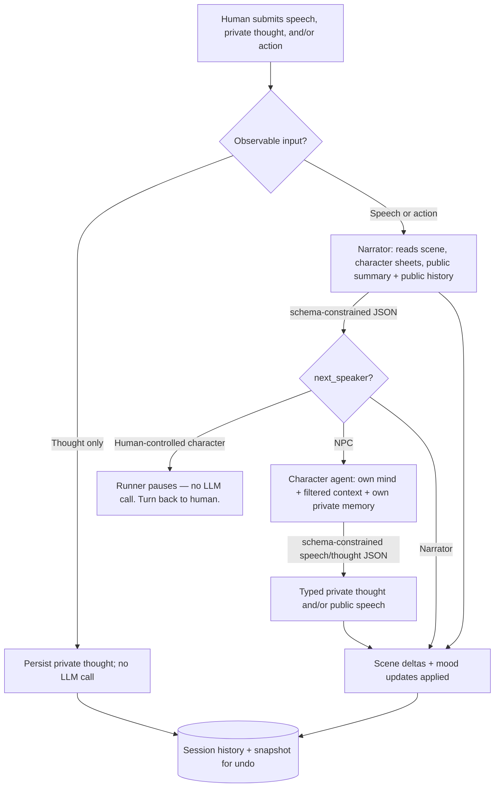

# 🎭 Alex Tavern: A Blind-Narrator Multi-Agent Roleplay Engine

<place_1:banner screenshot or gif of the app running a scene, chat bubbles for Narrator/Character, undo and force-speaker buttons visible>

Alex Tavern is a multi-agent roleplay engine built around a blind Narrator: the game-master model
never knows which character is controlled by a human. The Narrator owns physical reality and
routing, independent Character agents produce only speech and private thought, and a stateless
FastAPI Runner enforces player agency, persistence, and knowledge boundaries. It supports local
llama.cpp inference and the DeepSeek API through provider adapters.

> [!NOTE]
> **Context Compaction is implemented.** A manual action backs up the session, folds older
> turns into a running story summary and per-character notes, and keeps a recent verbatim
> window active. See [Context compaction](#-context-compaction) for the exact behavior and
> restore safeguards.

> [!NOTE]
> **Provider-native prompt caching is verified on both supported backends.** DeepSeek reused
> 3,968 of 4,031 prompt tokens in the controlled repeated-prefix probe; llama.cpp reused 5,456
> of 5,457. Alex Tavern records the provider's real hit/miss counters in the session JSONL.
> See [Verified prompt caching](#-verified-prompt-caching) and the
> [Task 09 evidence](docs/09-prompt-caching.md).

<place_2:gif of a full turn — player submits an action, narration streams in, a character responds, mood/scene update in the debug panel>

---

## ⚡ Quickstart

To install and run the server locally:

```bash
# Clone the repository
git clone https://github.com/al4xdev/alex-tavern.git
cd alex-tavern

# Install dependencies and generate default config (requires 'uv')
./install.sh

# Start the server (runs on port 8889)
./start.sh
```

Open the gear menu to choose the AI engine and edit its server-owned settings. The install script
creates `.data/config.json`; provider configuration and API keys live only there, never in browser
storage. llama.cpp remains available as a local engine, while DeepSeek uses
`deepseek-v4-flash` with thinking explicitly disabled.

### 💻 Other Operating Systems (Windows / macOS)

On systems where the repository shell scripts are unavailable, install and start the application
with `uv` directly:

```powershell
# Install dependencies
uv sync

# Start the server (runs on port 8889)
uv run uvicorn src.main:app --host 0.0.0.0 --port 8889
```

*Note: The server will automatically generate the default `.data/config.json` on its first launch. You can then edit it manually.*

> [!NOTE]
> **Docker Support**: A `Dockerfile` and GitHub Action workflow are available and fully supported. The container runs as a non-root system user (`appuser` with UID/GID 10001) for security. When mounting a volume to `/app/.data`, ensure the host directory has write permissions for UID 10001.

---

## ⚡ Verified prompt caching

Roleplay prompts grow as history accumulates. Alex Tavern orders stable identity and instruction
blocks before frequently changing scene, mood, routing, and private-state blocks, then lets each
inference backend reuse the matching prefix. This is not a response cache: every Narrator and
Character response is generated normally.

The cache belongs to the provider, while the adapters expose a consistent evidence path:

| Backend | Behavior | Provider evidence |
|---|---|---|
| DeepSeek | [Context Caching](https://api-docs.deepseek.com/guides/kv_cache/) is automatic; no application cache key or request flag is required | `usage.prompt_cache_hit_tokens` and `usage.prompt_cache_miss_tokens` |
| llama.cpp | The adapter sends `cache_prompt: true`; the server reuses matching tokens from its [KV/prompt cache](https://github.com/ggml-org/llama.cpp/blob/master/tools/server/README.md) | `usage.prompt_tokens_details.cached_tokens` |

The controlled Task 09 probe used a unique long prefix, one warm call, three identical repeats,
and a negative call that changed the beginning of the prefix:

| Provider | Warm call | Best identical repeat | Changed-prefix control |
|---|---:|---:|---:|
| DeepSeek V4 Flash | 0 / 4,031 cached | 3,968 / 4,031 cached (98.4%) | 0 / 4,032 cached |
| llama.cpp build `b9950-bcde81f10` | 0 / 5,457 cached | 5,456 / 5,457 cached (>99.9%) | 0 / 5,457 cached |

The resulting JSONL is provider-specific under `usage` and normalized under `prompt_cache`.
These are compact excerpts from the real successful repeat calls:

```json
{"agent":"prompt_cache_probe:repeat-1","provider":"deepseek","usage":{"prompt_tokens":4031,"completion_tokens":1,"total_tokens":4032,"prompt_cache_hit_tokens":3968,"prompt_cache_miss_tokens":63},"prompt_cache":{"hit_tokens":3968,"miss_tokens":63}}
```

```json
{"agent":"prompt_cache_probe:repeat-3","provider":"llama_cpp","usage":{"prompt_tokens":5457,"completion_tokens":2,"total_tokens":5459,"prompt_tokens_details":{"cached_tokens":5456}},"prompt_cache":{"hit_tokens":5456,"miss_tokens":1}}
```

Inspect cache behavior across any normal or probe session with:

```bash
jq -c '
  select(.usage != null)
  | {turn_number, agent, provider, usage, prompt_cache, duration_ms}
' .data/sessions/<session-id>.debug.jsonl
```

To reproduce the controlled probes using the provider settings and API key already stored in
`.data/config.json`:

```bash
uv run python -m tools.prompt_cache_probe --provider deepseek
uv run python -m tools.prompt_cache_probe --provider llama_cpp
```

Each command exits successfully only when an identical repeat has a non-zero hit and the changed
early prefix has a smaller hit. The output contains no API key. Full environment, hashes, calls,
timings, limitations, and raw usage objects are preserved in
[the Task 09 evidence](docs/09-prompt-caching.md).

Scene or mood updates, a different forced-speaker constraint, history trimming, and manual
compaction can change an early portion of a prompt. The providers naturally reuse the unchanged
prefix and evaluate the changed suffix; Alex Tavern does not own cache keys and therefore does
not perform manual invalidation. Explicit llama.cpp slot allocation remains deployment-owned and
is not required for correctness.

---

## 🗺️ How a Turn Flows



An observable human turn can trigger up to two sequential LLM calls. A thought-only turn is
persisted privately and stops without calling the Narrator, because there is no public event to
resolve:

1. **Narrator call** — reads the current scene, the full personality and appearance of every
   present character, the running `story_summary` when one exists, and the active history
   (trimmed by an estimated token budget, never by a fixed turn count or by character clipping).
   Before the first manual compaction, that active history is the entire stored history; after
   compaction, it is the retained verbatim window. Private `thought` records are removed before
   token trimming, so they cannot re-enter through the budget path. There's no separate "player
   input" block; public human speech/action records appear under the controlled character's name
   like anyone else's. It answers with grammar-constrained JSON:
   the narration text, who acts next, a context message filtered specifically for that next
   speaker, any physical changes to the scene, and any mood updates (a missing key means
   unchanged, `null` means the fact is removed from the scene entirely).
2. **Character call**, only if the routed speaker is a present, non-human-controlled character.
   Receives its own personality, knowledge, and current mood, the Narrator's filtered context
   message, public speech, and only that Character's own private thoughts. Narration, actions,
   and other Characters' thoughts are excluded. Replies as structured JSON with nullable
   `speech` and `thought` fields; at least one must be populated.

If the routed speaker is the human-controlled character (or forced to be, see
[manual triggers](#-manual-trigger-system-force-speaker--suggestions)), the runner stops after
narration — no character call happens — and the API response tells the frontend it's the
human's turn.

Two details are part of the prompt contract:

- **Language is injected at call time, not at prompt-build time.** The language instruction
  (and an instruction to avoid em/en dashes entirely) is appended to the system message inside
  the shared LLM client wrapper, after the narrator/character prompt builders already did their
  work. The "debug preview" of a prompt (built without calling the LLM) is intentionally the
  pre-language version.
- **The two calls are fully independent.** The Character agent re-reads the history itself; it
  isn't handed anything precomputed by the Narrator beyond the one filtered context string.

---

## 🎲 Why a *blind* Narrator

The blind Narrator is the central design constraint.

Alex Tavern does not emulate a general-purpose character-chat frontend. It uses explicit role
contracts, schema-constrained output, canonical state, and isolated prompts instead of template
substitution, per-character sampler profiles, or implicit narrator/player conventions.

Features are evaluated with one structural rule:

> Does this exist to compensate for a weak model or a small context window, or does it solve a
> structural problem that exists regardless of how good the model is?

Structural mechanisms remain useful independently of model quality. JSON Schema constrains the
program/model boundary, while compaction and future retrieval address finite context volume.

The design goes one step further than "the Narrator knows who the player is
but keeps it out of the fiction." **No agent, not even the Narrator, ever knows a human exists
at all.**

The trade-off is that a blind game master can route to the controlled character, since it treats the
human-controlled character exactly like every NPC when deciding who speaks or acts next. A
fully model-driven implementation could then generate dialogue or action for the human.

**The mitigation: player agency lives in code, not in the prompt.** The Narrator stays blind — it
never sees the word "player" in any form, and its `next_speaker` field can only ever be a
character id or `"Narrator"`, never a player token. But the backend runner *does* know which
character id is human-controlled. When the Narrator routes to that character, the runner never
calls the Character agent — it just stops and hands control back to the human.

Storage isn't the same as rendering. Internally, the human's input is still recorded with an
internal marker (`speaker == "Player"`) so undo and tooling can identify it — but a helper
function translates that marker into the controlled
character's actual name before it's ever placed into any prompt sent to any LLM. The Narrator's
history literally reads `"Thorn: ..."`, never `"Player: ..."`.

The pause behavior and prompt redaction are covered by integration tests and can be inspected in
the per-session debug log. The internal `"Player"` marker is translated before any LLM prompt is
assembled.

<place_3:screenshot of the debug/observability panel with the raw LLM call log open, showing narrator + character calls for one turn>

---

## 👥 Role Model

| Role | Can | Cannot | Receives in its prompt |
|---|---|---|---|
| **Human player** | Speak, think, and act through three independent inputs | — the human designs the scene at setup time | — |
| **Narrator** | Everything physical: action, description, consequence, scene transitions, and deciding who speaks next | Cannot know which character is human-controlled or read private thoughts | Everything observable about the world: full personality and appearance (the `body`) of every character, the scene, the running public story summary, and the active public history window |
| **Character** | Only speak or think, strictly first person | Cannot narrate, describe environment, or perform/describe physical action, including its own | Only its own mind, private accumulated note, Narrator-filtered context, public speech, and its own prior thoughts |

Character output uses the structural contract `{speech: string|null, thought: string|null}`.
Either field may be null, but both cannot be empty. History stores them as separate typed records,
the UI renders `thought` directly, and prompts expose private thoughts only to their owner. Obvious
action-like Character output is rejected once with a corrective retry. When an older session is
loaded, legacy `**thought**` fragments are split idempotently into typed records.

---

## ⏪ History, Undo, and Mood

Every history record carries a deep copy of the scene state and every character's mood at the
moment it was appended — that snapshot is what makes undo possible without a separate undo log.

All records belonging to a single player turn (human speech/thought/action, Narrator narration,
Character thought/speech — whichever actually exist for that turn) share one turn number, so undo
always knows exactly which records make up "the last thing that happened" as one atomic unit.
Undo removes every record sharing the highest turn number and restores scene + moods from the
snapshot those records carry.

Scene and mood restoration use the snapshots stored with the removed turn records, so one undo
reverts the complete step rather than only its visible messages.

<place_4:short gif of the undo button reverting a mood + scene change in one click>

Session load and undo always re-render from the authoritative backend history. Typed speech,
thought, and action records sharing a speaker and turn number are grouped into the same bubble,
without guessing how many visible messages a step produced.

---

## 🎯 Manual Trigger System (force speaker & suggestions)

The action menu next to Send provides two explicit routing controls:

- **Force speaker** — an optional field on the turn request naming a present character id, or
  the Narrator, that overrides whatever `next_speaker` the Narrator actually chose. If the
  forced speaker is the human-controlled character, the runner still pauses instead of
  generating for them — agency is never bypassed by this mechanism.
- **Suggest** — a separate endpoint that asks the (still fully blind) Narrator for three
  candidate `{speech, action}` pairs for the human-controlled character, worded generically
  ("suggest three plausible next moves for C1"), never revealing that character is the human.
  Nothing is persisted by this call; the frontend fills speech/action and clears the private
  thought field, while the human still
  has to press send, so it enters the world through the completely normal path.

<place_5:screenshot of the suggestion popup with three candidate speech/action pairs>

An entirely empty turn is rejected. A force-speaker override is meaningful only with observable
speech or action; a thought-only submission remains private, is persisted as its own undoable
step, and does not cause another character to react to information they cannot know.

---

## 🔍 Two-layer observability

Alex Tavern exposes two complementary inspection layers:

1. **In-app inspection.** Enabling Debug opens a drawer with a bounded rendered view of the
   session log. `Preview do prompt` assembles the next Narrator prompt without calling an LLM;
   `Log` shows actual requests, raw responses, errors, retries, and timing.
2. **Persistent JSONL evidence.** Every session writes an append-only
   `.data/sessions/{session_id}.debug.jsonl`. Each line is one chronological event, suitable for
   command-line inspection, deterministic replay, MCP tools, or analysis by a connected agent.

The JSONL records the exact turn input before the first model call, followed by every real LLM
attempt, raw provider token usage, normalized prompt-cache hit/miss counts, and state-operation
markers such as undo, compaction, and restore. A redacted two-line example looks like this:

```jsonl
{"ts":"2026-07-12T22:02:00Z","session_id":"a1b2c3d4","turn_number":12,"agent":"turn_input","input":{"speech":"Como está, Lyra?","thought":"Ela parece preocupada.","action":"Observo o rosto dela.","force_speaker":"C2"},"effective_force_speaker":"C2"}
{"ts":"2026-07-12T22:02:03Z","session_id":"a1b2c3d4","turn_number":12,"agent":"character:Lyra","provider":"deepseek","model":"deepseek-v4-flash","request":{"messages":[{"role":"system","content":"[full system prompt]"},{"role":"user","content":"[full filtered context]"}],"max_tokens":1024,"response_format":{"type":"json_object"},"provider_options":{"api_base":"https://api.deepseek.com","thinking_enabled":false}},"response":"{\"speech\":\"Estou bem.\",\"thought\":\"Ele parece preocupado.\"}","usage":{"prompt_tokens":604,"completion_tokens":18,"total_tokens":622,"prompt_cache_hit_tokens":512,"prompt_cache_miss_tokens":92},"prompt_cache":{"hit_tokens":512,"miss_tokens":92},"error":null,"error_type":null,"duration_ms":2650.4,"attempt_number":1,"prompt_chars":2418,"prompt_estimated_tokens":604}
```

`session_id`, `turn_number`, append order, and `agent` make the causal chain machine-readable:
input → Narrator decision → Character response → retry/error → state mutation. A connected agent
can call the MCP `inspect_debug_log` tool, compare the JSONL with persisted session state, and
identify whether a problem originated in player input, prompt assembly, provider adaptation,
model output, validation, routing, or undo/compaction. This evidence path is intentionally usable
for root-cause analysis instead of relying on the final chat bubble alone.

Credentials and authorization headers are never written. Prompts, user-authored content, model
responses, provider host, and error details are present, so the file should still be treated as
sensitive session data.

---

## ✍️ Generation constraints

- **Narration favors concrete perception.** The Narrator resolves the latest physical consequence
  first, then grounds prose in sensory detail without a fixed sentence cap.
- **Generated text avoids em/en dashes.** The shared client injects this output policy for every
  agent. Dialogue therefore uses quotation marks even in languages where a dash is conventional.
- **Character thought is subjective, not physical narration.** Prompts distinguish interpretation
  from observable action, while the structured response contract and local validator enforce the
  boundary outside prompt wording.
- **Language policy is centralized.** The configured response language is injected at call time,
  so provider and role-agent implementations do not duplicate it.

---

## 🧠 Context Compaction

> [!IMPORTANT]
> Compaction is a completed manual MVP. It is not triggered automatically by context usage, and
> its progress bar is a UI estimate rather than measured generation progress.

Context is finite even with large model windows. Alex Tavern keeps scene facts and current moods
as durable structured state, while manual compaction condenses old narrative prose into a public
story summary and isolated per-character notes. No layer is recomputed on every prompt;
compaction is a discrete state transition:

1. Read `compaction_keep_recent_turns` (8 by default) and count distinct `turn_number` values,
   not individual history records. If the session has at most that many turns, return without
   creating a backup or calling the model.
2. Copy the current session bytes to the next `{session_id}.kb_N.json` before changing the live
   state.
3. Send only public records older than the retained window to the world summarizer, together with
   the existing public summary. It never receives thoughts or character notes.
4. In parallel, run a smaller private-memory call for each relevant character. Each receives
   public events, that character's existing note, and only that character's thoughts; it cannot
   see another character's thoughts or note.
5. Replace `story_summary`, merge the isolated character notes, and replace live history with the
   retained verbatim window.
6. Save the compacted state and append a `compact` marker to the session's debug log.

In practical terms, one compaction fans out into a public summary plus granular private memories:

```text
Session before compaction
│
├── Old records (everything before the last 8 turns)
│   │
│   ├── Public memory call: world
│   │   ├── receives: previous story_summary
│   │   ├── receives: old speech, action, and narration
│   │   ├── never receives: thoughts or character_notes
│   │   └── writes: new story_summary
│   │
│   ├── Private memory call: Thorn (C1)
│   │   ├── receives: previous character_notes["C1"]
│   │   ├── receives: old public events
│   │   ├── receives: only Thorn's old thoughts
│   │   ├── never receives: Lyra's thoughts/note
│   │   └── writes: new character_notes["C1"]
│   │
│   └── Private memory call: Lyra (C2)
│       ├── receives: previous character_notes["C2"]
│       ├── receives: old public events
│       ├── receives: only Lyra's old thoughts
│       ├── never receives: Thorn's thoughts/note
│       └── writes: new character_notes["C2"]
│
└── Recent records (last 8 distinct turn numbers)
    └── remain verbatim in active history
```

Private calls run concurrently and only for **relevant** characters: a character is relevant when
they own an old record or their name appears in one. If no private call is needed, that character's
existing note remains unchanged. The privacy boundary is deterministic for thoughts: code removes
other characters' thoughts before building each prompt. Public events are not perception-filtered
per character at this layer; the private summarizer receives the public slice and is instructed to
retain only events that character experienced.

Afterward, the Narrator receives `story_summary` as an optional `STORY SO FAR` section followed
by the active history. A Character receives only its own note as an optional `What you remember`
line, plus public speech and its own thought records from active history; it never receives another
character's note/thoughts or the world-level summary.

```text
Next turn after compaction
│
├── Narrator prompt
│   ├── new story_summary
│   ├── current scene and character sheets
│   └── recent public history (thoughts removed before token trimming)
│
├── Lyra Character prompt, when routed as an NPC
│   ├── character_notes["C2"] as "What you remember"
│   ├── Narrator-filtered current perception
│   ├── recent public speech
│   └── only Lyra's recent thoughts
│
└── Thorn, while human-controlled
    ├── character_notes["C1"] remains stored
    └── no Character LLM is called, so the private note stays dormant
```

### Live DeepSeek probe: an event missed while absent

The public-event caveat above was tested directly on 2026-07-12 against the configured
`deepseek-v4-flash` API. The probe called Lyra's real private-memory boundary rather than a mock:

```text
Turn 1: Lyra leaves the tavern hall and cannot see or hear the table
Turn 2: Thorn opens a box; the Narrator reveals a secret royal gold seal
        Thorn says he will hide it before Lyra returns
Turn 3: Lyra returns and asks what she missed
        ↓
Compact exactly those old records into character_notes["C2"]
```

Three independent absent-Lyra calls were compared with one positive control where Lyra knew the
seal. The control retained the seal, confirming that the compacted note could carry the fact.

| Run | Did Lyra's private note retain the missed event? |
|---|---|
| Absent 1 | **Exact leak.** Recorded the royal seal, secret crest, and that Thorn hid it |
| Absent 2 | Withheld the seal, but inferred that something secret happened at the table |
| Absent 3 | Withheld the seal, but inferred that Thorn hid something |
| Present control | Correctly retained the royal seal |

The exact real output from the leaking absent run included:

> Ela saiu para buscar seu cajado e, ao retornar, não percebeu que Thorn abriu uma caixa e
> encontrou um selo real de ouro com o brasão secreto do rei, que ele escondeu antes dela voltar.

So prompt guidance reduced the leak but did not establish a knowledge boundary: the exact hidden
fact leaked in **1/3** absent runs, while some information derived from the missed interval appeared
in **3/3**. Thoughts remain structurally isolated; physical presence does not. A deterministic
presence filter would first require canonical enter/leave state to be updated per history record,
then exclude public records whose snapshots do not include that character before building their
private compaction prompt.

A consequence accepted explicitly: ordinary turn undo cannot reach past whatever was compacted
away, since those turns are gone from the active history. It continues to work normally for
turns inside the retained window.

Current deliberate constraints and known gaps include:

- **No automatic token-threshold trigger** in this first version — only a manual button next to
  the existing undo control, with a deliberately simulated (not measured) progress indicator,
  since real progress tracking would need a streaming architecture judged not worth the
  complexity yet.
- **Per-character notes** (accumulated memory/relationships, distinct from the world-level
  rolling summary) are included from the start, scoped per character the same way personality
  already is — each character only ever sees its own notes, never anyone else's.
- **Presence is not yet a deterministic memory boundary.** Private compactors receive the public
  evicted slice and rely on model judgment about which events the character experienced. The live
  probe above demonstrates why canonical presence tracking is the prerequisite for closing it.

<place_6:screenshot of the compact-session button with its progress bar mid-animation>

Summary and notes are wired into the actual prompts: the Narrator's user prompt has an
optional "story so far" section, placed before the current scene, populated only once a
`story_summary` exists. The Character's system prompt gained an optional "what you remember"
line, populated only from that character's own notes — matching the same per-role scoping used
everywhere else in this project.

**Undoing a compaction itself.** A separate action restores the highest-numbered backup, but only
when the live session has no turn newer than that backup. The backend compares their maximum
`turn_number` values and refuses without changing either file if restoration would discard newer
play. On success it copies the backup over the live session and deletes that consumed backup.
The UI asks for confirmation, reloads the restored state, and reports refusals without changing
the visible history. This is deliberately not a merge operation and not an unrestricted undo
stack: older backups can remain after restoring the newest one, but the same safety check may
make them impossible to restore through the UI if the live history is already newer.

---

## 🖥️ Frontend behavior

The turn composer now has three explicit fields: **speech**, **private thought**, and **physical
action**. They are independent inputs but render as one character bubble: thought first in italic,
then audible speech, then action with its clapper icon. Enter moves focus through the three fields;
submitting from the action field sends the turn. Live responses, session reload, and undo all use
the same typed renderer, so presentation no longer depends on parsing model-authored markdown.

The interface is dependency-free and built from native ES modules. Current behavior includes:

- an action menu for undo, retry, force-speaker, suggestions, compaction, and restore;
- a network-first service worker with cache fallback for the application shell;
- typewriter reveal for Narrator and Character responses, with click-to-skip and
  `prefers-reduced-motion` support;
- instant rendering for player echoes and history replay;
- a session-list landing screen with load, fork, delete, and new-session controls;
- a responsive debug drawer that becomes a full-screen sheet on narrow displays.

<place_7:screenshot of the session list landing screen>

---

## ⚡ Multi-provider LLM architecture

Alex Tavern supports multiple OpenAI-compatible inference backends without teaching the Runner,
Narrator, Character, Suggestion, or Historian about individual vendors. The integration is split
between a shared client and small provider adapters:

```text
Player turn / suggestion / compaction
                 │
                 ▼
        Runner and role agents
                 │
                 │ provider-neutral messages, limits, schema
                 ▼
          shared LLM client
    ┌────────────┼─────────────────────────────┐
    │            │                             │
    │ retries    │ raw observability log       │ JSON parsing and
    │ timeout    │ without credentials         │ local validation
    │            │                             │
    └────────────┴──────────────┬──────────────┘
                                │
                     ProviderAdapter contract
                    ┌───────────┴───────────┐
                    ▼                       ▼
            LlamaCppAdapter          DeepSeekAdapter
            native json_schema       Bearer authentication
            no required secret       forced non-reasoning mode
            local/network host       json_object adaptation
```

This boundary exists because “OpenAI-compatible” does not mean “identical”. Providers commonly
differ in URL construction, authentication, model requirements, structured-output capabilities,
reasoning controls, defaults, and optional payload fields. Encoding those differences as branches
throughout the agents would make every new provider a cross-cutting feature. Here, those decisions
are registered once in `src/llm/adapters/`.

### Ownership and responsibilities

| Layer | Owns | Deliberately does not own |
|---|---|---|
| Role agents | Prompts, role rules, schemas, and output-token choice | URLs, API keys, vendor payloads |
| Shared LLM client | HTTP execution, timeouts, retries, output policy, and JSON parsing | Provider forms, vendor payloads, response envelopes, debug persistence, or schema implementation |
| Provider adapter | URL, headers, request capability adaptation, response extraction, defaults, secrets, and forced settings | Story logic, persistence, retry policy, or response side effects |
| Schema validator | Supported JSON Schema contract and local output validation | HTTP, retries, prompts, or provider selection |
| Debug log | Concurrent append/read of raw calls and state-operation markers | Provider credentials, HTTP execution, or story state |
| Configuration service | Canonical config validation, atomic writes, redaction, secret preservation, and active-provider resolution | HTTP calls or prompt construction |
| Frontend adapters | Provider cards, fields, secrets, forced UI settings, parsing, and serialization | Server persistence or backend transport rules |

`ProviderAdapter` is a structural Python protocol. An implementation declares metadata and four
operations:

```python
class ProviderAdapter(Protocol):
    name: str
    config_defaults: dict[str, Any]
    secret_fields: tuple[str, ...]
    model_required: bool
    requires_secret_when_active: bool
    forced_settings: dict[str, Any]

    def completion_url(self, api_base: str) -> str: ...
    def headers(self, api_key: str) -> dict[str, str] | None: ...
    def prepare_request(
        self,
        messages: list[dict],
        response_format: dict[str, Any] | None,
        json_schema: dict[str, Any] | None,
        thinking_enabled: bool,
    ) -> PreparedRequest: ...

    def extract_response(self, response: object) -> ParsedResponse: ...
```

The immutable registry is also the backend source of truth for provider identity and
configuration metadata. `src/config.py` derives the supported names, default configuration,
secret handling, model requirements, and forced settings from the registered adapters. This
prevents the transport layer and backend configuration catalog from drifting apart.

The frontend mirrors the same boundary in `src/static/adapters/`. The base adapter renders common
controls and each provider module declaratively owns its card, fields, secret behavior, forced
settings, parsing, and serialization. `index.html` contains only provider containers; it has no
llama.cpp or DeepSeek form markup. The browser modules use explicit ES imports instead of shared
application globals.

### Request lifecycle

A structured Narrator or Historian call follows this path:

1. The agent builds provider-neutral messages and a JSON Schema describing its output contract.
2. `llm_request_options()` projects only the active provider's transport settings into the call.
3. The shared client resolves the adapter and calls `prepare_request()` exactly once.
4. The adapter preserves the semantic contract using the strongest capability supported by that
   provider.
5. The shared client sends the request and asks the adapter to extract content, raw token usage,
   and normalized prompt-cache evidence from its declared response envelope.
6. `src/llm/schema.py` parses and validates structured output while
   `src/llm/debug_log.py` records complete attempts under a per-session lock.
7. HTTP, parsing, or schema failures are written to the raw debug log and enter the same bounded
   retry path.
8. Only a successfully parsed and validated value reaches the agent and application state.

Character responses use a JSON Schema with nullable `speech` and `thought` fields. Provider
switching does not create separate implementations of Narrator, Character, Suggestion, or
Historian.

The shared `httpx.AsyncClient` intentionally has no provider-bound `base_url`. Every adapter
returns the completion URL for its request. Switching providers therefore does not require
recreating the client, and one provider's host cannot leak into another provider's call.

### Llama.cpp adapter

Llama.cpp remains the default provider and requires no secret. Its adapter:

- builds `<api_base>/chat/completions`;
- sends no authorization header;
- accepts an empty model name, which is useful when the server already owns model selection;
- passes the native OpenAI-style `json_schema` response format through unchanged;
- sends `cache_prompt: true` and normalizes `prompt_tokens_details.cached_tokens`;
- defaults to `http://localhost:8888/v1` and a 98,304-token configured context.

The adapter works with a local process or a llama.cpp server elsewhere on the network. The API
base belongs to the provider config, not to the global HTTP client.

### DeepSeek compatibility

The adapter contract is based on direct DeepSeek API capability checks. The [DeepCode](https://github.com/lessweb/deepcode-cli/blob/main/RELEASE_en.md) project was
also consulted as an external behavioral reference for the model identifier and provider-specific
non-reasoning payload; it is not copied or included as a runtime dependency:

```json
{
  "model": "deepseek-v4-flash",
  "thinking": {"type": "disabled"}
}
```

Alex Tavern selects `deepseek-v4-flash`, and `thinking_enabled` is forced to `false` by both
defaults and validation. A submitted configuration cannot silently enable reasoning for this
integration.

The supported capability boundary is:

| Capability | llama.cpp | DeepSeek V4 Flash API |
|---|---:|---:|
| OpenAI-style chat completions | Yes | Yes |
| Bearer API key required | No | Yes |
| `response_format: json_object` | Yes | Yes |
| `response_format: json_schema` | Yes | Rejected by the probed API |
| Explicit thinking control | Not needed here | `thinking.type = disabled` |

DeepSeek returned HTTP 400 for `response_format: json_schema`, so pretending the two APIs are
identical would either break structured calls or weaken application contracts. Instead, the
adapter performs a capability-preserving transformation:

1. Serialize the requested schema compactly into the system instruction.
2. Ask DeepSeek for `response_format: {"type": "json_object"}`.
3. Include `thinking: {"type": "disabled"}`.
4. Authenticate only inside the adapter with `Authorization: Bearer <key>`.
5. Let the shared client parse and validate the returned object locally against the original
   schema.

The local validator covers objects, arrays, primitive and nullable types, enums, constants,
required properties, `additionalProperties`, array bounds, string length/pattern constraints, and
numeric bounds. Unknown types, malformed declarations, references, combinators, and every other
unsupported keyword are rejected before output can be accepted. A future schema feature must
therefore be implemented explicitly; merely placing it in a prompt cannot create false safety.

Local schema validation rejects invalid enums and field types before they reach application state;
the same failures enter the bounded retry path used by native-schema providers.

### Server-owned configuration and secret handling

There is one canonical configuration file: `.data/config.json`. Provider settings are not split
across environment caches, browser storage, or unrelated files. A representative redacted shape
is:

```json
{
  "active_provider": "llama_cpp",
  "language": "Portuguese",
  "compaction_keep_recent_turns": 8,
  "providers": {
    "llama_cpp": {
      "api_base": "http://localhost:8888/v1",
      "model": "",
      "context_max": 98304,
      "max_tokens_narrator": 2048,
      "max_tokens_character": 1024,
      "summarizer_max_tokens": 1024,
      "llm_timeout_seconds": 60.0
    },
    "deepseek": {
      "api_base": "https://api.deepseek.com",
      "api_key": "<stored only on the server>",
      "model": "deepseek-v4-flash",
      "thinking_enabled": false,
      "context_max": 524288,
      "max_tokens_narrator": 2048,
      "max_tokens_character": 1024,
      "summarizer_max_tokens": 1024,
      "llm_timeout_seconds": 60.0
    }
  }
}
```

Writes use a temporary file, flush and `fsync`, then atomically replace the destination. Invalid
or old config shapes fail explicitly; the loader does not accumulate legacy compatibility layers.
The active provider must have all required secret fields before it can be selected.

The setup modal's **Motor de IA** section calls `GET /config` and `PUT /config`:

- `GET /config` removes every declared secret and returns only `api_key_configured: true/false`;
- leaving the key field blank during `PUT /config` preserves the existing server-side key;
- the frontend never writes provider configuration to localStorage;
- `/config` is network-only in the service worker and cannot be satisfied from the PWA cache;
- raw LLM logs contain provider and host diagnostics but never authorization headers or keys.

The entire `.data/` directory is gitignored and removed from the repository index. Development,
CI/CD, desktop, and packaged runtimes must create and own separate data directories rather than
sharing a checked-in key, session, preset, or debug log.

Built-in presets are immutable application assets under `src/defaults/`. User presets remain
mutable runtime data under `.data/presets/`. Both use the same nested `mind`/`body` character
shape from browser form through API, storage, and Runner; there is no flat legacy conversion path.

### Runtime switching and concurrency

Changing `active_provider` applies to subsequent operations, including existing sessions, because
provider selection is application runtime configuration rather than persisted story state. It
does not rewrite any session.

Configuration, the shared HTTP client, and the active Runner live in an application-scoped
`RuntimeState`, not mutable module globals. `PUT /config` validates and persists the update,
resolves the active provider, and replaces the Runner under the state's runtime lock. This closes
the race where concurrent updates could otherwise leave one config on disk and a different Runner
in memory. An operation already executing keeps its bound Runner; later operations observe the
newly selected provider.

Session turns, suggestions, snapshots, history reads, prompt previews, forks, deletion,
compaction, undo, and restore share the same per-session transaction lock. Delete waits for active
work and removes state, debug log, and backups together. Preset writes/deletes and debug-log
append/reads have their own locks. Lock registries use weak references so completed session or
preset identifiers do not accumulate for the lifetime of the process.

The lock and Runner are process-local. Multi-worker Uvicorn deployment would require a shared
coordination mechanism and is not claimed by this architecture.

### Repeatable provider playtests

`tools/playtest_harness.py` can execute the same scenario set against any configured provider:

```bash
uv run python tools/playtest_harness.py \
  --config-file .data/config.json \
  --provider deepseek \
  --model-label deepseek-v4-flash \
  --language English \
  --context-max 65536 \
  --repeat 2 \
  --max-in-flight 1
```

The key is read from the server-owned config and is never accepted as a command-line argument or
written to the result manifest. For fair A/B work, the harness deliberately overrides experiment
variables such as language, context, token limits, timeout, repetition count, and concurrency
while retaining provider transport, model, and authentication from the selected config.

In a baseline comparison of four scenarios repeated twice per provider, DeepSeek was about
25% faster and produced fewer Character action markers, nested physical facts, redundant moods,
and forbidden dashes. It was not a strict model-quality upgrade: under the English suite it used
second-person narration far more often and sometimes let the Narrator write another Character's
actions or dialogue. Provider compatibility is therefore complete, while model/prompt quality
remains an empirical and language-sensitive concern.

### Adding another provider

A third OpenAI-compatible backend should be added as another adapter, not as branches in agents or
the harness:

1. Add the backend adapter under `src/llm/adapters/` and implement `ProviderAdapter`.
2. Declare defaults, secret fields, model requirements, and immutable forced settings on it.
3. Implement URL, authorization headers, and request capability adaptation.
4. Register the adapter in `_ADAPTERS`.
5. Add a declarative frontend adapter under `src/static/adapters/`; do not add provider markup to
   `index.html` or provider branches to `runtime-config.js`.
6. Add tests for redaction, configuration validation, request transformation, and failure paths.
7. Run the same harness scenarios against the existing baseline before judging model quality.

Transport and response-envelope differences end at the adapter. A non-OpenAI response can be
supported by implementing `extract_response()` in its adapter; it does not require conditionals
in the shared client or role agents.

## 🚀 Running It

```bash
source .venv/bin/activate.fish   # fish shell virtual environment
uv run pytest                    # test suite
uv run ruff check                # lint
uv run ruff format               # formatting
uv run mypy src                  # type checking
```

Start the development server:

```bash
./start.sh
```

This runs `uv run uvicorn src.main:app --reload --host 0.0.0.0 --port 8889`. Configuration lives
in `.data/config.json` (gitignored); edit it through the gear menu or directly while the server is
stopped. Presets (character and scene starting points) live under `.data/presets/`.

<place_8:gif of ./start.sh booting and a fresh session being created from a preset>

---

## 🔌 MCP Debugging and Deterministic Replay

Alex Tavern includes a debug-only [Model Context Protocol](https://modelcontextprotocol.io/)
server for external development clients. MCP is deliberately **not** part of the roleplay
pipeline: Narrator, Character, suggestion, and Historian calls still use the same direct
OpenAI-compatible HTTP client. The MCP process sits outside the application and operates its
ordinary HTTP API, exactly as a developer or test driver would.

That boundary is important. The roleplay runtime does not become dependent on MCP, an MCP outage
cannot break a turn, and the model never receives MCP tool definitions in its prompt. MCP is used
where it adds real leverage: letting a coding agent inspect and drive a running application with
typed tools instead of assembling ad hoc `curl` commands.

### Architecture

```text
External MCP client
        |
        | stdio / JSON-RPC
        v
tools/mcp_server.py
        |
        | ordinary HTTP
        +-----------------------> Roleplay API :8889
        |                           Runner, sessions, frontend,
        |                           undo, suggestions, compaction
        |
        +-----------------------> Replay API :8888
                                    recorded output tape,
                                    status, reset, seek

Roleplay agents ----------------> :8888 /v1/chat/completions
                                  (llama.cpp in normal use,
                                   replay_llm.py during replay)
```

The three processes have separate responsibilities:

| Component | Responsibility | Persistent state |
|---|---|---|
| `tools/mcp_server.py` | Translate typed MCP tools into Roleplay or replay HTTP requests | None |
| `src.main:app` | Run the real application, persistence, prompts, and frontend | Session data under `ROLEPLAY_DATA_DIR` |
| `tools/replay_llm.py` | Serve recorded successful LLM responses in strict sequence | Immutable fixture loaded once plus an in-memory cursor |

### Available tools

The server exposes exactly 15 tools. Naming is part of the safety model: inspection is visibly
separate from mutation.

| Read-only tool | Purpose |
|---|---|
| `inspect_api_routes` | Enumerate the live Roleplay OpenAPI operations |
| `inspect_sessions` | List saved sessions and summary metadata |
| `inspect_session_state` | Read a complete serialized session |
| `inspect_session_history` | Read a bounded recent history window |
| `inspect_debug_log` | Read bounded raw LLM/debug records |
| `inspect_replay_status` | Inspect tape size, cursor, remaining entries, and next response metadata |

| Mutating tool | Purpose |
|---|---|
| `mutate_start_session` | Start from a preset or explicit configuration |
| `mutate_fork_session` | Create a non-destructive copy |
| `mutate_submit_turn` | Submit speech/thought/action and optionally force a speaker |
| `mutate_request_suggestions` | Consume a model/replay call to generate three suggestions |
| `mutate_undo_turn` | Undo the latest complete turn |
| `mutate_compact_session` | Summarize older history and retain the configured recent window |
| `mutate_restore_compaction` | Restore a compaction backup when the backend safety check allows it |
| `mutate_reset_replay` | Rewind the replay tape to position zero |
| `mutate_seek_replay` | Move the replay cursor to an absolute position |

Session/preset deletion and retry are intentionally absent. Undo, compaction, and compaction
restore are exposed because they are essential debugging operations, but each call must include
`confirm=true`. MCP's `destructiveHint` annotation remains present for client UIs; the explicit
argument is the server-side gate and does not rely on a particular client honoring the hint.

`inspect_debug_log` deserves the same care as reading a local database. Entries can contain full
system prompts, user-authored dialogue, model responses, timing, and exception details. The tool
is bounded to at most 1,000 records per call, the MCP transport is local stdio, and the default
HTTP targets use `127.0.0.1`. Pointing the process at remote APIs is an explicit CLI choice.

### Running the MCP server

Start the Roleplay application first:

```bash
./start.sh
```

Then register this repository-local process in an MCP client:

```json
{
  "mcpServers": {
    "alex-tavern-debug": {
      "command": "uv",
      "args": ["run", "python", "tools/mcp_server.py"],
      "cwd": "/absolute/path/to/roleplay"
    }
  }
}
```

The defaults are `http://127.0.0.1:8889` for Roleplay and
`http://127.0.0.1:8888` for replay. Both can be changed explicitly:

```bash
uv run python tools/mcp_server.py \
  --roleplay-url http://127.0.0.1:8889 \
  --replay-url http://127.0.0.1:8888
```

Communication with the MCP client uses stdio, so stdout is reserved for protocol messages. The
server owns two shared asynchronous HTTP clients and closes both through the FastMCP lifespan.
Connection failures, timeouts, non-success HTTP responses, and invalid JSON become MCP
`ToolError` results with the service and request identified.

### Deterministic replay without llama.cpp

Every current-format turn writes a `turn_input` marker before its first LLM request. It records
the exact speech, private thought, action, requested force-speaker value, and validated effective
override. That
marker makes a session reproducible without guessing from prompt text.

Start the fake OpenAI-compatible endpoint with a current debug log:

```bash
uv run python tools/replay_llm.py tests/fixtures/current_replay.debug.jsonl
```

Run the real application on port 8889 with `llm_host` pointing to port 8888, then drive and
compare the complete conversation:

```bash
uv run python tools/replay_session.py tests/fixtures/current_replay.debug.jsonl
```

The driver resets the cursor, starts a real preset session, submits every recorded input, and
requests state immediately after every turn. It rejects a wrong response turn number, missing
history, or a persisted turn that does not match the input just submitted. When the source tape
contains a Historian output it also triggers real compaction, then compares all successful
`{turn_number, agent, response}` records in exact order. Optional source backup/final-state files
enable full structural state comparison in addition to output comparison.

Replay is strict about plain text versus structured output and never silently recycles a tape.
Mismatch and exhaustion return HTTP 409 without advancing the cursor. Reset and seek share the
same asynchronous lock as consumption, so concurrent callers cannot receive the same entry.

Legacy logs without `turn_input` are intentionally rejected. The project does not infer player
inputs or overrides from old Narrator prompts, avoiding a compatibility layer whose output would
only appear exact while silently guessing important routing decisions.

The checked-in fixture predates structured Character thoughts and partitioned compaction. It
remains useful for parser/replay-cursor regression tests because missing `thought` input defaults
to an empty string, but it is no longer claimed as a current full end-to-end compaction tape. A
new live capture is required before making exact output/state claims for the updated multi-call
compaction flow. More operational commands are documented in [`tools/README.md`](tools/README.md).

---

## 📚 Related agent architecture patterns

The architecture uses several established context-engineering patterns, including structured
output, isolated sub-agents, durable external state, and bounded active context.

**Structured output over string parsing.** Narrator, Character, and compaction responses are
constrained by JSON schemas enforced through grammar-constrained decoding where supported, not
"please return only JSON" plus a regex parser and a hope. Same underlying idea as tool calling and
structured-output support in modern agent frameworks: the contract between program and model
should be enforced at decode time, not negotiated through instruction-following alone —
especially with a smaller local model where instruction-following is weaker than a frontier
model's.

**Sub-agents with isolated, clean context.** Character and Narrator never share a context window.
The Character receives only a filtered message, public speech, and its own private memory. During
compaction, the world summarizer receives only observable events; separate per-character calls
receive public events plus that Character's thoughts and note. Private thoughts therefore cannot
enter another Character's note or the public story summary through prompt sharing.

**Structured note-taking as durable, external memory.** Scene facts and character mood are
external, structured state that persists cheaply outside the prose, read back in as needed
rather than re-derived from conversation text every time. Same underlying idea as letting an
agent keep notes in files outside its active context window and pull them back in just in time.
Only unstructured narrative prose needs compaction; canonical scene and mood state remains durable.

**Compaction.** The general pattern summarizes content approaching a context limit and continues
from that summary. Alex Tavern performs this manually as one transaction: summarize the evicted
window, retain recent turns verbatim, rewrite the session, and preserve a numbered backup.

**Retrieval-augmented generation, explicitly deferred.** RAG addresses source material larger than
any practical context window. It remains future work after compaction, following the same
just-in-time retrieval principle instead of front-loading all data into every prompt.

**Tool-result and context editing.** The pattern of clearing
old, already-processed tool call outputs to save context has no clean analog here, since this
project has no bulky tool results to clear in the first place — its closest equivalent is simply
old narration and dialogue, which the compaction mechanism already addresses directly.

**Prompt caching.** Stable identity and instruction content precedes frequently changing state,
and provider adapters retain the real token counters in JSONL. DeepSeek caching is automatic;
llama.cpp receives `cache_prompt: true`. Compaction changes the rewritten suffix and naturally
causes misses from that point without an application-owned invalidation mechanism. See the
[verified probe and practical examples](#-verified-prompt-caching).

**Silent failure as an operating risk.** Structurally valid output can still be semantically wrong.
Schema validation, persisted state, prompt preview, JSONL evidence, deterministic replay, and live
provider probes provide complementary checks. The observability layers above make these checks
available without changing the turn pipeline.

---

## 🔮 Future Work

**RAG, delivered as a slash-command tool rather than a pipeline change.** RAG itself (see
[Related agent architecture patterns](#-related-agent-architecture-patterns))
is deferred. The proposed design keeps the existing turn pipeline unchanged and uses
**vector embeddings over a lexical keyword search** — the data volume
per session is small enough that embedding it is cheap, and a vector store buys actual semantic
retrieval instead of exact string matches. An optional (opt-in) vectorization agent runs in the
background while the human is simply reading or playing, not blocking a turn: it watches for
older or already-compacted JSON it hasn't embedded yet and incrementally adds it to that
session's own vector store, so the index stays warm without a dedicated indexing step.

Retrieval itself is deliberately **not "pure RAG"** — raw chunks are never dumped straight into a
prompt. Two separate LLM layers sit between the vector search and the live conversation:

1. **Curation.** An LLM distills whatever the vector search actually returns into clean,
   relevant information, discarding near-duplicate or irrelevant hits.
2. **Message generation.** A second pass turns that curated result into the actual invisible
   context message — matching the same pattern the Narrator already uses for
   `context_for_character` — that exists purely to feed the Character and Narrator prompts. It
   is never shown to the human and never enters the visible chat, only the session's underlying
   JSON/log, alongside everything else in the
   [JSONL evidence](#-two-layer-observability).

Retrieval would be triggered on demand via `/rag <keyword>` instead of keeping external material
permanently loaded in the live prompt.

**A general slash-command tool system, not a one-off for RAG.** `/rag` is meant to be the first
instance of a small plugin mechanism, not a special case: a slash-command layer that lets new
tools be registered and invoked on demand, instead of being hardcoded into the turn-assembly
pipeline one `if` at a time. This keeps the core Narrator/Character loop untouched while still
allowing ad hoc capabilities — RAG today, more later — to be bolted on cleanly.
