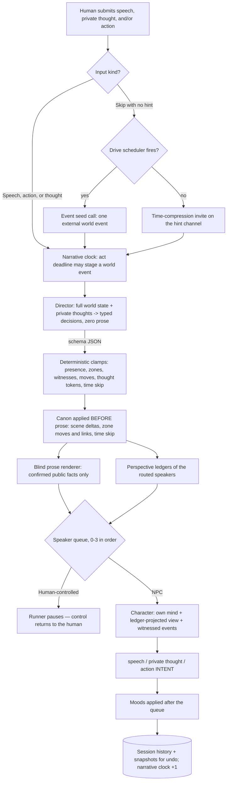

<p align="center">
  
</p>

# 🎭 Alex Tavern: A Blind-Narrator Multi-Agent Roleplay Engine

Alex Tavern is a **rigid multi-agent kernel** for roleplay, built around blind agents: no model
ever knows which character is controlled by a human. A blind **Director** decides what physically
happens as typed events (with deterministic zone/witness clamps), a blind **prose renderer** turns
only confirmed public facts into narration (it never sees minds, thoughts, or even the words
characters spoke), independent **Character** agents produce speech, private thought, and physical
*attempts* (never outcomes), and each character carries a private **perspective ledger** — who they
know, by which name, and what they remember, learned only through events they perceived. A
code-owned **narrative clock** keeps story time moving strictly forward: every committed beat
advances it, act deadlines force scheduled world events when the opt-in roteiro is enabled, and
the Director may compress time on a pass turn but can never stop it. A FastAPI Runner (session state loaded per request under a per-session lock)
enforces player agency, persistence, and the knowledge boundaries (whispers, acoustic zones,
per-viewer identity) as code, not prompt promises. The kernel owns narrative physics; roleplay
mechanics and expansions belong to plugins. It supports local llama.cpp inference and the DeepSeek
API through provider adapters.

> [!NOTE]
> **Context Compaction is implemented.** Manual and opt-in automatic actions fold older turns
> into a running world story summary, keep a recent verbatim window, and append incremental undo
> checkpoints; manual progress is measured over SSE. Per-character memory is NOT part of
> compaction: each character accumulates a private, perception-filtered memory in its
> perspective ledger every turn, and an LLM revision condenses the oldest lines when they grow
> past a threshold (secrets, codes and numbers preserved verbatim). See
> [Context compaction](#-context-compaction) for the exact trigger, privacy, and undo behavior.

> [!NOTE]
> **Provider-native prompt caching is verified on both supported backends.** DeepSeek reused
> 3,968 of 4,031 prompt tokens in the controlled repeated-prefix probe; llama.cpp reused 5,456
> of 5,457. Alex Tavern records the provider's real hit/miss counters in the session JSONL.
> See [Verified prompt caching](#-verified-prompt-caching) and the
> [Task 09 evidence](docs/cases/06-prompt-caching-evidence-2026-07-12.md).

> [!NOTE]
> **Docker and Android builds are available.** The current container image is published as
> `ghcr.io/al4xdev/alex-tavern:latest`. An experimental Android APK is published through GitHub
> Releases as the **Latest Debug APK**. Despite living on the Releases page, the APK is a rough
> debug build for active development, not a production-ready mobile release.

> [!NOTE]
> **Knowledge boundaries are structural, not prompt promises.** Speech and actions can carry an
> `audience` (a whisper) and scenes can carry an **acoustic zone graph**: who perceives a record is
> computed from physics, characters outside it never receive the content in any prompt (live, in
> notes, or in ledgers), and a deterministic output guard blocks a character from leaking a
> whispered secret aloud. Identity is earned: a character addresses a stranger through a
> viewer-relative reference until a name is learned from a perceived event, with provenance
> recorded. Sessions are schema-versioned (`SESSION_SCHEMA_VERSION`): when kernel semantics
> change, old sessions are flagged incompatible and refused instead of migrated — see the
> [memory and confidentiality case studies](docs/cases/README.md).

> [!WARNING]
> **Plugins are trusted code, not sandboxed extensions.** The Plugin Center can activate reviewed,
> fixed-hash packages from the curated hub or install a third-party ZIP. Either kind runs inside the
> Python/browser process and may replace core behavior. Curated means full-source review; installing
> anything else accepts its full risk.

> [!WARNING]
> **Known behavioral limitations (measured, not hidden).** The *structural* guarantees above hold;
> *narrative quality* over long horizons is measured honestly and has real limits — the same
> blind-critic, curl-first method that built the engine also documents where it falls short:
> - **Long-horizon canon consistency is variance-bound, not guaranteed.** A 24-turn counter-canon
>   stress test slips on ~1 single-turn canon family per run (origin refusal, alias recall,
>   promise-through-compaction, …); it is one-turn model noise spread across many independent
>   families, not a single fixable bug, so "clean every run" is a distribution, not a gate. See
>   [case No. 14](docs/cases/14-audible-speech-persistence-wt09-2026-07-20.md).
> - **The opt-in roteiro is scene-dependent.** It reliably improves narrative drive in tight action
>   scenes but is roughly a coin-flip on large procedural/ceremony scenes. OFF by default. See
>   [case No. 11](docs/cases/11-roteiro-drive-scene-stagnation-2026-07-17.md).
> - **Narrator prose can still paraphrase-echo below the dedup guard** (~9% of sentences in a static
>   scene are re-descriptions the exact-match guard does not catch; a purely semantic mitigation is
>   open work).
> - **NPCs can dominate a scene opening.** Assertive characters may pull the first beats toward their
>   own conflict before the player re-asserts.
> - **No public-vs-real persona split for the player character yet** — deliberate bluff/disguise
>   (presenting power you lack, or hiding what you have) is not a first-class mechanic. Backlog.

> [!NOTE]
> **Truth or story — the toggle at the heart of the engine.** The better the character simulation
> gets, the more it *fights* your plot: a coherent agent never splits the party, never opens the
> door, never crosses the rotten bridge. That is correct behavior, not a bug — real people don't
> know a screenplay exists, and left alone they argue about nothing while the story stalls, even
> with the Narrator present. So Alex Tavern treats *"should characters serve the drama?"* as an
> explicit, **warned** choice instead of hiding the railroading. **Free simulation** is true but can
> be dull; the **directed** mode licenses the dramatically productive "bad" choice a real person
> would refuse. The honest mechanism is disposition, not puppetry — alignment pushes what a
> character *feels* (bolder, warier), it never dictates what they *do*, so the agency lock always
> holds. Whoever wants something real has it available; the cost is a quieter story. (The two
> toggles — roteiro on/off and character alignment on/off — are
> [planned work](.plan/tasks/44-roteiro-character-alignment-toggles.md); the disposition substrate
> they ride on is
> [documented here](docs/cases/15-character-disposition-substrate-2026-07-20.md).)

<place_1:gif of a full turn — player submits an action, narration streams in, a character responds, mood/scene update in the debug panel>

---

## ⚡ Quickstart

To install and run the server locally:

```bash
# Clone the repository
git clone https://github.com/al4xdev/alex-tavern.git
cd alex-tavern

# Install dependencies and generate default config (requires 'uv')
./install.sh

# Start the server (runs on port 8889)
./start.sh
```

Open the gear menu to choose the AI engine and edit its server-owned settings. The install script
creates `.data/config.json`; provider configuration and API keys live only there, never in browser
storage. llama.cpp remains available as a local engine, while DeepSeek uses
`deepseek-v4-flash` with thinking explicitly disabled.

The same menu also selects the interface language. English is the default and fallback;
Portuguese browsers start in Portuguese. Changing the interface between `en` and `pt-BR` updates
the visible application immediately and synchronizes the model response language to **English**
or **Brazilian Portuguese** without changing the active session, form contents, or chat history.


### 🐳 Docker

On Linux, the helper script is the shortest path:

```bash
./start_docker.sh
```

It creates or reuses the repository's `.data/` directory, pulls
`ghcr.io/al4xdev/alex-tavern:latest`, replaces an existing `alex-tavern` container, bind-mounts
`.data` at `/app/.data`, and starts the application in the background with host networking. Open
<http://localhost:8889> after it starts. Because the container adopts the current Unix UID/GID,
the mounted files remain owned by the local user.

Windows users only need Docker Desktop and can run the published image directly from PowerShell;
no Python or `uv` installation is required:

```powershell
docker pull ghcr.io/al4xdev/alex-tavern:latest
docker volume create alex-tavern-data
docker run -d --name alex-tavern -p 8889:8889 `
  -v alex-tavern-data:/app/.data --restart unless-stopped `
  ghcr.io/al4xdev/alex-tavern:latest
```

Then open <http://localhost:8889>. The named volume preserves configuration, scenarios, sessions,
and debug logs when the container is replaced. To update an existing installation, pull the new
image, run `docker rm -f alex-tavern`, and execute the `docker run` command again. When a Windows
container must reach llama.cpp running on the host, use
`http://host.docker.internal:<port>/v1` as its API base.

### 🤖 Experimental Android APK

Download `app-debug.apk` from the
[Latest Debug APK release](https://github.com/al4xdev/alex-tavern/releases/tag/latest) and
sideload it on Android 7.0 or newer. Android may require permission to install apps from the
browser or file manager used to open the APK.

The APK bundles the web interface and runs the FastAPI backend locally inside the application.
It does **not** bundle an LLM: configure DeepSeek or a llama.cpp server reachable from the phone
through the gear menu. The Android build is currently rough and may contain platform-specific
problems; it is intentionally labeled a debug APK even though CI publishes it on the Releases
page. Every push to `master` rebuilds the APK and replaces the `latest` prerelease, while `v*`
tags create matching prereleases.

### 💻 Other Operating Systems (Windows / macOS)

On systems where the repository shell scripts are unavailable, install and start the application
with `uv` directly:

```powershell
# Install dependencies
uv sync

# Start the server (runs on port 8889)
uv run python -m src.supervisor --host 0.0.0.0 --port 8889
```

*Note: The server automatically generates `.data/config.json` on first launch. The gear menu is
the preferred editor; manual edits should be made only while the server is stopped.*

---

## ⚡ Verified prompt caching

Roleplay prompts grow as history accumulates. Alex Tavern orders stable identity and instruction
blocks before frequently changing scene, mood, routing, and private-state blocks, then lets each
inference backend reuse the matching prefix. This is not a response cache: every Narrator and
Character response is generated normally.

The cache belongs to the provider, while the adapters expose a consistent evidence path:

| Backend | Behavior | Provider evidence |
|---|---|---|
| DeepSeek | [Context Caching](https://api-docs.deepseek.com/guides/kv_cache/) is automatic; no application cache key or request flag is required | `usage.prompt_cache_hit_tokens` and `usage.prompt_cache_miss_tokens` |
| llama.cpp | The adapter sends `cache_prompt: true`; the server reuses matching tokens from its [KV/prompt cache](https://github.com/ggml-org/llama.cpp/blob/master/tools/server/README.md) | `usage.prompt_tokens_details.cached_tokens` |

The controlled Task 09 probe used a unique long prefix, one warm call, three identical repeats,
and a negative call that changed the beginning of the prefix:

| Provider | Warm call | Best identical repeat | Changed-prefix control |
|---|---:|---:|---:|
| DeepSeek V4 Flash | 0 / 4,031 cached | 3,968 / 4,031 cached (98.4%) | 0 / 4,032 cached |
| llama.cpp build `b9950-bcde81f10` | 0 / 5,457 cached | 5,456 / 5,457 cached (>99.9%) | 0 / 5,457 cached |

The resulting JSONL is provider-specific under `usage` and normalized under `prompt_cache`.
These are compact excerpts from the real successful repeat calls:

```json
{"agent":"prompt_cache_probe:repeat-1","provider":"deepseek","usage":{"prompt_tokens":4031,"completion_tokens":1,"total_tokens":4032,"prompt_cache_hit_tokens":3968,"prompt_cache_miss_tokens":63},"prompt_cache":{"hit_tokens":3968,"miss_tokens":63}}
```

```json
{"agent":"prompt_cache_probe:repeat-3","provider":"llama_cpp","usage":{"prompt_tokens":5457,"completion_tokens":2,"total_tokens":5459,"prompt_tokens_details":{"cached_tokens":5456}},"prompt_cache":{"hit_tokens":5456,"miss_tokens":1}}
```

Inspect cache behavior across any normal or probe session with:

```bash
jq -c '
  select(.usage != null)
  | {turn_number, agent, provider, usage, prompt_cache, duration_ms}
' .data/sessions/<session-id>/debug.jsonl
```

To reproduce the controlled probes using the provider settings and API key already stored in
`.data/config.json`:

```bash
uv run python -m tools.prompt_cache_probe --provider deepseek
uv run python -m tools.prompt_cache_probe --provider llama_cpp
```

Each command exits successfully only when an identical repeat has a non-zero hit and the changed
early prefix has a smaller hit. The output contains no API key. Full environment, hashes, calls,
timings, limitations, and raw usage objects are preserved in
[the Task 09 evidence](docs/cases/06-prompt-caching-evidence-2026-07-12.md).

Scene or mood updates, a different forced-speaker constraint, history trimming, and manual
compaction can change an early portion of a prompt. The providers naturally reuse the unchanged
prefix and evaluate the changed suffix; Alex Tavern does not own cache keys and therefore does
not perform manual invalidation. Explicit llama.cpp slot allocation remains deployment-owned and
is not required for correctness.

---

## 🗺️ How a Turn Flows



Every turn — including a thought-only one — runs the Decision/Prose pipeline. A private thought
reaches ONLY the Director (marked as interiority no character may perceive); a deterministic
guard redacts any thought-only payload token from the emitted events, so the world can react in
timing and pressure but never in content:

1. **Director call** — the world authority. Reads the current scene (including the zone graph
   and positions), the full personality and appearance of every present character, the running
   `story_summary`, and the active history (trimmed by token budget; human records appear under
   the controlled character's name like anyone else's; private thoughts appear marked as
   PRIVATE THOUGHT — interiority only the Director perceives, used for timing, pressure and
   dramatic intent, never as public fact). It answers with typed decisions only, zero prose:
   a mandatory `scene_blocking` spatial draft, `perception_events` (what happens this beat,
   each with `witness_ids`), an ordered `next_speakers` queue (0-3; an empty queue is normalized in code to the Narrator sentinel), scene deltas, mood updates,
   `zone_moves` (which may name a NEW zone — canon reconciliation can split the stage),
   `zone_link_updates` (opening or sealing acoustic paths), and `time_skip_ticks` (compress
   time when a beat is exhausted — validated to never fire mid-action). Code then CLAMPS
   every proposal: witnesses are intersected with what the zone graph allows, moves and links
   are validated against existing zones and presence, thought-only payload tokens are redacted
   from events, the scene location changes only when the WHOLE scene moves, and canon applies
   BEFORE the prose renders — a model can narrow perception, never widen it.
2. **Blind prose renderer**, run concurrently with the routed speakers' ledger preparation.
   Receives ONLY what a reader is entitled to: the public scene, cast appearance (no minds), a
   reader-facing transcript whose spoken lines are content-free markers, and the confirmed
   events (speech events staged without their words). Dialogue inside narration is impossible
   by construction — the words are simply never loaded.
3. **Character calls**, in queue order, each hearing the previous replies. A character receives
   its own mind, its **perspective-ledger projection** (a stranger stays "o homem de camisa
   aberta" until a name is learned from a perceived event — false names included), its private
   ledger MEMORY ("what you remember": deterministic per-turn digests of what it perceived,
   plus the LLM-revised summary of older lines with secrets kept verbatim), and only
   events/records it physically witnessed. It replies with nullable
   `speech`, `thought`, and `action_intent` — an intent is an ATTEMPT recorded for the next
   beat's Director to adjudicate, never a self-declared outcome.

If the routed speaker is the human-controlled character (or forced to be, see
[manual triggers](#-manual-trigger-system-force-speaker--suggestions)), the runner stops after
narration — no character call happens — and the API response tells the frontend it's the
human's turn.

Two details are part of the prompt contract:

- **Language is injected at call time, not at prompt-build time.** The selected interface locale
  is persisted in the browser and synchronized to the server as `English` or
  `Brazilian Portuguese`. That response-language instruction (and an instruction to avoid em/en
  dashes entirely) is appended to the system message inside the shared LLM client wrapper after
  the narrator/character prompt builders finish. The "debug preview" of a prompt, built without
  calling the LLM, is intentionally the pre-language version.
- **The three stages stay independent.** Director, prose renderer, and Character agents never
  share a context window; a Character receives only the typed events it witnessed, rendered
  through its own ledger — never the Director's reasoning or another stage's prompt.

---

## 🎲 Why a *blind* Narrator

The blind Narrator is the central design constraint.

Alex Tavern does not emulate a general-purpose character-chat frontend. It uses explicit role
contracts, schema-constrained output, canonical state, and isolated prompts instead of template
substitution, per-character sampler profiles, or implicit narrator/player conventions.

Features are evaluated with one structural rule:

> Does this exist to compensate for a weak model or a small context window, or does it solve a
> structural problem that exists regardless of how good the model is?

Structural mechanisms remain useful independently of model quality. JSON Schema constrains the
program/model boundary, while compaction and future retrieval address finite context volume.

The design goes one step further than "the Narrator knows who the player is
but keeps it out of the fiction." **No agent, not even the Narrator, ever knows a human exists
at all.**

The trade-off is that a blind game master can route to the controlled character, since it treats the
human-controlled character exactly like every NPC when deciding who speaks or acts next. A
fully model-driven implementation could then generate dialogue or action for the human.

**The mitigation: player agency lives in code, not in the prompt.** The Director stays blind — it
never sees the word "player" in any form, and its `next_speakers` queue can only ever contain
character ids or `"Narrator"`, never a player token. But the backend runner *does* know which
character id is human-controlled. When the queue reaches that character, the runner never
calls the Character agent — it just stops and hands control back to the human.

Storage isn't the same as rendering. Internally, the human's input is still recorded with an
internal marker (`speaker == "Player"`) so undo and tooling can identify it — but a helper
function translates that marker into the controlled
character's actual name before it's ever placed into any prompt sent to any LLM. The Narrator's
history literally reads `"Thorn: ..."`, never `"Player: ..."`.

The pause behavior and prompt redaction are covered by integration tests and can be inspected in
the per-session debug log. The internal `"Player"` marker is translated before any LLM prompt is
assembled.

> [!TIP]
> **Developer Testimony: Why this beats SillyTavern-style frontends**
> 
> "In traditional roleplay frontends (like SillyTavern), the system explicitly alerts the LLM about the distinction between the 'User/Player' and the 'Character'. This often causes the model to break character or 'cater' directly to the player's meta-presence, disrupting immersion.
> 
> In Alex Tavern, because the LLMs are completely blind to the presence of a 'User' (every human input is translated into their character's name at the prompt boundary), the engine treats the player's character as just another natural actor in the physical world. For example, if you write a physical action trying to force another character to do something, the Narrator maintains strict physical consistency and mediates/restricts it just as it would for any NPC. This physical boundary reinforcement is what makes the engine feel so immersive. To actually override the world, the operator must use application-level controls (like 'God-Mode' GM overrides) rather than breaking character inside the narrative."

<place_2:screenshot of the debug/observability panel with the raw LLM call log open, showing narrator + character calls for one turn>

---

## 🧱 A rigid multi-agent kernel

The project began as a "rigid kernel" for a single blind-narrator roleplay; delivering that
original brief honestly forced the kernel itself to become a multi-agent system. The philosophy
did not change — the **scope of what counts as narrative physics did**:

- **Kernel-owned (rigid, structural, test-pinned):** the blind Director/Prose contract;
  independent Character agents with typed `{speech, thought, action_intent}` output; the
  world-only Summarizer/compaction pipeline and the per-character ledger memory;
  player agency in code; the **audience model** (whispers, witnessed actions, reply-audience
  inheritance); the **narrative clock** (a monotonic, code-owned tick — act deadlines force
  scheduled world events, time compression is clamped by code, undo never rewinds time);
  **deterministic confidentiality guards** on the Director's transient context, the Characters'
  spoken output, and the Director's thought omniscience (secrets derived from history, never
  hardcoded — see [`src/confidentiality.py`](src/confidentiality.py)); session persistence with
  **forward-only schema versioning** (incompatible sessions are refused, never migrated).
- **Plugin territory:** everything that shapes *a particular* roleplay — mechanics, commands,
  experiences, content, presentation. Plugins extend through hooks and contracts; they never
  patch kernel invariants.
- **Experimental, opt-in (OFF by default):** the roteiro — a story-arc planner whose premise,
  acts and beats are confidential to the Director (they never reach character or prose prompts —
  spoilers), whose act deadlines feed the narrative clock, and whose stall watcher
  (material-delta audit + causal intervention) currently lives outside the canonical turn in
  `tools/` while its battery matures.

The dividing rule stays the one stated below: kernel mechanisms must solve structural problems
that exist regardless of model quality. Whether a model is weak or strong, someone outside a
whisper must not have it in their prompt — that is physics, so it lives in the kernel. How a
smuggler *phrases* a deflection is behavior — that is the model's job, nudged by prompts, and
mechanics beyond that belong to plugins. The full evolution is documented as
[engineering case studies](docs/cases/README.md).

---

## 🗒️ Glossary: one agent, one name

Historical sections and config keys still say "Narrator" — the original name of the decision
role before the Decision/Prose split. Canonical names:

| Canonical name | Also appears as | What it is |
|---|---|---|
| **Director** | "Narrator" (historical prose, `max_tokens_narrator`, agent id `director`) | The blind decision agent: typed events, routing, canon |
| **Prose renderer** | "blind Narrator" in older cases | Blind narration from confirmed events only |
| **Summarizer** | "Historian" in older cases/prompts | The world-only compaction agent |
| **Narrator** (literal) | — | Only a routing sentinel ("no one reacts") and the narration speaker label |

## 👥 Role Model

| Role | Can | Cannot | Receives in its prompt |
|---|---|---|---|
| **Human player** | Speak, think, and act through three independent inputs; design the scene and cast at setup time | Cannot dictate world outcomes from inside the fiction — attempts are adjudicated like any character's; overrides go through application-level controls | — |
| **Director** (blind) | Everything physical: decides typed events and outcomes, who reacts next (a 1-3 speaker queue), scene/mood deltas, zone movement and creation, opening/sealing acoustic links, and time compression; omniscient over private thoughts as dramaturgical signal | Cannot know which character is human-controlled or write prose; cannot surface a private thought as public fact (a deterministic token guard redacts thought-only payloads from its events); its witness/move/link/skip proposals are clamped by code | Everything observable about the world plus every PRIVATE THOUGHT (marked as perceivable only by it): full personality and appearance of every character, the scene with its zone graph and positions, the public story summary, and the active history window |
| **Prose renderer** (blind) | Turns the beat's confirmed events into reader-facing narration | Cannot see minds, thoughts, notes, whispers' content, or even the WORDS anyone spoke (speech arrives as content-free markers); cannot invent outcomes or dialogue | Public scene and zone-visible staging, cast appearance only, a content-free reader transcript, and the clamped events of this beat |
| **Character** | Speak, think, and ATTEMPT physical actions (`action_intent`, adjudicated by the next beat's Director); a reply inside a whispered turn stays whispered | Cannot state action outcomes; cannot perceive across whispers or acoustic zones; addresses strangers by reference until a name is legitimately learned | Only its own mind, its perspective ledger (viewer-relative identities + private perception-filtered memory, older lines LLM-revised with secrets verbatim), events it witnessed, speech/actions it perceived, and its own prior thoughts |

Character output uses the structural contract
`{speech: string|null, thought: string|null, action_intent: string|null}`.
Any field may be null, but at least one must be populated. History stores them as separate typed records,
the UI renders `thought` directly, and prompts expose private thoughts only to their owner. Obvious
action-like Character output is rejected once with a corrective retry. The frontend consumes only
the canonical typed history representation and contains no markdown-era compatibility parser.

---

## ⏪ History, Undo, and Mood

Every history record carries a deep copy of the scene state and every character's mood at the
moment it was appended — that snapshot is what makes undo possible without a separate undo log.

All records belonging to a single player turn (human speech/thought/action, Narrator narration,
Character thought/speech — whichever actually exist for that turn) share one turn number, so undo
always knows exactly which records make up "the last thing that happened" as one atomic unit.
Undo removes every record sharing the highest turn number and restores scene + moods from the
snapshot those records carry.

Scene and mood restoration use the snapshots stored with the removed turn records, so one undo
reverts the complete step rather than only its visible messages.

<place_3:short gif of the undo button reverting a mood + scene change in one click>

Session load and undo always re-render from the authoritative backend history. Typed speech,
thought, and action records sharing a speaker and turn number are grouped into the same bubble,
without guessing how many visible messages a step produced.

---

## 🎯 Manual Trigger System (force speaker & suggestions)

The action menu next to Send provides two explicit routing controls:

- **Force speaker** — an optional field on the turn request naming a present character id, or
  the Narrator, that collapses whatever `next_speakers` queue the Director actually chose down
  to that one speaker. If the forced speaker is the human-controlled character, the runner still
  pauses instead of generating for them — agency is never bypassed by this mechanism.
- **Suggest** — a separate endpoint that asks the (still fully blind) Director for three
  candidate `{speech, action}` pairs for the human-controlled character, worded generically
  ("suggest three plausible next moves for C1"), never revealing that character is the human.
  Nothing is persisted by this call; the frontend fills speech/action and clears the private
  thought field, while the human still
  has to press send, so it enters the world through the completely normal path.

<place_4:screenshot of the suggestion popup with three candidate speech/action pairs>

An entirely empty turn is rejected. A force-speaker override is meaningful only with observable
speech or action; a thought-only submission remains private, is persisted as its own undoable
step, and does not cause another character to react to information they cannot know.

---

## 🔍 Two-layer observability

Alex Tavern exposes two complementary inspection layers:

1. **In-app inspection.** Enabling Debug opens a drawer with a bounded rendered view of the
   session log. `Prompt preview` assembles the next Narrator prompt without calling an LLM;
   `Log` shows actual requests, raw responses, errors, retries, and timing.
2. **Persistent JSONL evidence.** Every session writes an append-only
   `.data/sessions/{session_id}/debug.jsonl`. Each line is one chronological event, suitable for
   command-line inspection, deterministic replay, MCP tools, or analysis by a connected agent.

The JSONL records the exact raw turn input before the first model call, the post-plugin effective
input, every real LLM attempt, raw provider token usage, normalized prompt-cache hit/miss counts,
and state-operation markers such as undo, compaction, and restore. A redacted example looks like
this:

```jsonl
{"ts":"2026-07-12T22:02:00Z","session_id":"a1b2c3d4","turn_number":12,"agent":"turn_input","input":{"speech":"Como esta, Lyra?","thought":"Ela parece preocupado.","action":"Observo o rosto dela.","force_speaker":"C2","narrator_hint":"","skip":false}}
{"ts":"2026-07-12T22:02:01Z","session_id":"a1b2c3d4","turn_number":12,"agent":"turn_input_effective","input":{"speech":"Como está, Lyra?","thought":"Ela parece preocupada.","action":"Observo o rosto dela.","force_speaker":"C2","narrator_hint":"","skip":false},"effective_force_speaker":"C2","transformed_fields":["speech","thought"]}
{"ts":"2026-07-12T22:02:03Z","session_id":"a1b2c3d4","turn_number":12,"agent":"character:Lyra","provider":"deepseek","model":"deepseek-v4-flash","request":{"messages":[{"role":"system","content":"[full system prompt]"},{"role":"user","content":"[full filtered context]"}],"max_tokens":1024,"response_format":{"type":"json_object"},"provider_options":{"api_base":"https://api.deepseek.com","thinking_enabled":false}},"response":"{\"speech\":\"Estou bem.\",\"thought\":\"Ele parece preocupado.\"}","usage":{"prompt_tokens":604,"completion_tokens":18,"total_tokens":622,"prompt_cache_hit_tokens":512,"prompt_cache_miss_tokens":92},"prompt_cache":{"hit_tokens":512,"miss_tokens":92},"error":null,"error_type":null,"duration_ms":2650.4,"attempt_number":1,"prompt_chars":2418,"prompt_estimated_tokens":604}
```

`session_id`, `turn_number`, append order, and `agent` make the causal chain machine-readable:
input → Director decision → Character response → retry/error → state mutation. A connected agent
can call the MCP `inspect_debug_log` tool, compare the JSONL with persisted session state, and
identify whether a problem originated in player input, prompt assembly, provider adaptation,
model output, validation, routing, or undo/compaction. This evidence path is intentionally usable
for root-cause analysis instead of relying on the final chat bubble alone.

Credentials and authorization headers are never written. Prompts, user-authored content, model
responses, provider host, and error details are present, so the file should still be treated as
sensitive session data.

---

## ✍️ Generation constraints

- **Narration favors concrete perception.** The prose renderer resolves the latest physical
  consequence first, then grounds prose in sensory detail without a fixed sentence cap.
- **Narration has a floor, never a cap.** A single validated line at the end of the prose
  contract asks for at least 150 words per beat — measured to lift median narration 3-5x on
  real payloads without any ceiling on longer beats.
- **Generated text avoids em/en dashes.** The shared client injects this output policy for every
  agent. Dialogue therefore uses quotation marks even in languages where a dash is conventional.
- **Character thought is subjective, not physical narration.** Prompts distinguish interpretation
  from observable action, while the structured response contract and local validator enforce the
  boundary outside prompt wording.
- **Language policy is centralized.** The interface selector synchronizes the response language,
  which is injected at call time so provider and role-agent implementations do not duplicate it.

---

## ⌨️ Slash tools, character presets, and avatars

Typing `/` in the Speech field opens one palette for Alex Tavern actions, active frontend-plugin
actions, and backend plugin tools. The leading slash becomes a violet sigil beside the field while
the palette is open and disappears outside slash mode. Search is deterministic across
names, aliases, localized titles, and keywords, with case and diacritics normalized. Arrow keys
navigate, Tab completes the canonical name, Enter activates, and Escape closes and clears. A tool
opens a descriptor-driven card containing every input; an unknown command is rejected locally.
Typing a second slash closes the palette and leaves one literal `/` in the speech field. Command
requests run under the same per-session lock as
turns, receive an isolated state snapshot, and cannot advance
history, revision, undo, Narrator, or Character execution. JSONL records operation identity and
input sizes without persisting uploaded Base64.

Built-ins include `/help`, `/plugins`, `/settings`, `/sessions`, `/new`, `/suggest`, `/hint`,
`/undo`, `/skip`, `/compact`, and `/restore`, with English and Brazilian Portuguese aliases. The
first curated backend tool is `dev.alex-tavern.character-converter` and its
`/convert-character` card. It accepts a visible preset name plus exactly one free-text description or one
open Character Card V1/V2/V3 PNG/JSON. PNG chunks and CRCs are validated locally, `ccv3` metadata
takes precedence over `chara`, and ordinary images fail clearly rather than invoking vision. The
active structured provider maps untrusted card data into canonical `mind`/`body`; one semantic
correction is allowed. The result is always an editable draft and is never saved automatically.

Native character presets live in `.data/presets/{preset-name}.json`. Writes are atomic and use
per-name locks plus optimistic revisions; replacing an existing name requires explicit
confirmation. The setup library can load, edit, save, replace, or delete presets. A browser upload
is center-cropped once to a 256×256 WebP at approximately 0.82 quality. Only that compact image is
stored with the preset. Sessions persist a character-to-preset mapping, never image Base64, and
avatars are fetched separately through revisioned URLs with ETags for setup and chat rendering.
Initials remain the fallback. Dynamic addition to a running session remains separate future work.

The in-app **Shortcuts & Features** guide explains the same behavior in English and Brazilian
Portuguese for non-technical users.

---

## 🧠 Context Compaction

> [!IMPORTANT]
> Compaction is a transactional state operation. It remains available manually, can be enabled
> automatically at a context threshold, reports measured lifecycle progress over SSE, and writes
> an incremental checkpoint journal for multi-step undo.

Context is finite even with large model windows. Alex Tavern keeps scene facts and current moods
as durable structured state, while compaction condenses old narrative prose into a public
world story summary. Per-character memory is deliberately NOT a compaction concern anymore: it
lives in each character's perspective ledger, accumulates deterministically every turn from
perceived records only, and is condensed by its own LLM revision when it grows (see below).
Compaction is a discrete state transition:

1. Read `compaction_keep_recent_turns` (200 by default) and count distinct `turn_number` values,
   not individual history records. If the session has at most that many turns, return without
   creating a checkpoint or calling the model.
2. Send only public records older than the retained window to the world summarizer, together
   with the existing public summary. It never receives private thoughts.
3. Run plugin pre-commit filters against an isolated compaction draft. Replace `story_summary`
   and replace live history with the retained verbatim window. Character ledgers are untouched:
   their memory already captured what each character perceived, turn by turn, when it happened.
4. Write `.data/sessions/{id}/backups/compaction.cNNNNNN.json` with only the evicted records,
   the previous summary, integrity hashes, and reversible plugin-state delta. Then save the
   compacted state atomically with a reference to that checkpoint.
5. Append a `compact` marker containing trigger, checkpoint ID, cutoff, counts, and automatic
   threshold evidence to the session debug log.

Automatic compaction is disabled by default. When enabled, the Runner prepares the same complete,
untrimmed Narrator messages used by the real call, estimates them with the shared character-based
estimator, adds the reserved Narrator output, and compares the result with
`automatic_compaction_threshold_percent` (80 by default). It runs only when a Director call is
about to happen and at least one complete turn is older than the retained window (since
thought-only turns also run the Director now, they participate in the check like any turn). If
the summarizer or a plugin fails, no checkpoint or compacted state is
committed, the failure is logged, and the normal token-trimmed turn continues.

The explicit browser operation negotiates `text/event-stream`. Its progress is based on completed
work: eligibility, the known world/private model-job denominator, each actual model completion,
plugin filtering, checkpoint writing, atomic save, and the terminal result. JSON clients such as
MCP and replay continue to receive the equivalent final object from the same endpoint. The client
never retries an interrupted compaction automatically.

In practical terms, compaction owns the WORLD's memory while each ledger owns its character's:

```text
Session before compaction
│
├── Old records (everything before the retained window)
│   │
│   └── Public memory call: world
│       ├── receives: previous story_summary
│       ├── receives: old speech, action, and narration
│       ├── never receives: private thoughts
│       └── writes: new story_summary
│
└── Recent records (retained distinct turn numbers)
    └── remain verbatim in active history

Per-character ledger memory (independent of compaction, every turn)
│
├── capture (deterministic, no LLM): one viewer-projected digest line per
│   speech/action the character PERCEIVED (audience and zone respected),
│   appended to its recent_memory
│
└── revision (LLM, when recent_memory grows past the threshold): condenses
    the oldest lines into the character's first-person memory_summary —
    promises, relationship changes and unresolved threads kept; secrets,
    codes and numbers kept VERBATIM; references never merged ("the man in
    the open shirt" never becomes a name that was not learned). A revision
    failure never fails the turn.
```

Afterward, the Narrator receives `story_summary` as an optional `STORY SO FAR` section followed
by the active history. A Character receives its own ledger memory as `What you remember`
(memory summary + recent digest lines), plus the events it perceives this beat; it never
receives another character's memory or the world-level summary.

### Historical probe: an event missed while absent

> **Historical evidence (2026-07-12).** This probe ran against the retired per-character
> compaction notes (`character_notes`), which the perspective-ledger memory has since replaced.
> It is preserved because it is the experiment that exposed the perception gap and motivated the
> deterministic boundary the ledger inherits today.

The public-event caveat was tested directly on 2026-07-12 against the configured
`deepseek-v4-flash` API. The probe called Lyra's real private-memory boundary rather than a mock:

```text
Turn 1: Lyra leaves the tavern hall and cannot see or hear the table
Turn 2: Thorn opens a box; the Narrator reveals a secret royal gold seal
        Thorn says he will hide it before Lyra returns
Turn 3: Lyra returns and asks what she missed
        ↓
Compact exactly those old records into character_notes["C2"]
```

Three independent absent-Lyra calls were compared with one positive control where Lyra knew the
seal. The control retained the seal, confirming that the compacted note could carry the fact.

| Run | Did Lyra's private note retain the missed event? |
|---|---|
| Absent 1 | **Exact leak.** Recorded the royal seal, secret crest, and that Thorn hid it |
| Absent 2 | Withheld the seal, but inferred that something secret happened at the table |
| Absent 3 | Withheld the seal, but inferred that Thorn hid something |
| Present control | Correctly retained the royal seal |

The exact real output from the leaking absent run included:

> Ela saiu para buscar seu cajado e, ao retornar, não percebeu que Thorn abriu uma caixa e
> encontrou um selo real de ouro com o brasão secreto do rei, que ele escondeu antes dela voltar.

That probe motivated Task 35, which made the boundary deterministic — and the ledger memory
that replaced the notes inherits it structurally: a character's memory captures a speech/action
record only when `record_visible_to` says that character perceived it (whispers and zone-scoped
records respect their computed audiences), narration never enters private memory (characters do
not perceive narrator prose — and prose can retell a whisper), and world directives never enter
(the campaign bible may define secrets as world truth). Measured effect on the counter-canon
benchmark: the whispered-secret family went from 26 instances to **0**, and the full benchmark
after the ledger-memory migration recorded zero memory-attributable violations.

A normal turn undo operates on the active verbatim window. Compaction undo is separate: it
rehydrates the evicted records from the newest active checkpoint while preserving every live turn
with a higher `turn_number`.

Current deliberate constraints and known gaps include:

- **Automatic compaction is opt-in.** The default remains off because the Historian is a
  semantically non-idempotent model operation. The browser exposes the opt-in and threshold; the
  recent-turn retention remains a server-owned default rather than another common-user control.
- **Per-character memory is ledger-owned, not compaction-owned.** Each character's memory
  accumulates deterministically from perceived records every turn and is revised by its own
  LLM call when it grows — scoped per character the same way personality already is; each
  character only ever sees its own memory, never anyone else's.
- **Perception IS a deterministic memory boundary since Task 35** for whispers and zone-scoped
  records; expressing "left the room" as a zone position makes absence structural too. The
  remaining gap is flat scenes without zones, where public records are treated as perceived by
  everyone present.

<place_5:screenshot of the compact-session button with its progress bar mid-animation>

Summary and memory are wired into the actual prompts: the Narrator's user prompt has an
optional "story so far" section, placed before the current scene, populated only once a
`story_summary` exists. The Character's prompt has a "What you remember" section populated
only from that character's own ledger memory — matching the same per-role scoping used
everywhere else in this project.

**Undoing compactions.** `state.json` holds an active LIFO stack of checkpoint references. Undo
validates the newest checkpoint's parent and hashes, restores its evicted prefix and previous
summary state, and appends every later live turn unchanged. Repeating undo walks backward
across multiple compactations. Checkpoint files are immutable journal evidence and remain until
the session is deleted, even after their active stack entry is popped. Plugin-owned state is
reversed path by path; a later divergent path causes a safe conflict unless that same plugin
registered `compaction.undo_conflict` to resolve its namespace explicitly.

---

## 🖥️ Frontend behavior

The turn composer now has three explicit fields: **speech**, **private thought**, and **physical
action**. They are independent inputs but render as one character bubble: thought first in italic,
then audible speech, then action with its clapper icon. Enter moves focus through the three fields;
submitting from the action field sends the turn. Live responses, session reload, and undo all use
the same typed renderer, so presentation no longer depends on parsing model-authored markdown.

The interface is dependency-free and built from native ES modules. Current behavior includes:

- English and Brazilian Portuguese catalogs, browser-locale detection, safe English fallback,
  and a versioned interface preference in `localStorage`;
- immediate in-place translation of static and dynamic controls, validation, tooltips, debug
  states, and accessibility labels without recreating forms or sessions;
- automatic synchronization between interface locale and model response language;
- an action menu for undo, retry, force-speaker, suggestions, compaction, and restore;
- a novice-facing automatic-compaction card with an on/off switch, an earlier-to-later timing
  slider, live plain-language consequences, and a direct link to the compaction guide;
- slash-command autocomplete and descriptor-driven tool cards that never masquerade as dialogue;
- a native character preset library with one compact avatar for setup and chat;
- a network-first service worker with cache fallback for the application shell;
- typewriter reveal for Narrator and Character responses, with click-to-skip and
  `prefers-reduced-motion` support;
- instant rendering for player echoes and history replay;
- a session-list landing screen with load, fork, delete, and new-session controls;
- a responsive debug drawer that becomes a full-screen sheet on narrow displays.

<place_6:screenshot of the session list landing screen>

---

### ✦ Plugin platform

The Plugin Center is Experience-first: an Experience is an ordered set of plugins plus their
configuration and preview. Individual plugins can also be cached and activated independently.
Changing the active set rebuilds its uv dependency target immediately, but batches process
replacement while the Plugin Center remains open. Closing it with the close button, Escape, or a
click outside asks the supervisor to replace the Python child and reloads the browser runtime once,
so several activations, deactivations, version switches, or Experience changes can be composed
before the new set takes effect.

Packages use a strict `plugin.toml`, immutable `id/version/SHA-256` cache, physical activation
pointers under `.data/plugins/started`, plugin-owned config, and an append-only access/crash journal.
Before any curated or external ZIP enters that cache, the Plugin Center shows its exact release,
hash, permissions, dependencies, entrypoints, and Python requirements. External ZIPs are inspected
without installation first and carry an explicit full-trust warning in the confirmation screen.
Backend plugins register deterministic actions, filters, wrappers, or contributions. Frontend
plugins load as JavaScript modules through the browser SDK. Before-commit filters work on isolated
drafts; a crash discards that plugin's draft, disables it for the boot, and continues clean. A
post-commit crash is recorded and never replays durable work. `context.unsafe` deliberately gives
trusted plugins an escape hatch to reach or replace arbitrary runtime objects.

#### A runtime extension platform, not a callback folder

The plugin system owns the complete path from reviewed source to deterministic execution. A plugin
is not copied into a scripts directory and imported opportunistically:

```text
reviewed source + strict manifest
              │
              ▼
 reproducible ZIP + fixed SHA-256
              │
              ▼
 immutable versioned cache ──► dependency resolution with uv
              │
              ▼
 activation pointers + per-hook ordering DAG
              │
              ▼
 supervisor replaces the Python runtime
              │
              ├── filters transform isolated drafts
              ├── wrappers surround Narrator/Character operations
              ├── actions observe lifecycle and durable commits
              ├── contributions extend providers, routes, settings, and panels
              ├── executable utility commands own a separate strict registry
              └── browser modules extend the same running product through the frontend SDK
```

The SDK surface is deliberately small, but each primitive has a different ownership and failure
contract:

| SDK primitive | Intended use | Runtime guarantee |
|---|---|---|
| `context.filter` | Transform input, structured model output, or a pre-commit draft | Ordered pipeline; a failed isolated draft is discarded |
| `context.wrapper` | Surround or replace the complete Narrator/Character call | Explicit nesting through `next`; no hidden provider branch |
| `context.action` | Observe a lifecycle event or durable commit | Post-commit work is never replayed automatically |
| `context.contribute` | Register providers, routes, settings, or panels | Shared registry with plugin provenance |
| `context.command` | Register one executable slash utility and its localized form | Unique global name, session lock, typed input, no narrative mutation |
| `sdk.registerAction` | Add a global or session-scoped frontend action to the slash palette | Shared name/alias namespace; active-plugin provenance and contextual availability |
| `sdk.registerCommandResultRenderer` | Render a plugin-namespaced backend result | Missing renderer disables the tool before execution |
| `context.config` | Read/write plugin-owned global configuration | Atomic JSON, separate from session state |
| `context.storage` | Read/write plugin-owned files under `.data/plugins/storage/<plugin-id>/` | Path-safe namespace (absolute paths, `..` and symlink escapes rejected) |
| `game.plugin_state[plugin_id]` | Persist plugin-owned session state | Saved, snapshotted, compacted, and undone with the session |
| `context.model.call_json` | Make a plugin-owned structured LLM call | Core-owned secrets, provider adaptation, schema validation, retries, and debug logging |
| `context.unsafe` | Reach a core object not covered by the stable SDK | Deliberate trusted-code escape hatch, journaled for review |

A stateful plugin can remain compact because the Runner still owns persistence and transactions:

```python
def setup(context):
    def count_commits(game, hook_context):
        state = game.plugin_state.setdefault(context.plugin_id, {})
        state["commits"] = int(state.get("commits", 0)) + 1
        return game

    context.filter(
        "turn.before_commit",
        count_commits,
        after=("dev.example.input-normalizer",),
        priority=10,
    )
```

Ordering is a deterministic DAG, not import order. A manifest's `[order]` table supplies default
`before`, `after`, and `priority` values. Explicit edges win; unconstrained registrations use higher
priority first, then plugin ID and registration sequence. Priority controls execution position, not
authority—a later filter receives and may transform the earlier result. Advanced plugins can
override ordering for one hook, so the same pair may compose in opposite directions at different
extension points. Cycles are rejected instead of guessed.

This separation is what allows a grammar filter, an LLM provider, a stateful world system, and an
administrative panel to evolve independently without adding provider or feature branches to the
Runner. Experiences then turn those capabilities into reviewed, ordered products with exact
versions and configuration.

Model-backed plugins use the provider-neutral `context.model.call_json` SDK. It requires JSON
Schema, uses the active provider and shared HTTP client, keeps API keys inside the server, and logs
every attempt as `plugin:<plugin_id>` with the current session and turn. The curated **Clean
Writing** Experience uses this gateway to correct grammar in speech, private thought, and action
before authoritative history, while preserving language, meaning, and character voice.

Reference packages live in `plugins/examples`. Authoring commands are available through
`uv run python -m tools.plugin_author`; the separate curated-hub scaffold at
`../alex-tavern-plugins` includes source, deterministic artifacts, an animated Experience preview,
documentation, and a stdio MCP with contract, scaffold, validate, test, pack, and trace tools. It
never performs Git or publication operations. Opening the Plugin Center automatically downloads a
validated GitHub snapshot when the local cache is missing or older than five minutes. Downloads are
bounded, reject unsafe archive paths, verify every artifact SHA-256 and its internal manifest, publish
atomically, and fall back to the last valid snapshot while offline. The Plugin Center groups cached
versions by plugin ID and compares the active package with the newest curated SemVer release. An
update review shows hashes, permissions and dependency/entrypoint changes before one transactional
“update and activate” operation; the old cache remains available for rollback. A same-version,
different-hash artifact is reported as a release conflict instead of silently replacing code. To
force the same synchronization from the CLI:

```fish
uv run python tools/plugin_hub.py sync --repository https://github.com/al4xdev/alex-tavern-plugins.git
```

#### Build plugins with Codex, Claude Code, or another coding agent

Alex Tavern is designed so a coding agent can inspect the running application and author a plugin
without guessing internal contracts. The two repository-local MCP servers have complementary jobs:

| MCP server | Repository | Purpose |
|---|---|---|
| Alex Tavern debug MCP | `roleplay` | Inspect sessions and debug logs, exercise the live HTTP boundary, and work with replay tools |
| Plugin authoring MCP | `alex-tavern-plugins` | Read the live SDK contract, scaffold source, validate, test, package, and trace a plugin |

Start the application before asking an agent to use the debug MCP. A generic MCP client entry looks
like this; the location of the MCP configuration itself depends on the agent client:

```json
{
  "mcpServers": {
    "alex-tavern-debug": {
      "command": "uv",
      "args": ["run", "python", "tools/mcp_server.py"],
      "cwd": "/absolute/path/to/roleplay"
    }
  }
}
```

For curated plugin development, ask the agent to read this repository's `AGENTS.md` and inspect
`.plan/tasks/` first. It should then locate the sibling `../alex-tavern-plugins` checkout or create
the sparse clone prescribed by `AGENTS.md`:

```fish
git clone --filter=blob:none --sparse \
  git@github.com:al4xdev/alex-tavern-plugins.git \
  ../alex-tavern-plugins
git -C ../alex-tavern-plugins sparse-checkout set docs plugins experiences
```

Inside the hub, the agent should read `AGENTS.md`, `docs/manifest.md`, `docs/sdk.md`,
`docs/hooks.md`, and `docs/mcp.md`; plugins that call an LLM must also follow
`docs/model-calls.md`. After `uv sync`, connect the authoring MCP with the main checkout as its
`--core-root` so exported contracts come from the exact core being developed:

```json
{
  "mcpServers": {
    "alex-tavern-plugin-author": {
      "command": "uv",
      "args": [
        "run",
        "python",
        "mcp_server.py",
        "--core-root",
        "/absolute/path/to/roleplay"
      ],
      "cwd": "/absolute/path/to/alex-tavern-plugins"
    }
  }
}
```

The recommended tool sequence is `plugin_contract`, `plugin_scaffold`, `plugin_validate`,
`plugin_test`, `plugin_trace`, and finally `plugin_pack`. Plugin source belongs in the hub's
`plugins/` directory; `.data/plugins/hub` is only an ephemeral runtime snapshot and must never be
edited as source. Neither MCP commits, pushes, or publishes anything.

You can begin a Codex, Claude Code, or similar agent session with this prompt:

```text
Read AGENTS.md and inspect .plan/tasks before changing code. Connect the repository-local Alex
Tavern debug MCP so you can inspect the running application when the task requires it. Locate the
sibling ../alex-tavern-plugins checkout; if it is missing, follow the sparse-clone workflow in
AGENTS.md. Read the hub's AGENTS.md and its manifest, SDK, hooks, MCP, and model-call documentation.
Then connect the hub authoring MCP with this checkout passed as --core-root, query plugin_contract
before choosing extension points, and use its scaffold, validation, test, trace, and pack tools.
Keep authored source in the sibling hub and do not edit .data/plugins/hub. Do not commit, push, or
publish without my explicit permission.
```

## ⚡ Multi-provider LLM architecture

Alex Tavern supports multiple OpenAI-compatible inference backends without teaching the Runner,
Director, prose renderer, Character, perspective/drive calls, Suggestion, or Historian about
individual vendors. The integration is split
between a shared client and small provider adapters:

```text
Player turn / suggestion / compaction
                 │
                 ▼
        Runner and role agents
                 │
                 │ provider-neutral messages, limits, schema
                 ▼
          shared LLM client
    ┌────────────┼─────────────────────────────┐
    │            │                             │
    │ retries    │ raw observability log       │ JSON parsing and
    │ timeout    │ without credentials         │ local validation
    │            │                             │
    └────────────┴──────────────┬──────────────┘
                                │
                     ProviderAdapter contract
                    ┌───────────┴───────────┐
                    ▼                       ▼
            LlamaCppAdapter          DeepSeekAdapter
            native json_schema       Bearer authentication
            no required secret       forced non-reasoning mode
            local/network host       json_object adaptation
```

This boundary exists because “OpenAI-compatible” does not mean “identical”. Providers commonly
differ in URL construction, authentication, model requirements, structured-output capabilities,
reasoning controls, defaults, and optional payload fields. Encoding those differences as branches
throughout the agents would make every new provider a cross-cutting feature. Here, those decisions
are registered once in `src/llm/adapters/`.

### Ownership and responsibilities

| Layer | Owns | Deliberately does not own |
|---|---|---|
| Role agents | Prompts, role rules, schemas, and output-token choice | URLs, API keys, vendor payloads |
| Shared LLM client | HTTP execution, timeouts, retries, output policy, and JSON parsing | Provider forms, vendor payloads, response envelopes, debug persistence, or schema implementation |
| Provider adapter | URL, headers, request capability adaptation, response extraction, defaults, secrets, and forced settings | Story logic, persistence, retry policy, or response side effects |
| Schema validator | Supported JSON Schema contract and local output validation | HTTP, retries, prompts, or provider selection |
| Debug log | Concurrent append/read of raw calls and state-operation markers | Provider credentials, HTTP execution, or story state |
| Configuration service | Canonical config validation, atomic writes, redaction, secret preservation, and active-provider resolution | HTTP calls or prompt construction |
| Frontend adapters | Provider cards, fields, secrets, forced UI settings, parsing, and serialization | Server persistence or backend transport rules |

`ProviderAdapter` is a structural Python protocol. An implementation declares metadata and four
operations:

```python
class ProviderAdapter(Protocol):
    name: str
    config_defaults: dict[str, Any]
    secret_fields: tuple[str, ...]
    model_required: bool
    requires_secret_when_active: bool
    forced_settings: dict[str, Any]

    def completion_url(self, api_base: str) -> str: ...
    def headers(self, api_key: str) -> dict[str, str] | None: ...
    def prepare_request(
        self,
        messages: list[dict],
        response_format: dict[str, Any] | None,
        json_schema: dict[str, Any] | None,
        thinking_enabled: bool,
    ) -> PreparedRequest: ...

    def extract_response(self, response: object) -> ParsedResponse: ...
```

The immutable registry is also the backend source of truth for provider identity and
configuration metadata. `src/config.py` derives the supported names, default configuration,
secret handling, model requirements, and forced settings from the registered adapters. This
prevents the transport layer and backend configuration catalog from drifting apart.

The frontend mirrors the same boundary in `src/static/adapters/`. The base adapter renders common
controls and each provider module declaratively owns its card, fields, secret behavior, forced
settings, parsing, and serialization. `index.html` contains only provider containers; it has no
llama.cpp or DeepSeek form markup. The browser modules use explicit ES imports instead of shared
application globals.

### Request lifecycle

A structured Narrator or Historian call follows this path:

1. The agent builds provider-neutral messages and a JSON Schema describing its output contract.
2. `llm_request_options()` projects only the active provider's transport settings into the call.
3. The shared client resolves the adapter and calls `prepare_request()` exactly once.
4. The adapter preserves the semantic contract using the strongest capability supported by that
   provider.
5. The shared client sends the request and asks the adapter to extract content, raw token usage,
   and normalized prompt-cache evidence from its declared response envelope.
6. `src/llm/schema.py` parses and validates structured output while
   `src/llm/debug_log.py` records complete attempts under a per-session lock.
7. HTTP, parsing, or schema failures are written to the raw debug log and enter the same bounded
   retry path.
8. Only a successfully parsed and validated value reaches the agent and application state.

Character responses use a JSON Schema with nullable `speech`, `thought`, and `action_intent` fields (at least one must be populated). Provider
switching does not create separate implementations of Narrator, Character, Suggestion, or
Historian.

The shared `httpx.AsyncClient` intentionally has no provider-bound `base_url`. Every adapter
returns the completion URL for its request. Switching providers therefore does not require
recreating the client, and one provider's host cannot leak into another provider's call.

### Llama.cpp adapter

Llama.cpp remains the default provider and requires no secret. Its adapter:

- builds `<api_base>/chat/completions`;
- sends no authorization header;
- accepts an empty model name, which is useful when the server already owns model selection;
- passes the native OpenAI-style `json_schema` response format through unchanged;
- sends `cache_prompt: true` and normalizes `prompt_tokens_details.cached_tokens`;
- defaults to `http://localhost:8888/v1` and a 98,304-token configured context.

The adapter works with a local process or a llama.cpp server elsewhere on the network. The API
base belongs to the provider config, not to the global HTTP client.

### DeepSeek compatibility

The adapter contract is based on direct DeepSeek API capability checks. The [DeepCode](https://github.com/lessweb/deepcode-cli/blob/main/RELEASE_en.md) project was
also consulted as an external behavioral reference for the model identifier and provider-specific
non-reasoning payload; it is not copied or included as a runtime dependency:

```json
{
  "model": "deepseek-v4-flash",
  "thinking": {"type": "disabled"}
}
```

Alex Tavern selects `deepseek-v4-flash`, and `thinking_enabled` is forced to `false` by both
defaults and validation. A submitted configuration cannot silently enable reasoning for this
integration.

The supported capability boundary is:

| Capability | llama.cpp | DeepSeek V4 Flash API |
|---|---:|---:|
| OpenAI-style chat completions | Yes | Yes |
| Bearer API key required | No | Yes |
| `response_format: json_object` | Yes | Yes |
| `response_format: json_schema` | Yes | Rejected by the probed API |
| Explicit thinking control | Not needed here | `thinking.type = disabled` |

DeepSeek returned HTTP 400 for `response_format: json_schema`, so pretending the two APIs are
identical would either break structured calls or weaken application contracts. Instead, the
adapter performs a capability-preserving transformation:

1. Serialize the requested schema compactly into the system instruction.
2. Ask DeepSeek for `response_format: {"type": "json_object"}`.
3. Include `thinking: {"type": "disabled"}`.
4. Authenticate only inside the adapter with `Authorization: Bearer <key>`.
5. Let the shared client parse and validate the returned object locally against the original
   schema.

The local validator covers objects, arrays, primitive and nullable types, enums, constants,
required properties, `additionalProperties`, array bounds, string length/pattern constraints, and
numeric bounds. Unknown types, malformed declarations, references, combinators, and every other
unsupported keyword are rejected before output can be accepted. A future schema feature must
therefore be implemented explicitly; merely placing it in a prompt cannot create false safety.

Local schema validation rejects invalid enums and field types before they reach application state;
the same failures enter the bounded retry path used by native-schema providers.

### Server-owned configuration and secret handling

There is one canonical configuration file: `.data/config.json`. Provider settings are not split
across environment caches, browser storage, or unrelated files. A representative redacted shape
is:

```json
{
  "active_provider": "llama_cpp",
  "language": "Portuguese",
  "compaction_keep_recent_turns": 200,
  "automatic_compaction_enabled": false,
  "automatic_compaction_threshold_percent": 80,
  "autonomous_burst_max_beats": 1,
  "roteiro_enabled": false,
  "auto_event_enabled": true,
  "auto_event_base_probability": 0.05,
  "auto_event_growth_per_quiet_turn": 0.12,
  "auto_event_max_probability": 0.85,
  "providers": {
    "llama_cpp": {
      "api_base": "http://localhost:8888/v1",
      "model": "",
      "context_max": 98304,
      "max_tokens_narrator": 24576,
      "max_tokens_character": 12288,
      "summarizer_max_tokens": 1024,
      "llm_timeout_seconds": 60.0
    },
    "deepseek": {
      "api_base": "https://api.deepseek.com",
      "api_key": "<stored only on the server>",
      "model": "deepseek-v4-flash",
      "thinking_enabled": false,
      "context_max": 524288,
      "max_tokens_narrator": 24576,
      "max_tokens_character": 12288,
      "summarizer_max_tokens": 1024,
      "llm_timeout_seconds": 60.0
    }
  }
}
```

Writes use a temporary file, flush and `fsync`, then atomically replace the destination. Invalid
or old config shapes fail explicitly; the loader does not accumulate legacy compatibility layers.
The active provider must have all required secret fields before it can be selected.

The setup modal's **AI engine** section calls `GET /config` and `PUT /config`:

- `GET /config` removes every declared secret and returns only `api_key_configured: true/false`;
- leaving the key field blank during `PUT /config` preserves the existing server-side key;
- the interface language selector owns the response language: `en` persists `English`, while
  `pt-BR` persists `Brazilian Portuguese`; queued frontend writes prevent rapid switches from
  being saved out of order;
- the frontend never writes provider configuration to localStorage;
- `/config` is network-only in the service worker and cannot be satisfied from the PWA cache;
- raw LLM logs contain provider and host diagnostics but never authorization headers or keys.

The entire `.data/` directory is gitignored and removed from the repository index. Development,
CI/CD, desktop, and packaged runtimes must create and own separate data directories rather than
sharing a checked-in key, session, scenario, or debug log.

Built-in scenarios are immutable application assets under `src/scenarios/`. User scenarios remain
mutable runtime data under `.data/scenarios/`. Both use the same nested `mind`/`body` character
shape from browser form through API, storage, and Runner; there is no flat legacy conversion path.

### Browser-boundary security

Mutating endpoints are protected by two independent gates, both enforced server-side:

- **Per-process access token.** The frontend fetches a random token from `/bootstrap` at load
  and sends it as `X-Tavern-Token` on every mutation. The token lives only in process memory —
  never persisted, never in the service-worker cache (`/bootstrap` is network-only) — and a
  restart invalidates it; the frontend transparently re-bootstraps on the first 403.
- **Origin policy.** Loopback origins match a strict regex; any other browser origin is
  accepted only when it is same-origin with the request's `Host` (which is what serves LAN and
  Docker access). The `null` origin can never READ the token — `/bootstrap`'s CORS excludes it,
  so a `file://` page cannot obtain it — while a null/absent-Origin request is admitted on the
  mutation gate only when it already carries a valid token (the trusted native/WebView caller
  path).

Provider targets have their own policy: the DeepSeek adapter only talks HTTPS to
`api.deepseek.com`, while llama.cpp accepts loopback, private-LAN addresses, single-label
hostnames (Docker service names), and private DNS suffixes (`.local`, `.internal`, `.lan`,
`.home.arpa`) — a submitted config cannot silently point a key-bearing adapter at an arbitrary
host.

### Runtime switching and concurrency

Changing `active_provider` applies to subsequent operations, including existing sessions, because
provider selection is application runtime configuration rather than persisted story state. It
does not rewrite any session.

Configuration, the shared HTTP client, and the active Runner live in an application-scoped
`RuntimeState`, not mutable module globals. `PUT /config` validates and persists the update,
resolves the active provider, and replaces the Runner under the state's runtime lock. This closes
the race where concurrent updates could otherwise leave one config on disk and a different Runner
in memory. An operation already executing keeps its bound Runner; later operations observe the
newly selected provider.

Session turns, suggestions, snapshots, history reads, prompt previews, forks, deletion,
compaction, undo, and restore share the same per-session transaction lock. Delete waits for active
work and removes state, debug log, and backups together. Scenario writes/deletes and debug-log
append/reads have their own locks. Lock registries use weak references so completed session or
scenario identifiers do not accumulate for the lifetime of the process.

The lock and Runner are process-local. Multi-worker Uvicorn deployment would require a shared
coordination mechanism and is not claimed by this architecture.

### Repeatable provider playtests

`tools/playtest_harness.py` can execute the same scenario set against any configured provider:

```bash
uv run python tools/playtest_harness.py \
  --config-file .data/config.json \
  --provider deepseek \
  --model-label deepseek-v4-flash \
  --language English \
  --context-max 65536 \
  --repeat 2 \
  --max-in-flight 1
```

The key is read from the server-owned config and is never accepted as a command-line argument or
written to the result manifest. For fair A/B work, the harness deliberately overrides experiment
variables such as language, context, token limits, timeout, repetition count, and concurrency
while retaining provider transport, model, and authentication from the selected config.

In a baseline comparison of four scenarios repeated twice per provider, DeepSeek was about
25% faster and produced fewer Character action markers, nested physical facts, redundant moods,
and forbidden dashes. It was not a strict model-quality upgrade: under the English suite it used
second-person narration far more often and sometimes let the Narrator write another Character's
actions or dialogue. Provider compatibility is therefore complete, while model/prompt quality
remains an empirical and language-sensitive concern.

### Adding another provider

A third OpenAI-compatible backend should normally be a plugin containing backend and frontend
adapters, not branches in agents or the harness. The built-in adapters remain useful as the
zero-plugin baseline; OpenRouter under `plugins/examples/openrouter_provider/` is the reference:

1. Scaffold a package with backend and frontend entrypoints.
2. Implement `ProviderAdapter` in the plugin and register it during `setup(context)`.
3. Declare defaults, secret fields, model requirements, and immutable forced settings on it.
4. Implement URL, authorization headers, and request capability adaptation.
5. Register a declarative frontend adapter through the browser SDK; do not add provider markup to
   `index.html` or provider branches to `runtime-config.js`.
6. Add tests for redaction, configuration validation, request transformation, and failure paths.
7. Run the same harness scenarios against the existing baseline before judging model quality.

Transport and response-envelope differences end at the adapter. A non-OpenAI response can be
supported by implementing `extract_response()` in its adapter; it does not require conditionals
in the shared client or role agents.

## 🚀 Running It

```bash
source .venv/bin/activate.fish   # fish shell virtual environment
uv run pytest                    # test suite
uv run ruff check                # lint
uv run ruff format               # formatting
uv run mypy src                  # type checking
```

Start the development server:

```bash
./start.sh
```

This runs `uv run python -m src.supervisor --host 0.0.0.0 --port 8889`. The supervisor owns a real
server child so activating a plugin or Experience can replace the Python process cleanly. Configuration lives
in `.data/config.json` (gitignored); edit it through the gear menu or directly while the server is
stopped. Scenarios (character and scene starting points) live under `.data/scenarios/`.

For a containerized installation, run `./start_docker.sh` on Linux or use the Docker Desktop
command from [Docker](#-docker).

<place_7:gif of ./start.sh booting and a fresh session being created from a scenario>

---

## 🔌 MCP Debugging and Deterministic Replay

Alex Tavern includes a debug-only [Model Context Protocol](https://modelcontextprotocol.io/)
server for external development clients. MCP is deliberately **not** part of the roleplay
pipeline: Narrator, Character, suggestion, and Historian calls still use the same direct
OpenAI-compatible HTTP client. The MCP process sits outside the application and operates its
ordinary HTTP API, exactly as a developer or test driver would.

That boundary is important. The roleplay runtime does not become dependent on MCP, an MCP outage
cannot break a turn, and the model never receives MCP tool definitions in its prompt. MCP is used
where it adds real leverage: letting a coding agent inspect and drive a running application with
typed tools instead of assembling ad hoc `curl` commands.

### Architecture

```text
External MCP client
        |
        | stdio / JSON-RPC
        v
tools/mcp_server.py
        |
        | ordinary HTTP
        +-----------------------> Roleplay API :8889
        |                           Runner, sessions, frontend,
        |                           undo, suggestions, compaction
        |
        +-----------------------> Replay API :8888
                                    recorded output tape,
                                    status, reset, seek

Roleplay agents ----------------> :8888 /v1/chat/completions
                                  (llama.cpp in normal use,
                                   replay_llm.py during replay)
```

The three processes have separate responsibilities:

| Component | Responsibility | Persistent state |
|---|---|---|
| `tools/mcp_server.py` | Translate typed MCP tools into Roleplay or replay HTTP requests | None |
| `src.main:app` | Run the real application, persistence, prompts, and frontend | Session data under `ROLEPLAY_DATA_DIR` |
| `tools/replay_llm.py` | Serve recorded successful LLM responses in strict sequence | Immutable fixture loaded once plus an in-memory cursor |

### Available tools

The server exposes exactly 17 tools. Naming is part of the safety model: inspection is visibly
separate from mutation.

| Read-only tool | Purpose |
|---|---|
| `inspect_api_routes` | Enumerate the live Roleplay OpenAPI operations |
| `inspect_sessions` | List saved sessions and summary metadata |
| `inspect_session_state` | Read a complete serialized session |
| `inspect_session_history` | Read a bounded recent history window |
| `inspect_debug_log` | Read bounded raw LLM/debug records |
| `inspect_replay_status` | Inspect tape size, cursor, remaining entries, and next response metadata |
| `replay_extract_call` | Locate one recorded LLM call in a session's debug log by agent, turn, and occurrence |

| Mutating tool | Purpose |
|---|---|
| `mutate_start_session` | Start from a scenario or explicit configuration |
| `mutate_fork_session` | Create a non-destructive copy |
| `mutate_submit_turn` | Submit speech/thought/action and optionally force a speaker |
| `mutate_request_suggestions` | Consume a model/replay call to generate three suggestions |
| `mutate_undo_turn` | Undo the latest complete turn |
| `mutate_compact_session` | Summarize older history and retain the configured recent window |
| `mutate_restore_compaction` | Undo the newest incremental compaction checkpoint while preserving later turns |
| `mutate_reset_replay` | Rewind the replay tape to position zero |
| `mutate_seek_replay` | Move the replay cursor to an absolute position |
| `replay_llm_call` | Re-fire a recorded call at the ACTIVE provider (up to 5 runs) with small prompt edits — the curl-first validation method as a typed tool |

Session/scenario deletion and retry are intentionally absent. Undo, compaction, and compaction
restore are exposed because they are essential debugging operations, but each call must include
`confirm=true`. MCP's `destructiveHint` annotation remains present for client UIs; the explicit
argument is the server-side gate and does not rely on a particular client honoring the hint.

`inspect_debug_log` deserves the same care as reading a local database. Entries can contain full
system prompts, user-authored dialogue, model responses, timing, and exception details. The tool
is bounded to at most 1,000 records per call, the MCP transport is local stdio, and the default
HTTP targets use `127.0.0.1`. Pointing the process at remote APIs is an explicit CLI choice.

### Running the MCP server

Start the Roleplay application first:

```bash
./start.sh
```

Then register this repository-local process in an MCP client:

```json
{
  "mcpServers": {
    "alex-tavern-debug": {
      "command": "uv",
      "args": ["run", "python", "tools/mcp_server.py"],
      "cwd": "/absolute/path/to/roleplay"
    }
  }
}
```

The defaults are `http://127.0.0.1:8889` for Roleplay and
`http://127.0.0.1:8888` for replay. Both can be changed explicitly:

```bash
uv run python tools/mcp_server.py \
  --roleplay-url http://127.0.0.1:8889 \
  --replay-url http://127.0.0.1:8888
```

Communication with the MCP client uses stdio, so stdout is reserved for protocol messages. The
server owns two shared asynchronous HTTP clients and closes both through the FastMCP lifespan.
Connection failures, timeouts, non-success HTTP responses, and invalid JSON become MCP
`ToolError` results with the service and request identified.

### Deterministic replay without llama.cpp

Every current-format turn writes a raw `turn_input` marker before its first LLM request and a
`turn_input_effective` marker after transactional input filters. Replay resubmits the raw payload,
then consumes any recorded plugin model output before Narrator and Character responses. This makes
the complete transformation reproducible without guessing from prompt text.

Start the fake OpenAI-compatible endpoint with a current debug log:

```bash
uv run python tools/replay_llm.py tests/fixtures/current_replay.debug.jsonl
```

Run the real application on port 8889 with `llm_host` pointing to port 8888, then drive and
compare the complete conversation:

```bash
uv run python tools/replay_session.py tests/fixtures/current_replay.debug.jsonl
```

The driver resets the cursor, starts a real scenario session, submits every recorded input, and
requests state immediately after every turn. It rejects a wrong response turn number, missing
history, or a persisted turn that does not match the input just submitted. When the source tape
contains a Historian output it also triggers real compaction, then compares all successful
`{turn_number, agent, response}` records in exact order. An optional source checkpoint compares
the exact evicted prefix and pre-compaction summaries/notes; an optional final-state file enables
full structural comparison after replay.

Replay is strict about plain text versus structured output and never silently recycles a tape.
Mismatch and exhaustion return HTTP 409 without advancing the cursor. Reset and seek share the
same asynchronous lock as consumption, so concurrent callers cannot receive the same entry.

Legacy logs without `turn_input` are intentionally rejected. The project does not infer player
inputs or overrides from old Narrator prompts, avoiding a compatibility layer whose output would
only appear exact while silently guessing important routing decisions.

The checked-in fixture predates structured Character thoughts and partitioned compaction. It
remains useful for parser/replay-cursor regression tests because missing `thought` input defaults
to an empty string, but it is no longer claimed as a current full end-to-end compaction tape. A
new live capture is required before making exact output/state claims for the updated multi-call
compaction flow. More operational commands are documented in [`tools/README.md`](tools/README.md).

---

## 📚 Related agent architecture patterns

The architecture uses several established context-engineering patterns, including structured
output, isolated sub-agents, durable external state, and bounded active context.

**Structured output over string parsing.** Narrator, Character, and compaction responses are
constrained by JSON schemas enforced through grammar-constrained decoding where supported, not
"please return only JSON" plus a regex parser and a hope. Same underlying idea as tool calling and
structured-output support in modern agent frameworks: the contract between program and model
should be enforced at decode time, not negotiated through instruction-following alone —
especially with a smaller local model where instruction-following is weaker than a frontier
model's.

**Sub-agents with isolated, clean context.** Character and Director never share a context window.
The Character receives only its perceived events, public speech, and its own ledger memory. The
world summarizer receives only observable events, and each character's memory revision receives
only that character's own perception-filtered digest lines. Private thoughts therefore cannot
enter another Character's memory or the public story summary through prompt sharing.

**Structured note-taking as durable, external memory.** Scene facts and character mood are
external, structured state that persists cheaply outside the prose, read back in as needed
rather than re-derived from conversation text every time. Same underlying idea as letting an
agent keep notes in files outside its active context window and pull them back in just in time.
Only unstructured narrative prose needs compaction; canonical scene and mood state remains durable.

**Compaction.** The general pattern summarizes content approaching a context limit and continues
from that summary. Alex Tavern performs it as one transaction, manually or through the opt-in
threshold: summarize the evicted window, retain recent turns verbatim, rewrite the session, and
append a numbered incremental undo checkpoint.

**Retrieval-augmented generation, explicitly deferred.** RAG addresses source material larger than
any practical context window. It remains future work after compaction, following the same
just-in-time retrieval principle instead of front-loading all data into every prompt.

**Tool-result and context editing.** The pattern of clearing
old, already-processed tool call outputs to save context has no clean analog here, since this
project has no bulky tool results to clear in the first place — its closest equivalent is simply
old narration and dialogue, which the compaction mechanism already addresses directly.

**Prompt caching.** Stable identity and instruction content precedes frequently changing state,
and provider adapters retain the real token counters in JSONL. DeepSeek caching is automatic;
llama.cpp receives `cache_prompt: true`. Compaction changes the rewritten suffix and naturally
causes misses from that point without an application-owned invalidation mechanism. See the
[verified probe and practical examples](#-verified-prompt-caching).

**Silent failure as an operating risk.** Structurally valid output can still be semantically wrong.
Schema validation, persisted state, prompt preview, JSONL evidence, deterministic replay, and live
provider probes provide complementary checks. The observability layers above make these checks
available without changing the turn pipeline.

## 🧪 Engineering case studies

Completed investigations are published under [`docs/cases/`](docs/cases/README.md), including the
original finding, implementation plan, final validation, and task closure where applicable. These
are development records rather than a second product specification: later closure reports and the
current source supersede intermediate assumptions.

> [!IMPORTANT]
> **AI Coding Agents & Contributors:** All active tasks, planning documents, and scratchpads are tracked in the [`.plan/`](.plan/) directory.
> - **Always consult [`.plan/tasks/`](.plan/tasks/) and [`AGENTS.md`](AGENTS.md) before writing any new code or features** to avoid duplication and maintain architectural consistency.
> - **`S`-prefixed tasks are Supertasks** — large structural changes. Completed ones are historical records under [`.plan/closed/`](.plan/closed/), including [S01-plugin-system.md](.plan/closed/S01-plugin-system.md); unstarted ones live in `.plan/backlog/` until the owner prioritizes them. Current source, tests, and `AGENTS.md` supersede their intermediate assumptions.

---

## 🔮 Future Work

**RAG can use the delivered slash-command boundary rather than changing the pipeline.** RAG itself (see
[Related agent architecture patterns](#-related-agent-architecture-patterns))
is deferred. The proposed design keeps the existing turn pipeline unchanged and uses
**vector embeddings over a lexical keyword search** — the data volume
per session is small enough that embedding it is cheap, and a vector store buys actual semantic
retrieval instead of exact string matches. An optional (opt-in) vectorization agent runs in the
background while the human is simply reading or playing, not blocking a turn: it watches for
older or already-compacted JSON it hasn't embedded yet and incrementally adds it to that
session's own vector store, so the index stays warm without a dedicated indexing step.

Retrieval itself is deliberately **not "pure RAG"** — raw chunks are never dumped straight into a
prompt. Two separate LLM layers sit between the vector search and the live conversation:

1. **Curation.** An LLM distills whatever the vector search actually returns into clean,
   relevant information, discarding near-duplicate or irrelevant hits.
2. **Message generation.** A second pass turns that curated result into the actual invisible
   context message — matching the typed perception-event pattern the Director already uses —
   that exists purely to feed the Character and Director prompts. It
   is never shown to the human and never enters the visible chat, only the session's underlying
   JSON/log, alongside everything else in the
   [JSONL evidence](#-two-layer-observability).

Retrieval would be triggered on demand via a `/rag` tool card with a visible keyword input instead of keeping external material
permanently loaded in the live prompt.

The general slash-command system is already implemented and first exercised by the curated
Character Converter plugin. A future `/rag` plugin can register through the same descriptor and
handler contract without adding a provider branch or special case to the Narrator/Character turn
pipeline.
