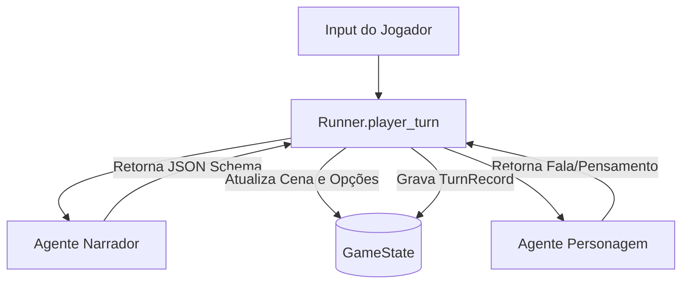

# Diretrizes de Desenvolvimento e Prompting do Agente (`agent.md`)

Este repositório implementa um **sistema de roleplay multi-agente** (Narrador + Personagens) orquestrado por um backend stateless em FastAPI (`src/runner.py`).

> [!IMPORTANT]
> **Este projeto NÃO é um clone do SillyTavern.**
> 
> Parâmetros e abordagens do SillyTavern (como lorebooks complexos, jailbreaks inseridos no meio do histórico, manipulação exaustiva de samplers e templates de prompt baseados em substituição de string bruta tipo `{{char}}`) são legados de uma época em que as LLMs tinham contextos pequenos (2k-4k) e precisavam de um "harness" rígido de completude de texto para não saírem do personagem.
> 
> Hoje, operamos sob o paradigma de **LLMs Agênticas** (similar ao Claude Code, Aider ou AGY):
> 1. Os modelos possuem janelas de contexto massivas (ex: `context_max` de 98k+ configurado em `.data/config.json`).
> 2. O Narrador é tratado como um agente lógico autônomo que retorna **JSON estruturado**, gerenciando o estado físico da cena (`scene_update`) e o roteamento da conversa (`next_speaker`).
> 3. As instruções de prompts são declarativas, limpas e em formato estruturado (Markdown / JSON), deixando a LLM raciocinar sobre as regras em vez de forçar formatações via hacks de string.

---

## 1. Arquitetura do Sistema



- **Estado Stateless**: `src/runner.py` gerencia o fluxo de turnos sem guardar estado em memória. A cada turno, ele obtém um lock na sessão, carrega o `GameState` de `.data/sessions/{session_id}.json`, invoca as LLMs necessárias, atualiza a cena física e as opções pendentes, e persiste o estado de volta no JSON.
- **Narrador como GM**: O Narrador é o único que altera o estado do mundo físico e define quem fala a seguir. Sua resposta deve sempre respeitar o schema estruturado:
  - `narration` (narração da cena baseada nas ações do Player).
  - `next_speaker` (próximo falante: "Player", "Narrator" ou o ID do Personagem).
  - `context_for_character` (informações sensoriais específicas que o próximo personagem percebe).
  - `scene_update` (dicionário de modificações físicas na cena).
  - `player_options` (lista de opções de escolha para o Player, se houver).
- **Personagens (Mind/Body)**: A mente (`mind` - personalidade, conhecimento, humor) e o corpo físico (`body` - aparência, vestimenta) são isolados e passados de forma modular nos prompts.

---

## 2. Tecnologias e Ambiente

- **Python >= 3.14** gerenciado pelo `uv`.
- **FastAPI / Uvicorn** para o servidor backend.
- **Ruff** para linting e formatação (configurado em `pyproject.toml`).
- **Mypy** para checagem estática de tipos.
- **Pytest + Pytest-asyncio** para a suíte de testes.
- **llama.cpp** rodando localmente na porta `8888` via endpoints compatíveis com a API da OpenAI.

---

## 3. Regras para Edição e Engenharia de Prompts

Se você estiver editando o código ou os prompts dos agentes:

1. **Evite hacks de prompt do SillyTavern**: Não adicione constantes para gerenciar samplers por personagem no meio das requisições, nem crie lógicas de substituição textual complexas. O prompt deve descrever regras estruturadas que o modelo interpretará de forma agêntica.
2. **Saída Estruturada**: Sempre utilize JSON Mode (`chat_completion_json`) com tratamento de retentativas para agentes lógicos (como o Narrador). Não tente fazer parser de texto puro usando expressões regulares para extrair decisões do GM.
3. **Gerenciamento de Contexto**: Confie no contexto nativo. Deixe o modelo ver o histórico recente de forma direta. Apenas faça trim de histórico quando atingir limites próximos a `context_max`.
4. **Localização**: Respeite a chave `"language"` em `.data/config.json`. O wrapper em `src/llm/client.py` injeta dinamicamente instruções de idioma no system prompt da chamada.

---

## 4. Comandos Úteis

Antes de submeter qualquer mudança, ative o ambiente virtual e valide os testes e a qualidade do código:

```bash
# Ativar venv (Fish shell)
source .venv/bin/activate.fish

# Rodar testes
uv run pytest

# Validar lint
uv run ruff check

# Formatar código
uv run ruff format
```
