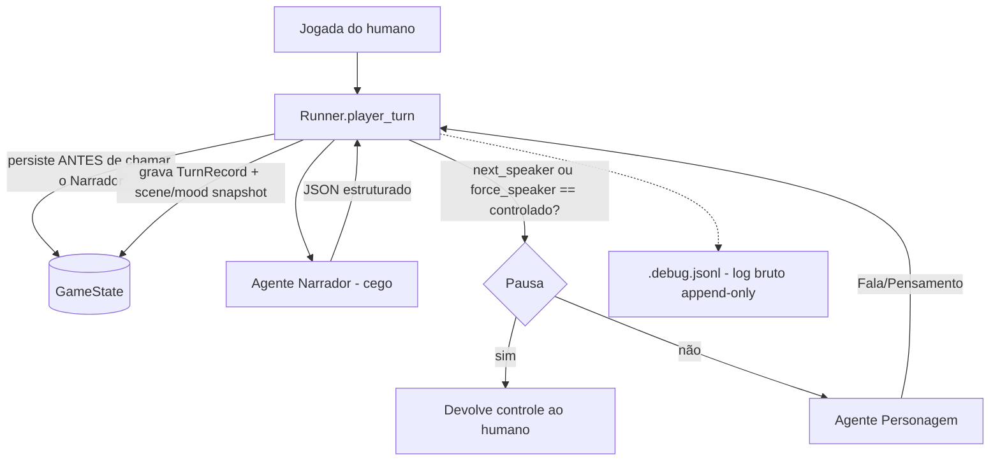

# Diretrizes de Desenvolvimento e Prompting do Agente (`agent.md`)

Este repositório implementa um **sistema de roleplay multi-agente** (Narrador +
Personagens) orquestrado por um backend stateless em FastAPI (`src/runner.py`), falando
com um modelo local via llama.cpp.

Este é o **documento de princípios e arquitetura** do projeto. Ele descreve *o que o
sistema é e como pensar sobre ele*, e reflete o **estado atual real do código** — não
carrega lista de tarefas (isso vive no `plan.md`/`.plan/plan.md`, quando existir uma
task em andamento). Qualquer LLM que edite este repo, mesmo as "menores" (hoje modelos
MoE — *Mixture of Experts* — pós-treinados para agir como agentes, com contexto de
sobra), deve ler tudo antes de tocar no código. Não precisa adivinhar nada aqui: o que
está escrito é o que o código faz hoje, não uma aspiração.

---

> [!IMPORTANT]
> ## Leia isto primeiro (vale mais que o resto do arquivo)
>
> **Este projeto NÃO é um clone do SillyTavern nem do character.ai.** Se você é uma LLM
> editando este repo, sua tarefa mais comum vai ser **resistir ao impulso** de trazer
> conceitos daquelas ferramentas. Eles dominam a literatura de roleplay-com-IA, então
> parecem "o jeito certo" — mas a maioria é **legado**.
>
> ### A distinção que separa legado de não-legado
>
> Antes de adicionar qualquer mecanismo, faça esta pergunta:
>
> > **"Isto existe para compensar um modelo fraco / contexto pequeno — ou para resolver
> > um problema estrutural que existe independente de quão bom seja o modelo?"**
>
> - **Compensa fraqueza do modelo → é legado. NÃO adicione.** SillyTavern e character.ai
>   foram desenhados na era de 2k–4k de contexto e modelos ruins de seguir instrução.
>   Lorebook por palavra-chave, `{{char}}`/`{{user}}`, jailbreak no meio do histórico,
>   tuning de sampler por personagem, greeting/first_mes como muleta de estilo,
>   budgeting agressivo de tokens — tudo isso é *harness de completude de texto* para
>   modelo burro. Modelos de hoje (inclusive os MoE "menores") dispensam essas muletas.
> - **Resolve problema estrutural → sobrevive.** Recuperação seletiva (RAG) e interface
>   estruturada (JSON schema / tool-calling) **não** são legado. Ver "O que NÃO é legado".
>
> ### O princípio positivo
>
> **Descreva regras de forma declarativa e deixe o modelo raciocinar.** Não force
> comportamento com hack de string. Na dúvida entre "criar um mecanismo de controle" e
> "confiar no raciocínio do modelo", **confie no modelo**.
>
> ### ⚠️ Cuidado: LLMs agênticas falham em silêncio
> Modelos agênticos erram **silenciosamente** em pequenos detalhes (um campo que não é
> populado, um formato que quase-obedece, um histórico que some sem erro). **Nunca confie
> em "rodou sem exceção" ou "passou no pytest".** Sempre inspecione a saída real: leia o
> prompt montado, leia o JSON de resposta, leia o **estado salvo da sessão**
> (`.data/sessions/{id}.json`), e leia o **log bruto de chamadas LLM**
> (`.data/sessions/{id}.debug.jsonl`, ver §5). Rode um turno real contra o LLM de
> verdade sempre que der, não só testes com client mockado.

---

## Tabela de anti-padrões — NÃO traga isto de volta

| ❌ Conceito legado (SillyTavern / character.ai) | Por que é legado | ✅ O jeito deste projeto |
|---|---|---|
| **Lorebook / World Info** por *trigger de palavra-chave* | Truque para caber conhecimento em 4k | Fato no prompt direto, ou o Narrador (que "sabe tudo") raciocina. Estado físico → `scene.physical_facts`. *(RAG de verdade é outra coisa — ver abaixo.)* |
| **`{{char}}` / `{{user}}` / substituição de string bruta** | Modelo não entendia papéis; precisava de macro | Roles nativos (`system`/`user`) e IDs de personagem estruturados. Sem macro engine. |
| **Jailbreak / prompt no meio do histórico** | Modelos velhos "saíam do personagem" | Regras declarativas no `system`. O modelo segue instrução. |
| **Tuning de sampler** (temperature/top_p/top_k, ainda mais *por personagem*) | Micro-ajuste para arrancar coerência de modelo fraco | Config única no servidor. A prática atual é **cravar temperature ≈ 1 e controlar via nível de reasoning**, não via sampler. Nunca crie sampler por personagem. |
| **Character card: greeting / first_mes / example dialogs / swipes** | Scripting de saída para modelo que não improvisava | O Personagem é um agente que gera fala a partir da sua `mind` + contexto. Tom se descreve, não se roteiriza. |
| **Parser de texto por regex** (extrair decisão do Narrador de dentro da prosa) | Não havia saída estruturada | **JSON estruturado** via `chat_completion_json` com `json_schema` (grammar constrained decoding no llama.cpp). |
| **Trim de histórico por "últimos N turnos" / clip por caractere** | Token budgeting de 4k | Trim **dirigido por tokens** (`trim_history_by_tokens`, usa `context_max`). |
| **Contexto dinâmico / criar tags / "depth injection"** | Compensava esquecimento e contexto curto | Histórico direto + `context_for_character` do Narrador. Se crescer demais, ver **compactação** (§7), não injeção de tag. |
| **Sistema de "options" gerado pelo Narrador** (`player_options`/`pending_options`) | Parecia agêntico mas era um estado de pausa complicado, com resolver de índice e undo tendo que saber lidar com ele | **Removido de verdade.** Gatilho manual do lado do undo: `force_speaker` (forçar quem age) + `suggest` (Narrador sugere fala/ação prontas pra preencher as caixas, sem pausar nem sujar histórico). Ver §4. |

> Se um pedido/PR usar qualquer termo da coluna esquerda, **pare e reavalie**. Quase
> sempre a resposta certa é "não fazemos isso aqui — o modelo já resolve".

---

## O que NÃO é legado (não caia na sobre-correção)

Recusar tudo que "lembra SillyTavern" é errar para o outro lado. Estes resolvem problema
estrutural e **são bem-vindos** quando o projeto crescer:

- **RAG / recuperação seletiva.** Um modelo perfeito ainda não lê um corpus de 10M tokens
  numa tacada — o problema é *volume de dados*, não inteligência. O que é legado é o
  *lorebook com trigger de palavra-chave*; recuperar conhecimento sob demanda não é.
  **(Trabalho futuro; vem depois da compactação de conversa — ver §7.)**
- **Saída estruturada (JSON schema / grammar / tool-calling).** Não é muleta — é o
  *contrato de entrada/saída* entre programa e modelo. É a forma correta e robusta,
  ainda mais importante com modelo pequeno (instruction-following mais fraco).

Regra prática: se o mecanismo continuaria necessário mesmo com um modelo hipoteticamente
perfeito, ele **não** é legado.

---

## Modelo de papéis (o coração do design — NÃO quebre isto)

Quem pode fazer o quê é **lei**. Toda separação de campos/contexto existe para servir a
isto.

| Papel | Pode | NÃO pode | O que recebe no prompt |
|---|---|---|---|
| **Usuário** (jogador) | **falar, pensar E agir** — por isso a UI tem 2 caixas (fala/pensamento + ação) | — | monta a cena no setup; não tem `name` próprio (ver Imersão) — só é identificado pelo `controlled_character_id` |
| **Narrador** | **tudo que é físico**: ação, descrição, consequência, transição de cena, e **decidir quem fala** | saber qual personagem é o humano | **TUDO sobre o mundo**: personalidade completa de todos, `body` (aparência/roupa), `scene`, `story_summary` (quando existe) + janela ativa do histórico. É o cérebro do jogo — mas trata **todos os personagens igual** (não sabe que existe um jogador). |
| **Personagem** | **só falar e pensar**, sempre em primeira pessoa | narrar, descrever ambiente, executar/descrever ação física (nem a sua, nem a de outro personagem — **nem dentro de um pensamento marcado**) | **O MÍNIMO**: a sua *própria* `mind` (personalidade, conhecimento, humor) + somente a sua própria `character_notes` + a mensagem do Narrador (`context_for_character`) + **no máximo as falas da janela ativa** (nunca narração/ação) |

### Personagem: pensamento é reação subjetiva, nunca narração objetiva

Achado real em playtest (não foi desenhado assim de propósito, apareceu no modelo): o
Personagem tendia a "pensar" descrevendo a linguagem corporal de **outro** personagem
como fato objetivo — ex. `**Ele aperta o punho da espada, pronto para o combate.**` —
que é narração disfarçada de pensamento, e é função exclusiva do Narrador.

A regra certa **não é** "nunca pensar sobre o corpo/ação de outro" (isso mataria
reações válidas). É: **pensamento sobre outro personagem é permitido, mas tem que ser a
leitura subjetiva de quem pensa, nunca a descrição objetiva do fato**.

- ❌ proibido: `Ele aperta o punho da espada` (fato objetivo — função do Narrador)
- ✅ permitido: `Ele parece tenso` / `isso me deixa nervosa` (o que o personagem
  sente/interpreta, do próprio ponto de vista)

E o `**pensamento**` **sempre** precisa estar entre os marcadores — sem exceção; texto
solto sem marcação vira ambíguo (pode ser lido como narração).

### ⚠️ Imersão — NENHUM agente sabe que existe um humano (regra dura, e já validada)

O jogador **é** o personagem controlado, dentro do mundo. **Nenhuma LLM** — nem os
Personagens, **nem o Narrador** — pode saber que existe um "jogador"/"usuário"/"humano".
Todos os personagens são tratados igual. O Narrador é cego: ele narra e roteia sem saber
que um dos personagens é dirigido por uma pessoa.

- **Nenhum prompt (Narrador ou Personagem) contém a palavra "Player".** O input do humano
  entra no mundo como fala/ação do **personagem controlado**. Na montagem de qualquer
  prompt, `"Player"` é **renderizado com o NOME do personagem** via
  `speaker_label()` (`src/models.py`) — usado em **todo** builder de histórico.
- **O Narrador não recebe `PLAYER INPUT` nem "Player controls X".** Ele lê só o histórico
  (cuja última entrada é a jogada do personagem controlado, como a de qualquer um) + cena +
  personagens. Ele pode até **gerar uma lista de falas/ações para um personagem** (o
  gatilho de sugestão, ver §4) sem saber que aquele personagem é o humano.
- **A agência do jogador é preservada no CÓDIGO, não no prompt.** O `runner` conhece o
  `controlled_character_id`. Quando o `next_speaker` (do Narrador, ou forçado via
  `force_speaker`) é o personagem controlado, o runner **pausa e devolve o controle ao
  jogador** em vez de gerar a fala dele. Assim o humano nunca é "jogado pela IA".
- **Armazenamento ≠ renderização.** Internamente o registro é marcado como origem-jogador
  (`speaker="Player"`, usado para undo/tooling) — mas isso é **traduzido** para o nome
  do personagem antes de ir para qualquer LLM.
- **Não existe campo de nome do jogador.** `Player` (dataclass em `models.py`) só tem
  `controlled_character_id`. Um campo `name` chegou a existir e foi **removido** — nunca
  era lido por nenhum prompt nem renderizado em lugar nenhum do front; era legado puro do
  design anterior (antes do Narrador ficar cego). Não recrie.
- **Sub-agente de limpeza de gramática (futuro, opcional, config):** normaliza o texto cru
  do jogador **antes** de entrar no histórico, para não "sujar" nem denunciar o humano.
  Não implemente sem pedido explícito.

> 🎲 **Isto foi uma aposta arriscada, e já foi validada com LLM real.** Um GM cego pode
> "atropelar" o personagem do jogador narrando/decidindo por ele. A trava de agência no
> runner (pausar quando `next_speaker == controlado`) é o que segura. Em sessões reais
> auditadas via log (§5), o Narrador rotear para o personagem controlado aconteceu em
> parte dos turnos e o runner pausou corretamente em 100% dos casos observados até agora
> (nenhum atropelo detectado). **Continue validando com volume** sempre que mudar o
> prompt do Narrador ou o fluxo do runner — a aposta continua de pé, não está "resolvida
> para sempre".

### Consequências práticas (respeite ao editar)
- **O Narrador traduz e enriquece.** Se o usuário digita algo simples como "pulei", o
  Narrador descreve o físico disso na `narration`. Quanto **mais e melhor** o Narrador
  descreve a cena, melhor o Personagem consegue reagir — o Narrador é o que dá contexto.
- **A narração é ancorada em sentido, não tem teto de frases.** A instrução do Narrador
  não diz "seja conciso (2-4 frases)" — isso *era* o motivo de narrações curtas e secas.
  Hoje a instrução pede ancoragem sensorial explícita (toque, som, cheiro, textura — ver
  `_build_system_prompt` em `narrator.py`) e deixa o tamanho seguir a cena. Não reintroduza
  um teto de frases "pra ficar mais rápido" — isso é regressão, não otimização.
- **O Personagem só reage/comenta o que o Narrador criou.** Ele lê a mensagem do Narrador
  e responde falando ou pensando. Por isso ele precisa de pouco contexto.
- **Nunca vaze para o prompt do Personagem**: `body` de ninguém, personalidade de *outros*
  personagens, dump de `scene`, nem as **narrações/ações** passadas (histórico do
  Personagem é filtrado por `content_type == "speech"`). No máximo, falas anteriores.
- **Personalidade é um campo único (`personality`)**, e está certo assim. O escopo é por
  papel, não por campo: o Narrador vê a personalidade completa de *todos*; o Personagem vê
  só a *sua*. Não há (nem se deve recriar) split summary/full.
- **`current_mood` é estado real**, atualizado pelo Narrador via `mood_updates` (inclusive
  do personagem controlado pelo jogador — isso é design, não bug).
- **Nunca use travessão/en-dash (`—`/`–`) em texto gerado.** Instrução injetada
  incondicionalmente no mesmo ponto do idioma (`src/llm/client.py`, `chat_completion`),
  pra todo agente. É estilo (o modelo puxava muito pra esse tique), não regra de jogo —
  mas é global e sempre ativa, não recrie por agente.

---

## 1. Arquitetura do Sistema



- **Estado stateless**: `src/runner.py` não guarda estado em memória (sem `self.game`).
  A cada chamada: lock na sessão (`_get_lock`), carrega o `GameState` de
  `.data/sessions/{id}.json`, invoca as LLMs, atualiza cena/humor, e persiste de volta.
- **Narrador como mestre do jogo (Game Master), cego**: único que altera o mundo físico e
  decide quem fala, mas nunca sabe que existe um humano. Responde JSON com schema
  (`build_narrator_json_schema` em `narrator.py`):
  - `narration` — o que acontece na cena a partir da última entrada do `HISTORY`.
  - `next_speaker` — um ID de personagem ou `"Narrator"` (**nunca** `"Player"` — o
    schema nem lista essa opção). Se cair no personagem controlado, o runner pausa.
  - `context_for_character` — mensagem filtrada para o próximo personagem.
  - `scene_update` — mudanças físicas (`{"chave": "valor"}`; valor `null` remove a chave).
  - `mood_updates` — `{character_id: novo_humor}` só para quem mudou, ou `null`.
  - **Não existe mais `player_options`** — removido junto com o sistema automático de
    opções (ver §4).
- **Personagens (Mind/Body)**: `mind` (personalidade, conhecimento, humor) e `body`
  (aparência, roupa) são isolados. Só o Narrador vê `body`.
- **`GameState`** (`src/models.py`) carrega os campos persistidos da compactação (§7):
  `story_summary: str` e `character_notes: dict[str, str]`. `runner._call_narrator`
  passa `game.story_summary` ao Narrador; `runner._call_character` passa somente
  `game.character_notes[character_id]` ao Personagem que está sendo chamado.

---

## 2. Como um turno é montado (fluxo real, não aspiracional)

Uma jogada do humano dispara **até duas chamadas LLM sequenciais**, mais uma opcional
(sugestão, sob demanda). Ordem real em `runner.player_turn`:

1. **Persiste a jogada do humano ANTES de chamar o Narrador.** Fala e ação viram
   registros separados no histórico (`speaker="Player"`, `content_type="speech"`/`"action"`),
   com o mesmo `turn_number` (ver §3). É por isso que o Narrador não precisa de um bloco
   de input separado: a jogada já é a última entrada do `HISTORY` que ele lê.
2. **Chamada 1 — Narrador** (`src/agents/narrator.py` → `chat_completion_json` +
   `json_schema`).
   - `system` (`_build_system_prompt`): papel + seção `FIELDS:` descrevendo cada campo do
     JSON de saída. **Não** implora "return only JSON" — a gramática (`json_schema`)
     garante o formato.
   - `user` (`_build_user_prompt`): `STORY SO FAR` opcional (se já houve compactação) +
     `CURRENT SCENE` + `CHARACTERS PRESENT` (personalidade completa + aparência + roupa +
     humor) + `HISTORY` (janela ativa, ainda trimada por tokens via
     `trim_history_by_tokens` se necessário). **Sem** bloco de input separado e **sem**
     "Player controls": tudo já está no `HISTORY`, renderizado com `speaker_label()`.
   - Saída: JSON validado. `next_speaker` inválido cai em fallback pra `"Narrator"` (não
     mais para `"Player"` — o Narrador não conhece esse conceito).
3. **Decide quem age a seguir**: `force_speaker` (se o gatilho manual foi usado, ver §4)
   ou o `next_speaker` do Narrador. Se for o personagem controlado, o runner **pausa
   aqui** — não chama o agente Personagem, devolve o resultado com esse `next_speaker`
   pra UI decidir o que fazer (mostrar que é a vez do humano).
4. **Chamada 2 — Personagem** (`src/agents/character.py` → `chat_completion`, texto
   puro), só se o falante decidido for um personagem presente **e não-controlado**.
   - `system`: "You are {name}…" + a `mind` *dele* (personality, knowledge, current_mood)
     + `What you remember` opcional com **somente a nota desse personagem** + regras
     (1ª pessoa, `**pensamento**` obrigatório e sempre marcado, pensamento é leitura
     subjetiva nunca narração objetiva, 1–3 frases, nunca narrar/descrever ambiente ou
     ação física).
   - `user`: `SCENE CONTEXT` (= o `context_for_character` do Narrador) + `RECENT EVENTS`
     (histórico filtrado só por `content_type == "speech"`, renderizado com
     `speaker_label()`) + `"What do you say or think?"`.
5. **Atualiza cena e humor** (`scene_update`/`mood_updates`), grava o(s) `TurnRecord`
   restante(s) com deep copy de `scene`/`mood` (ver §3), salva a sessão.

### Detalhes que importam ao editar
- **Idioma (e a regra de evitar travessão) são injetados em tempo de chamada**
  (`src/llm/client.py`, dentro de `chat_completion`): faz `deepcopy` das messages e
  anexa as instruções ao primeiro `system`. O que os builders (`narrator.py`/
  `character.py`) montam é **pré**-essas instruções; o preview de prompt
  (`preview_narrator_prompt`, sem chamar o LLM) mostra essa versão pré-injeção.
- **Duas chamadas independentes**: o Personagem relê o histórico por conta própria; só
  recebe do Narrador o `context_for_character`. Nunca precomputa nada pro Personagem além
  disso.
- **Não existe mais debug embutido na resposta do turno.** O campo `debug`/`type`/
  `options` que existiam na resposta da API foram removidos. Observabilidade é o log
  bruto sequencial — ver §5.

---

## 3. Histórico, `turn_number` e undo

- **Todos os registros de uma mesma jogada compartilham o mesmo `turn_number`** (fala do
  humano, ação do humano, narração, fala do personagem — o que existir naquele passo).
  Calculado uma vez no início de `player_turn` (`step = último turn_number + 1`) e
  repassado em cada `_append_history`. Pré-requisito do undo funcionar em passo inteiro.
- **Cada `TurnRecord` carrega `scene_snapshot` e `mood_snapshot`** (deep copy da cena e do
  humor de todos os personagens **no momento do append**, ou seja, **antes** de
  `scene_update`/`mood_updates` daquele mesmo passo serem aplicados). Isso é o que
  permite o undo restaurar exatamente o estado anterior ao passo.
- **`undo_turn`** remove **todos** os registros com o maior `turn_number` de uma vez, e
  restaura `scene`/`mood` a partir do snapshot de qualquer um deles (são idênticos entre
  si, já que nada muda cena/humor entre os appends de um mesmo passo). Depois de
  compactação (§7), o undo só alcança o que ainda está na janela ativa da sessão — turnos
  já resumidos e removidos do histórico ativo não são mais alcançáveis por undo (só via
  restaurar manualmente um backup `kb_N`).

---

## 4. Gatilho manual (force_speaker + sugestão)

O sistema antigo (`player_options`/`pending_options`/`_resolve_chosen_option`) foi
**removido**. Era um estado de pausa complicado: o Narrador gerava uma lista de opções, a
sessão ficava pausada esperando escolha, e o undo precisava saber lidar com esse estado
especial. Substituído por dois mecanismos manuais, do lado do botão de undo na UI:

- **`force_speaker`** (parâmetro opcional em `player_turn`/`POST /session/{id}/turn`):
  id de personagem presente ou `"Narrator"`. Sobrepõe o `next_speaker` que o Narrador
  escolheu. Se o falante forçado for o personagem controlado, o runner **ainda pausa**
  (a agência nunca é contornada por esse mecanismo).
- **`suggest`** (`POST /session/{id}/suggest`, agente `src/agents/narrator.py::suggest`):
  pede ao Narrador (ainda cego) três sugestões de `{speech, action}` **para o personagem
  controlado**, com um pedido genérico ("sugira jogadas para este personagem") que nunca
  revela que é o humano. **Não persiste nada** — só devolve pro front preencher as duas
  caixas de input. O humano ainda precisa apertar enviar, então entra pela via normal
  (vira jogada de verdade, não suja histórico nem cria estado de pausa).

Ambos validados juntos com LLM real: pedir sugestão, escolher uma, e forçar o personagem
não-controlado a responder com as duas caixas vazias — confirmado que nenhum registro
`Player` fantasma é criado quando as caixas ficam em branco.

---

## 5. Observabilidade: log bruto sequencial (`.debug.jsonl`)

Substituiu o debug embutido por turno na resposta da API. Antes de cada turno, o Runner
grava um marcador `turn_input` com `speech`, `action`, `force_speaker` solicitado e o
override efetivo. Depois, cada chamada real ao LLM (sucesso, erro e retry) é interceptada
em `chat_completion` e acrescenta outra linha em `.data/sessions/{session_id}.debug.jsonl`:

```json
{"ts": "...", "session_id": "...", "turn_number": N, "agent": "narrator|narrator_suggest|character:<nome>|summarizer", "request": {...}, "response": "...", "error": null, "duration_ms": 123.4, "attempt_number": 1, "prompt_chars": 4567}
```

- **Append-only de propósito.** Nunca reescreve/apaga linha. `undo_turn` acrescenta uma
  linha `{"agent": "undo", "removed_records": K}` só como marcador sequencial (não
  reverte nada no log) — sem isso, uma mudança de humor por undo pareceria uma decisão
  nova do Narrador quando alguém for debugar depois.
- **Erros estruturados.** Além da mensagem compatível em `error`, o registro guarda
  `error_type` e `error_repr`, portanto exceções como `ReadTimeout` nunca ficam vazias.
- **Replay exato.** O driver exige `turn_input`; não infere inputs ou overrides pelo HISTORY.
- **Endpoint**: `GET /session/{id}/debug_log` retorna as entradas parseadas. O front
  (`app.js`) busca isso sob demanda (botão "🔄 Log" no drawer de debug), não mais um
  campo por turno.
- **É a ferramenta primária de auditoria deste projeto.** Todo audit de imersão ("Player"
  vazando), agência (quem pausou/quem foi chamado) e consistência de estado neste projeto
  foi feito lendo esse arquivo diretamente, não só rodando pytest.

### MCP de debug e replay determinístico

`tools/mcp_server.py` expõe a superfície HTTP já existente para clientes externos de
desenvolvimento por MCP/stdio. Ele é uma ferramenta de fora do runtime: não entra no
turn loop, não injeta tools em prompt e não substitui o HTTP direto usado pelos agentes.

- Tools `inspect_*` enumeram rotas, sessões, estado, histórico, log bruto e cursor de replay.
- Tools `mutate_*` iniciam/forkam sessões, enviam turnos, pedem sugestões, operam
  compactação/undo e controlam o cursor.
- `undo`, `compact` e `restore_compaction` exigem `confirm=true` no servidor, além do
  `destructiveHint` usado pela UI do cliente MCP. Delete e retry não são expostos.
- `tools/replay_llm.py` carrega respostas bem-sucedidas do JSONL uma vez e as serve na
  ordem, com cursor protegido por lock. Mismatch de formato ou fita esgotada não avança.
- `tools/replay_session.py` exige o formato atual com `turn_input`, envia cada jogada pela
  API real e relê o estado após cada turno. Não existe inferência para logs legados.
- A fixture mantida em `tests/fixtures/current_replay.debug.jsonl` cruza a janela padrão de
  compactação e permite validar tudo isso sem iniciar llama.cpp.

Arquitetura, inventário das 15 tools, registro em clientes, segurança e comandos completos
estão no README principal e em `tools/README.md`.

---

## 6. Tecnologias e Ambiente

- **Python >= 3.14** com `uv` (venv em `.venv/`, ative com `source .venv/bin/activate.fish`).
- **FastAPI / Uvicorn** (backend), **Ruff** (lint/format), **Mypy** (tipos),
  **Pytest + pytest-asyncio** (testes).
- **Provedores LLM por adapters isolados.** `src/llm/adapters/` contém contrato, registry e um
  módulo por backend; `src/static/adapters/` contém a configuração declarativa equivalente para
  a UI. Hoje há llama.cpp (JSON Schema nativo) e DeepSeek V4 Flash (`thinking=disabled`, JSON
  Object + validação local). URL, payload, segredo, formulário e envelope de resposta não entram
  no Runner nem nos agentes.
- **Configuração única em `.data/config.json`.** `src/config.py` valida e persiste atomicamente o
  provedor ativo e os conjuntos separados de llama.cpp/DeepSeek. A API e o frontend nunca
  devolvem nem cacheiam a chave; mostram apenas se ela está configurada.
- **Servidor dev**: `./start.sh` (porta 8889, `--reload`, `--host 0.0.0.0`).

---

## 7. Compactação de contexto (IMPLEMENTADA — MVP manual)

Objetivo: quando a conversa ficar grande, resumir os turnos antigos numa "história até
agora" (`story_summary`) e notas por personagem (`character_notes`), pra caber num
modelo menor sem perder coerência de longo prazo. Baseado em como a Anthropic documenta
compaction/memória estruturada/sub-agentes (pesquisa registrada, antes de virar plano,
no histórico de conversa deste projeto).

**Decisão de design importante**: isto **não** é memória recomputada a cada prompt (sem
"camadas" recalculadas por chamada). É um **evento discreto e manual**:

1. `compact_session` lê `compaction_keep_recent_turns` (padrão: 8) e conta
   `turn_number` distintos, não registros individuais. Com até esse número de turnos,
   devolve `compacted=False` sem backup nem chamada LLM.
2. Acima da janela, faz backup do `{session_id}.json` atual como
   `{session_id}.kb_N.json` (N incremental, cópia dos bytes crus).
3. Um sub-agente **Historiador** (`src/agents/summarizer.py`) recebe somente os turnos
   anteriores à janela, mais o resumo e as notas atuais. Ele é cego igual ao Narrador:
   `speaker_label` traduz `"Player"` para o nome do personagem controlado. A saída usa
   `json_schema` e contém o resumo completo reescrito + somente as notas alteradas.
4. O runner substitui `game.story_summary`, mescla as notas retornadas em
   `game.character_notes`, substitui `game.history` pelos turnos mantidos e salva.
5. Nas chamadas seguintes, o Narrador recebe `STORY SO FAR` + janela ativa; cada
   Personagem recebe somente seu `What you remember` + falas da janela ativa.

**Undo comum depois de compactar:** só alcança turnos da janela ativa. Os turnos antigos
não estão mais em `game.history`, portanto não participam de `undo_turn`.

**Desfazer a compactação:** o botão dedicado chama `restore_last_compaction`, que pega o
backup de maior N. Antes de sobrescrever a sessão, compara o maior `turn_number` do estado
ativo com o do backup. Se o ativo tiver turno mais novo, recusa sem mudar nada, pois a
restauração apagaria jogo novo. Se for seguro, restaura os bytes do backup e apaga esse
backup consumido. Não há merge de históricos. Backups mais antigos podem continuar no
disco, mas a mesma trava pode impedir restaurá-los se o histórico ativo já for mais novo.

**Sem gatilho automático por token nesta versão** — só um botão manual do lado do undo,
com barra de progresso **simulada** (não é progresso real medido; tem comentário em
inglês no código avisando isso).

**Superfície implementada:** `POST /session/{id}/compact`, botão de compactação com
progresso simulado, `POST /session/{id}/restore_compaction`, botão de restauração com
confirmação, marcadores `compact`/`restore_compaction` no log e testes de integração do
fluxo completo.

---

## 8. Regras para Edição e Engenharia de Prompts

1. **Nada da tabela de anti-padrões.** Regra número um.
2. **Não quebre o modelo de papéis** (§ acima). Se sua mudança faz o Personagem receber
   `body`, personalidade de outros, cena, narrações/ações passadas, ou `story_summary` —
   pare, está errado.
3. **Pensamento de Personagem é leitura subjetiva, nunca narração objetiva** — mesmo
   sobre outro personagem. Reforce isso ao mexer no prompt, não remova a distinção.
4. **Saída estruturada de verdade**: `chat_completion_json` + `json_schema` para agentes
   lógicos (Narrador, Resumidor). Nunca parser por regex.
5. **Confie no contexto nativo.** Trim só por tokens perto de `context_max`
   (`trim_history_by_tokens`). Nunca por número de turnos nem clipando por caractere.
6. **Prompts declarativos e curtos.** Descreva a regra; não empilhe reforços. Não
   reintroduza teto de frases na narração do Narrador (ver §2 — foi removido de propósito).
7. **Estado dinâmico é do Narrador** (humor, cena, fatos) via campos estruturados — não
   hardcode nem heurística no runner.
8. **`session_id`/`turn_number`/`agent` sempre repassados** em qualquer chamada nova ao
   LLM, pra aparecer no log bruto (§5). Não crie uma chamada "silenciosa" fora dele.
9. **Verifique de verdade** (ver o aviso de "falha silenciosa"): inspecione prompt
   montado, JSON de resposta, estado salvo, e o `.debug.jsonl`. Rode contra o LLM real
   quando possível. Não confie em "não deu erro" nem só em "passou no pytest".

---

## 9. Comandos Úteis

```bash
source .venv/bin/activate.fish   # venv (Fish shell)
uv run pytest                    # testes
uv run ruff check                # lint
uv run ruff format               # formatação
uv run mypy src                  # tipos
./start.sh                       # sobe o servidor dev (porta 8889, --reload)
tail -f .data/sessions/<id>.debug.jsonl | jq .   # acompanhar o log bruto ao vivo
```
