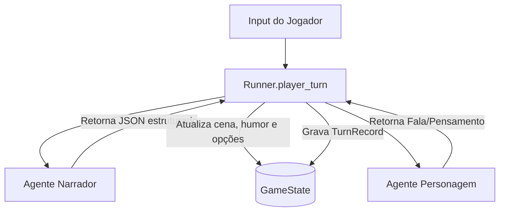

# Diretrizes de Desenvolvimento e Prompting do Agente (`agent.md`)

Este repositório implementa um **sistema de roleplay multi-agente** (Narrador +
Personagens) orquestrado por um backend stateless em FastAPI (`src/runner.py`).

Este é o **documento de princípios e arquitetura** do projeto. Ele descreve *o que o
sistema é e como pensar sobre ele* — **não** carrega lista de tarefas (isso vive no
`plan.md`). Qualquer LLM que edite este repo (mesmo as "menores", que hoje são modelos
MoE — *Mixture of Experts* — com contexto de sobra) deve ler tudo antes de tocar no
código.

---

> [!IMPORTANT]
> ## Leia isto primeiro (vale mais que o resto do arquivo)
>
> **Este projeto NÃO é um clone do SillyTavern nem do character.ai.** Se você é uma LLM
> editando este repo, sua tarefa mais comum vai ser **resistir ao impulso** de trazer
> conceitos daquelas ferramentas. Eles dominam a literatura de roleplay-com-IA, então
> parecem "o jeito certo" — mas a maioria é **legado**.
>
> ### A distinção que separa legado de não-legado
>
> Antes de adicionar qualquer mecanismo, faça esta pergunta:
>
> > **"Isto existe para compensar um modelo fraco / contexto pequeno — ou para resolver
> > um problema estrutural que existe independente de quão bom seja o modelo?"**
>
> - **Compensa fraqueza do modelo → é legado. NÃO adicione.** SillyTavern e character.ai
>   foram desenhados na era de 2k–4k de contexto e modelos ruins de seguir instrução.
>   Lorebook por palavra-chave, `{{char}}`/`{{user}}`, jailbreak no meio do histórico,
>   tuning de sampler, greeting/first_mes como muleta de estilo, budgeting agressivo de
>   tokens — tudo isso é *harness de completude de texto* para modelo burro. Modelos de
>   hoje (inclusive os MoE "menores", pós-treinados para agir como agentes) dispensam
>   essas muletas.
> - **Resolve problema estrutural → sobrevive.** Recuperação seletiva (RAG) e interface
>   estruturada (JSON schema / tool-calling) **não** são legado. Ver "O que NÃO é legado".
>
> ### O princípio positivo
>
> **Descreva regras de forma declarativa e deixe o modelo raciocinar.** Não force
> comportamento com hack de string. Na dúvida entre "criar um mecanismo de controle" e
> "confiar no raciocínio do modelo", **confie no modelo**.
>
> ### ⚠️ Cuidado: LLMs agênticas falham em silêncio
> Modelos agênticos erram **silenciosamente** em pequenos detalhes (um campo que não é
> populado, um formato que quase-obedece, um histórico que some sem erro). **Nunca confie
> em "rodou sem exceção".** Sempre inspecione a saída real — leia o prompt montado, leia o
> JSON de resposta, leia o estado salvo. Ver o modo debug do front.

---

## Tabela de anti-padrões — NÃO traga isto de volta

| ❌ Conceito legado (SillyTavern / character.ai) | Por que é legado | ✅ O jeito deste projeto |
|---|---|---|
| **Lorebook / World Info** por *trigger de palavra-chave* | Truque para caber conhecimento em 4k | Fato no prompt direto, ou o Narrador (que "sabe tudo") raciocina. Estado físico → `scene.physical_facts`. *(RAG de verdade é outra coisa — ver abaixo.)* |
| **`{{char}}` / `{{user}}` / substituição de string bruta** | Modelo não entendia papéis; precisava de macro | Roles nativos (`system`/`user`) e IDs de personagem estruturados. Sem macro engine. |
| **Jailbreak / prompt no meio do histórico** | Modelos velhos "saíam do personagem" | Regras declarativas no `system`. O modelo segue instrução. |
| **Tuning de sampler** (temperature/top_p/top_k, ainda mais *por personagem*) | Micro-ajuste para arrancar coerência de modelo fraco | Config única no servidor. A prática atual é **cravar temperature ≈ 1 e controlar via nível de reasoning**, não via sampler. Nunca crie sampler por personagem. |
| **Character card: greeting / first_mes / example dialogs / swipes** | Scripting de saída para modelo que não improvisava | O Personagem é um agente que gera fala a partir da sua `mind` + contexto. Tom se descreve, não se roteiriza. |
| **Parser de texto por regex** (extrair decisão do Narrador de dentro da prosa) | Não havia saída estruturada | **JSON estruturado** via `chat_completion_json` com `json_schema` (grammar). |
| **Trim de histórico por "últimos N turnos" / clip por caractere** | Token budgeting de 4k | Trim **dirigido por tokens** (`trim_history_by_tokens`, usa `context_max`). |
| **Contexto dinâmico / criar tags / "depth injection"** | Compensava esquecimento e contexto curto | Histórico direto + `context_for_character` do Narrador. |

> Se um pedido/PR usar qualquer termo da coluna esquerda, **pare e reavalie**. Quase
> sempre a resposta certa é "não fazemos isso aqui — o modelo já resolve".

---

## O que NÃO é legado (não caia na sobre-correção)

Recusar tudo que "lembra SillyTavern" é errar para o outro lado. Estes resolvem problema
estrutural e **são bem-vindos** quando o projeto crescer:

- **RAG / recuperação seletiva.** Um modelo perfeito ainda não lê um corpus de 10M tokens
  numa tacada — o problema é *volume de dados*, não inteligência. O que é legado é o
  *lorebook com trigger de palavra-chave*; recuperar conhecimento sob demanda não é.
  **(Trabalho futuro; virá depois da compactação de conversa estilo Claude Code.)**
- **Saída estruturada (JSON schema / grammar / tool-calling).** Não é muleta — é o
  *contrato de entrada/saída* entre programa e modelo. É a forma correta e robusta.

Regra prática: se o mecanismo continuaria necessário mesmo com um modelo hipoteticamente
perfeito, ele **não** é legado.

---

## Modelo de papéis (o coração do design — NÃO quebre isto)

Quem pode fazer o quê é **lei**. Toda separação de campos/contexto existe para servir a
isto. Este é o modelo que o dono do projeto definiu:

| Papel | Pode | NÃO pode | O que recebe no prompt |
|---|---|---|---|
| **Usuário** (jogador) | **falar, pensar E agir** — por isso a UI tem 2 caixas (fala/pensamento + ação) | — | monta a cena no setup |
| **Narrador** | **tudo que é físico**: ação, descrição, consequência, transição de cena, e **decidir quem fala** | saber qual personagem é o humano | **TUDO sobre o mundo**: personalidade completa de todos, `body` (aparência/roupa), `scene`, histórico completo. É o cérebro do jogo — mas trata **todos os personagens igual** (não sabe que existe um jogador). |
| **Personagem** | **só falar e pensar** | narrar, descrever ambiente, executar ação física | **O MÍNIMO**: a sua *própria* `mind` (identidade) + a mensagem do Narrador (`context_for_character`, que já contém o que acontece na cena) + **no máximo as falas anteriores** |

### ⚠️ Imersão — NENHUM agente sabe que existe um humano (regra dura + aposta arriscada)

O jogador **é** o personagem controlado, dentro do mundo. **Nenhuma LLM** — nem os
Personagens, **nem o Narrador** — pode saber que existe um "jogador"/"usuário"/"humano".
Todos os personagens são tratados igual. O Narrador é cego: ele narra e roteia sem saber
que um dos personagens é dirigido por uma pessoa.

- **Nenhum prompt (Narrador ou Personagem) contém a palavra "Player".** O input do humano
  entra no mundo como fala/ação do **personagem controlado**. Na montagem de qualquer
  prompt, `"Player"` é **renderizado com o NOME do personagem** ("Thorn: ...").
- **O Narrador não recebe `PLAYER INPUT` nem "Player controls X".** Ele lê só o histórico
  (cuja última entrada é a jogada do personagem controlado, como a de qualquer um) + cena +
  personagens. Ele pode até **gerar uma lista de falas/ações para um personagem** (a pedido,
  ver sugestões) sem saber que aquele personagem é o humano.
- **A agência do jogador é preservada no CÓDIGO, não no prompt.** O `runner` conhece o
  `controlled_character_id`. Quando o Narrador roteia `next_speaker` para o personagem
  controlado, o runner **pausa e devolve o controle ao jogador** em vez de gerar a fala
  dele. Assim o humano nunca é "jogado pela IA", mesmo o Narrador sendo cego.
- **Armazenamento ≠ renderização.** Internamente o registro é marcado como origem-jogador
  (`speaker="Player"`, para undo/tooling/gramática) — mas isso é **traduzido** para o nome
  do personagem antes de ir para qualquer LLM.
- **Sub-agente de limpeza de gramática (futuro, opcional, config):** normaliza o texto cru
  do jogador **antes** de entrar no histórico, para não "sujar" nem denunciar o humano.

> 🎲 **Isto é uma aposta arriscada.** Um GM cego pode "atropelar" o personagem do jogador.
> A trava de agência no runner (pausar quando `next_speaker == controlado`) é o que segura.
> **Valide cedo, rodando vários turnos reais**: se o Narrador railroada demais, reavaliar
> com o dono.

### Consequências práticas (respeite ao editar)
- **O Narrador traduz e enriquece.** Se o usuário digita algo simples como "pulei", o
  Narrador descreve o físico disso na `narration`. Quanto **mais e melhor** o Narrador
  descreve a cena, melhor o Personagem consegue reagir — o Narrador é o que dá contexto.
- **O Personagem só reage/comenta o que o Narrador criou.** Ele lê a mensagem do Narrador
  e responde falando ou pensando. Por isso ele precisa de pouco contexto.
- **Nunca vaze para o prompt do Personagem**: `body` de ninguém, personalidade de *outros*
  personagens, dump de `scene`, nem as **narrações/ações** passadas. No máximo, falas
  anteriores. O Personagem NÃO precisa disso para falar.
- **Personalidade é um campo único (`personality`), e está certo assim.** O escopo é por
  papel, não por campo: o Narrador vê a personalidade completa de *todos*; o Personagem vê
  só a *sua*. Não há (nem se deve recriar) split summary/full.
- **`current_mood` é estado real**, atualizado pelo Narrador via `mood_updates` (inclusive
  do personagem controlado pelo jogador — isso é design, não bug).

---

## 1. Arquitetura do Sistema



- **Estado stateless**: `src/runner.py` não guarda estado em memória. A cada turno: lock
  na sessão, carrega o `GameState` de `.data/sessions/{id}.json`, invoca as LLMs, atualiza
  cena/humor/opções, e persiste de volta.
- **Narrador como mestre do jogo (Game Master)**: único que altera o mundo físico e decide
  quem fala. Responde JSON com schema (`build_narrator_json_schema`):
  - `narration` — o que acontece na cena a partir da última jogada.
  - `next_speaker` — `"Narrator"` ou um ID de personagem (o Narrador **não** conhece
    `"Player"`). Se cair no personagem controlado, o runner pausa para o humano.
  - `context_for_character` — mensagem filtrada para o próximo personagem (o que ELE
    percebe). É a "mensagem do Narrador" que o Personagem lê.
  - `scene_update` — mudanças físicas (`{"chave": "valor"}`; valor `null` remove a chave).
  - `player_options` — opções de escolha para o Player, ou `null`.
  - `mood_updates` — `{character_id: novo_humor}` só para quem mudou, ou `null`.
- **Personagens (Mind/Body)**: `mind` (personalidade, conhecimento, humor) e `body`
  (aparência, roupa) são isolados. Só o Narrador vê `body`.

---

## 2. Como um turno é montado (fluxo-alvo dos prompts)

> Reflete o desenho definido no `plan.md` (Narrador cego + agência no runner). Se o código
> ainda tiver `PLAYER INPUT`/`"Player controls"`, é legado a remover — ver plano.

Uma jogada do humano dispara **até duas chamadas LLM sequenciais**:

### Chamada 1 — Narrador (`src/agents/narrator.py` → `chat_completion_json` + `json_schema`)
- **`system`** (`_build_system_prompt`): papel + seção `FIELDS:` descrevendo cada campo do
  JSON. **Não** implora "return only JSON" — a gramática (`json_schema`) garante o formato.
- **`user`** (`_build_user_prompt`): `CURRENT SCENE` + `CHARACTERS PRESENT` (personalidade
  completa + aparência + roupa + humor) + `HISTORY` (janela completa, trimada por tokens via
  `trim_history_by_tokens`). **Sem** bloco `PLAYER INPUT` e **sem** "Player controls": a
  jogada do humano já está no fim do `HISTORY`, renderizada com o nome do personagem.
- **Saída**: JSON validado. `next_speaker ∈ {ids de personagem, "Narrator"}`. Se for o
  personagem controlado, o **runner pausa** e devolve o controle ao humano.

### Chamada 2 — Personagem (`src/agents/character.py` → `chat_completion`, texto puro)
Só ocorre se `next_speaker` for um personagem **não-controlado**.
- **`system`**: "You are {name}…" + a `mind` *dele* (personality, knowledge, current_mood)
  + regras (1ª pessoa, `**pensamento**`, 1–3 frases, não narrar/descrever ambiente).
- **`user`**: `SCENE CONTEXT` (= o `context_for_character` do Narrador) + `RECENT EVENTS`
  (histórico) + `"What do you say or think?"`.

### Detalhes que importam ao editar
- **Idioma é injetado em tempo de chamada** (`src/llm/client.py`): faz `deepcopy` das
  messages e anexa `"- Always respond and write in {language}."` ao primeiro `system`.
  Ou seja: o system realmente enviado tem uma linha a mais que a montada pelos builders —
  o modo debug mostra o prompt **pré-idioma**.
- **Duas chamadas independentes**: o Personagem relê o histórico por conta própria; só
  recebe do Narrador o `context_for_character`.
- **Modo debug**: o backend já retorna os prompts **dos dois** agentes em
  `result["debug"]["narrator"|"character"]["messages"]`.

---

## 3. Tecnologias e Ambiente

- **Python >= 3.14** com `uv` (venv em `.venv/`, ative com `source .venv/bin/activate.fish`).
- **FastAPI / Uvicorn** (backend), **Ruff** (lint/format), **Mypy** (tipos),
  **Pytest + pytest-asyncio** (testes).
- **llama.cpp** local na porta `8888`, API compatível com OpenAI.

---

## 4. Regras para Edição e Engenharia de Prompts

1. **Nada da tabela de anti-padrões.** Regra número um.
2. **Não quebre o modelo de papéis** acima. Se sua mudança faz o Personagem receber `body`,
   personalidade de outros, cena ou narrações passadas — pare, está errado.
3. **Saída estruturada de verdade**: `chat_completion_json` + `json_schema` para agentes
   lógicos. Nunca parser por regex.
4. **Confie no contexto nativo.** Trim só por tokens perto de `context_max`
   (`trim_history_by_tokens`). Nunca por número de turnos nem clipando por caractere.
5. **Prompts declarativos e curtos.** Descreva a regra; não empilhe reforços.
6. **Estado dinâmico é do Narrador** (humor, cena, fatos) via campos estruturados — não
   hardcode nem heurística no runner.
7. **Verifique de verdade** (ver o aviso de "falha silenciosa"): inspecione prompt montado,
   JSON de resposta e estado salvo. Não confie em "não deu erro".

---

## 5. Comandos Úteis

```bash
source .venv/bin/activate.fish   # venv (Fish shell)
uv run pytest                    # testes
uv run ruff check                # lint
uv run ruff format               # formatação
uv run mypy src                  # tipos
```
